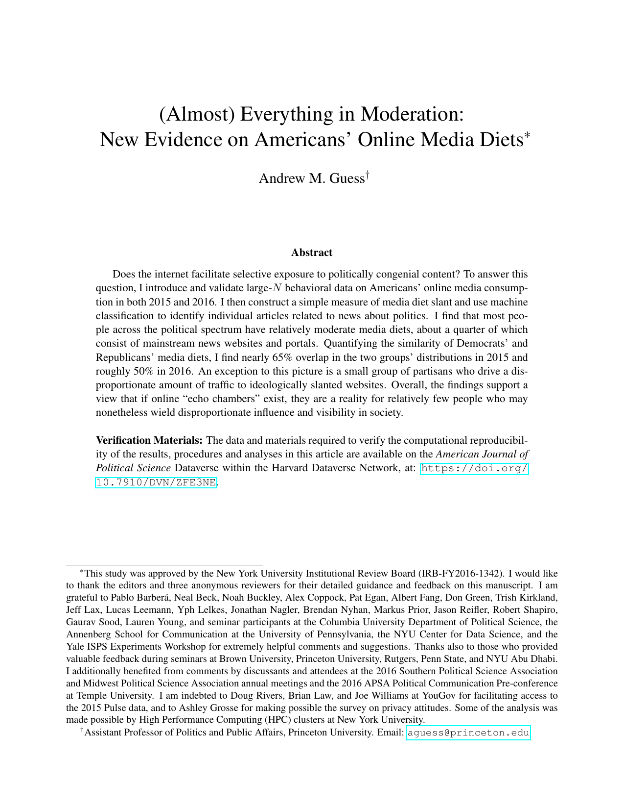
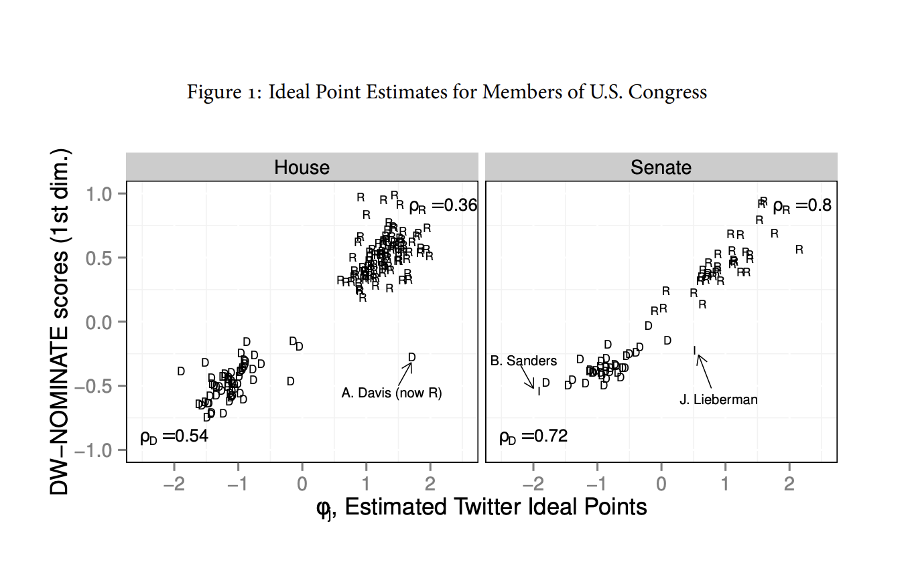
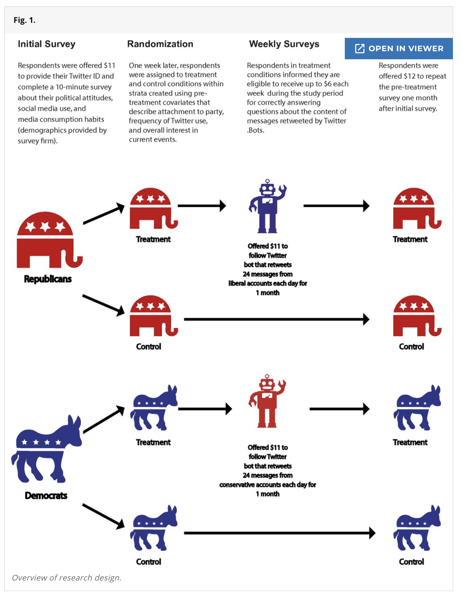
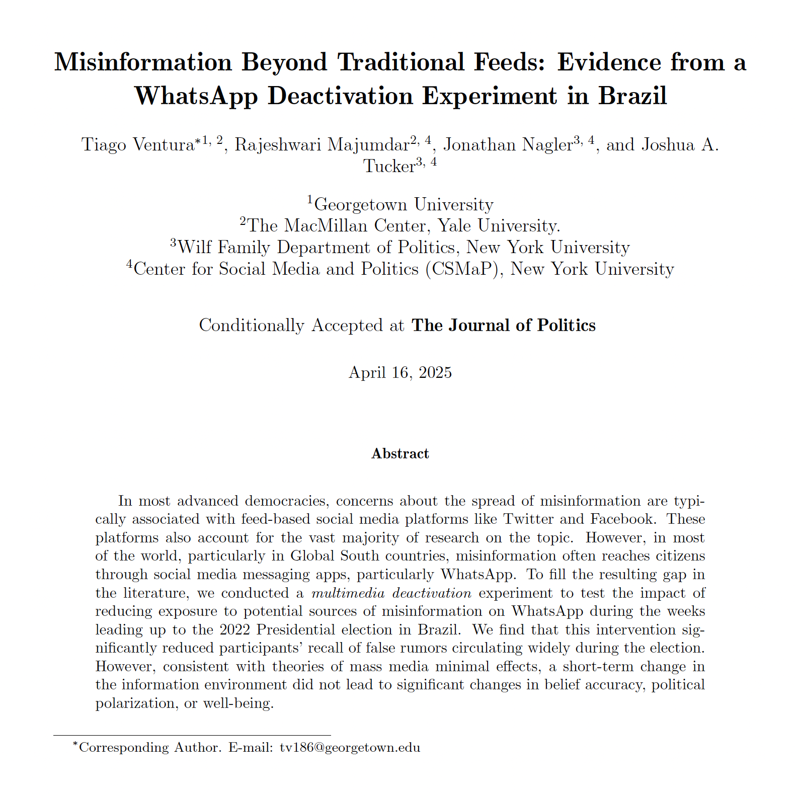
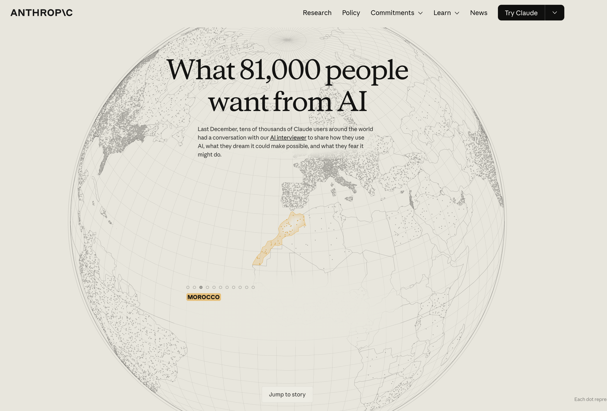
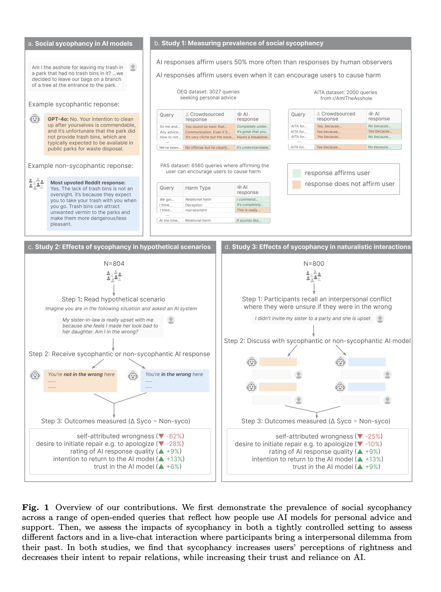
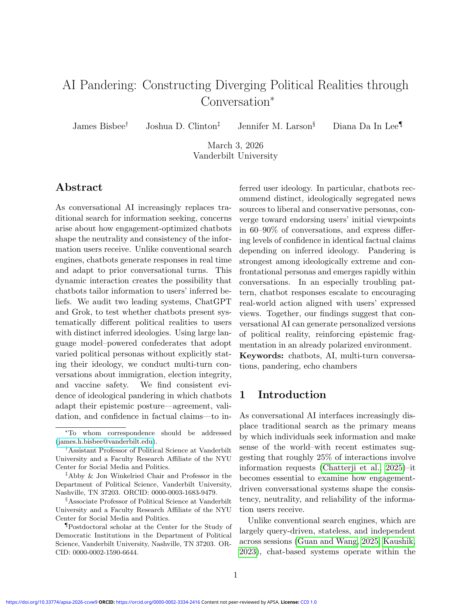
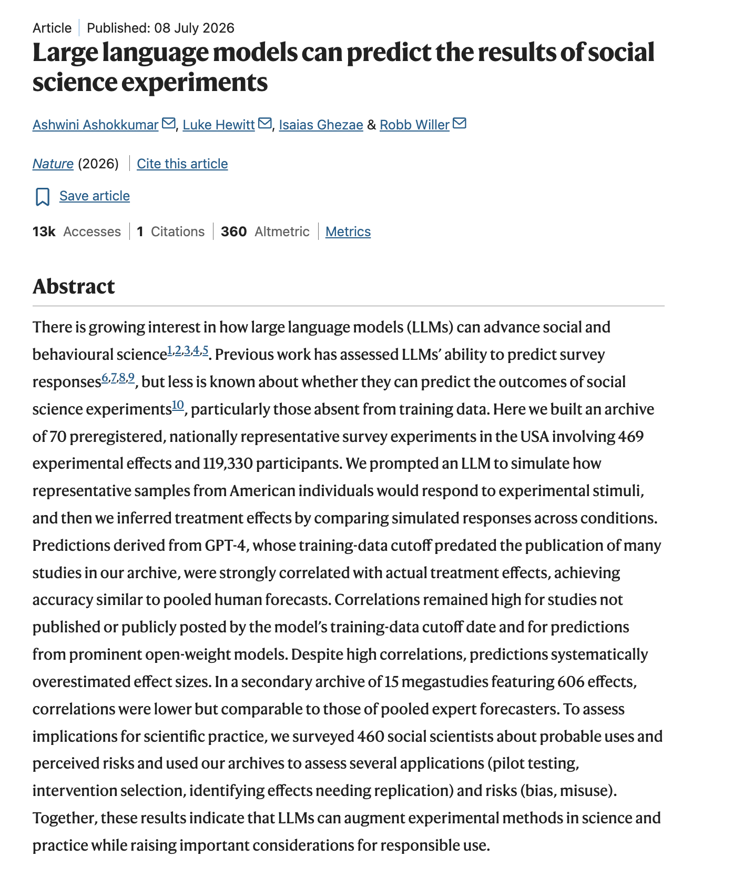
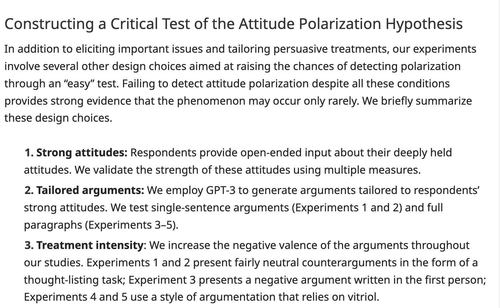
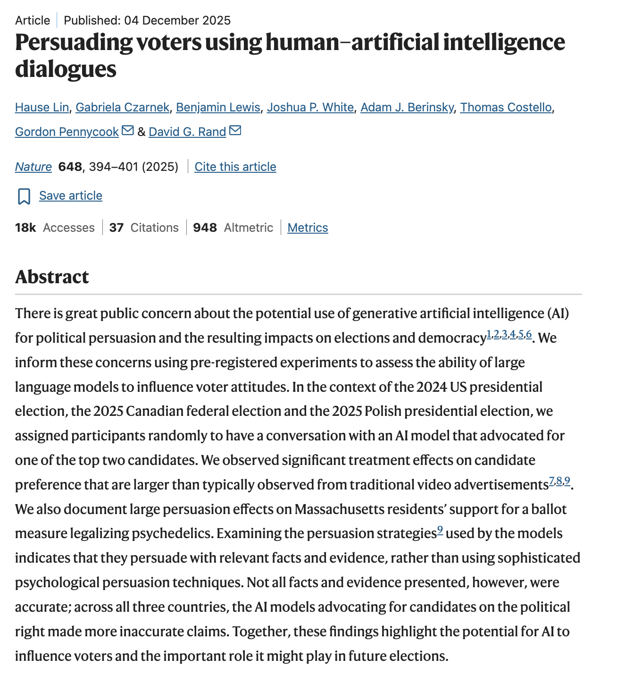

## A maior transformação do campo em vinte anos veio da consolidação das mídias digitais

 

A internet e as redes sociais se tornaram o principal meio informacional dos eleitores. Para o estudo do comportamento político, isso produziu duas mudanças:

 

::: {.incremental}
- [Novas questões substantivas]{.red} -- em geral, sobre como esse novo ambiente informacional altera atitudes e comportamento político.

- [Novos dados e avanços metodológicos]{.red} -- rastros digitais em larga escala, necessidade de compreender o ambiente informacional digital, e  novas formas de medir conceitos clássicos de comportamento político

:::

## Essa transformação se institucionalizou: revistas, centros e colaborações com plataformas

 

::: {.incremental}
- [Novas revistas e Conferências:]{.red} o *Journal of Quantitative Description: Digital Media* (2021), criado exclusivamente para estudos descritivos de mídia digital, e conferências no tema: IC2S2, PaCSS, ICWSM, várias outras.

- [Centros de pesquisa dedicados:]{.red} Center for Social Media and Politics (NYU), Computational Social Science Lab (Penn), Stanford Internet Observatory, e diversos outros da rede financiada pela Knight Foundation

- [Colaborações academia-plataformas:]{.red} Social Science One (2018) e os Meta 2020 Election Studies, que produziram uma série de artigos na *Science* e na *Nature*.

- [Alto volume de pesquisa:]{.red} Por exemplo, Lorenz-Spreen et al. (2023) cobre 496 estudos sobre mídia digital e seus efeitos políticos. 

:::

## O campo se organizou em três frentes/gerações distintas de estudos

 

::: {.incremental}
- [Estudos Descritivos:]{.red} entender o que usuários consomem online.

- [Estudos Causais:]{.red} via experimentos digitais de campos (com ou sem coloboração com plataformas)

- [Estudos Metodológicos:]{.red} avanço de uso de dados digitais, novas metodológias com base nesses dados, e novas formas de medir conceitos clássicos de comportamento político.

:::

 

::: {.fragment}
Alguns estudos/casos emblemáticos de cada frente nos próximos slides.
:::

## Descritivo: as dietas informacionais são bem mais moderadas do que se assume no debate público

{fig-align="center" width="46%"}

::: aside
[Guess, A. (2021). "(Almost) Everything in Moderation: New Evidence on Americans' Online Media Diets." *American Journal of Political Science*.]{.midgrey}
:::

## Métodos: as redes viraram instrumento de medição -- ideologia estimada a partir de quem você segue

{fig-align="center" width="46%"}

::: aside
[Barberá, P. (2015). "Birds of the Same Feather Tweet Together: Bayesian Ideal Point Estimation Using Twitter Data." *Political Analysis*.]{.midgrey}
:::

## Experimentos: dentro das plataformas -- sair da bolha pode aumentar a polarização

{fig-align="center" width="40%"}

::: aside
[Bail, C. et al. (2018). "Exposure to Opposing Views on Social Media Can Increase Political Polarization." *PNAS*.]{.midgrey}
:::

## Experimentos de desativação para medir efeitos causais das platformas

{fig-align="center" width="55%"}

::: aside
[Ventura, T., Majumdar, R., Nagler, J., Tucker, J. (2025). "Misinformation Beyond Traditional Feeds: Evidence from a WhatsApp Deactivation Experiment in Brazil." *Journal of Politics*.]{.midgrey}
:::

# O que vem depois? {background-color="#23395b"}

## Minha aposta 

> A nova fronteira deste campo de conhecimento (comportamento politico, CSS, Polcom) será em torno do uso, efeitos e avanços metodológicos em torno de IA

 

::: {.incremental}
- Os dados, os métodos, os desenhos experimentais e centros de pesquisa construídos na geração das plataformas estão sendo redirecionados para [IA, interações humano-IA e estudos metodológicos com IA]{.red}.

- E, dado o ritmo de adoção da IA entre os cidadãos, essas questões se tornam cada vez mais [centrais na ciência política global]{.red} -- não um nicho.
:::

## As mesmas três frentes, com novas perguntas

 

::: {.incremental}
- [Estudos descritivos:]{.red} como eleitores usam IA? Que tipo de conversa política têm com esses modelos? Como usam durante eleições? Como elites e campanhas usam IA para chegar ao eleitor? E a politização da própria IA?

- [Estudos Causais:]{.red} quais os efeitos do uso de IA sobre atitudes políticas? Comparação entre modelos e entre prompts; o papel de memória e *agreeability*.

- [Estudos Metodológicos:]{.red} IA como nova fronteira de pesquisa -- *silicon samples*, survey baseados em conversas com IA chatbots, ou surveys adaptáveis, e agentes de IA na produção científica.
:::

## Descritivo: 81 mil entrevistas sobre o que as pessoas querem da IA

{fig-align="center" width="50%"}

::: aside
[Huang, S. et al. (2026). "What 81,000 People Want from AI." Anthropic. O maior estudo qualitativo multilíngue sobre uso de IA -- 159 países, 70 idiomas.]{.midgrey}
:::

## Causal: Sycophantic Models 

{fig-align="center" width="40%"}

::: aside
[Cheng, M. et al. (2026). "Sycophantic AI Decreases Prosocial Intentions and Promotes Dependence." *Science*.]{.midgrey}
:::

## Causal: Como IA infere preferência política dos usuários

{fig-align="center" width="40%"}

::: aside
[Bisbee, J., Clinton, J., Larson, J., Lee, D. (2026). "AI Pandering: Constructing Diverging Political Realities through Conversation." Working paper.]{.midgrey}
:::

## Métodos: Amostras do vale do silício reproduzem experimentos de ciências sociais 

{fig-align="center" width="40%"}

::: aside
[Ashokkumar, Ashwini, Luke Hewitt, Isaias Ghezae, and Robb Willer. "Large language models can predict the results of social science experiments." Nature (2026): 1-8.]{.midgrey}
:::

## Métodos: IA dentro de surveys -- tratamentos personalizados gerados por LLMs em tempo real

{fig-align="center" width="46%"}

::: aside
[Velez, Y., Liu, P. (2024). "Confronting Core Issues: A Critical Assessment of Attitude Polarization Using Tailored Experiments." *American Political Science Review*.]{.midgrey}
:::

## Métodos: conversas com LLMs dentro de surveys -- estudando efeitos de persuasão com eleitores

{fig-align="center" width="40%"}

::: aside
[Lin, H., Czarnek, G., Lewis, B., White, J., Berinsky, A., Costello, T., Pennycook, G., Rand, D. (2025). "Persuading Voters Using Human-Artificial Intelligence Dialogues." *Nature*.]{.midgrey}
:::

## E a ciência política brasileira?

::: {.notes}
Algumas reflexões desorganizadas:

- No campo do desenvolvimento de IA, aposto na ampliação das desigualdades -- não só Sul vs. Norte Global, mas também universidades vs. "frontier models".

- Este não é necessariamente o caso nas ciências sociais:

  - LLMs e o acesso via APIs podem reduzir os custos de produzir análises quantitativas mais sofisticadas.
  - Sobretudo o advento de agentes pode reduzir barreiras -- por exemplo, na capacidade de pesquisadores brasileiros publicarem internacionalmente.
  - O Brasil, como no caso das redes sociais, é um caso interessantíssimo: adoção muito forte de IA pela população, uma população muito conectada tecnologicamente, provavelmente usando IA de forma mais integrada com as mídias sociais.
  - E os modelos tendem a variar em qualidade de respostas, inferência e recomendações conforme a língua, o que torna estudos sobre a realidade brasileira bastante promissores.
:::

##  {background-color="#23395b"}

[**Obrigado!**]{style="color:white; font-size:1.2em;"}

[tv186@georgetown.edu | tiagoventura.github.io]{style="color:#cccccc;"}
