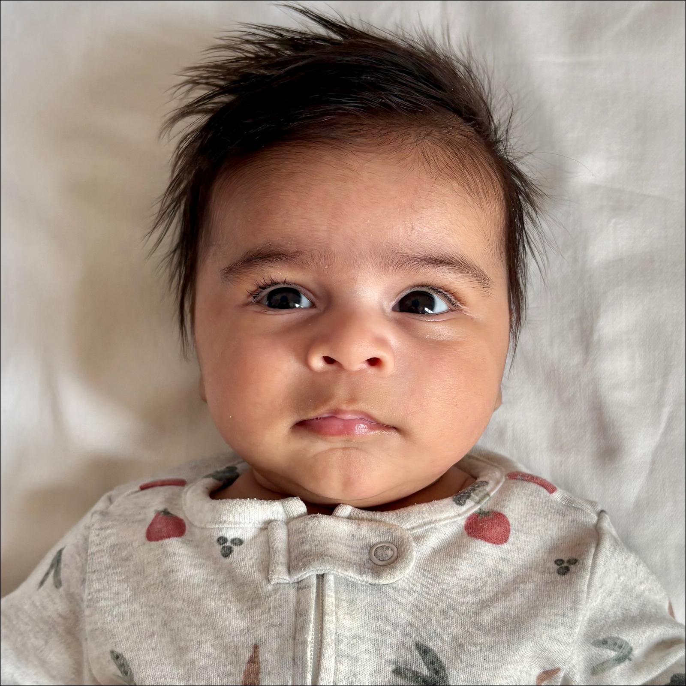
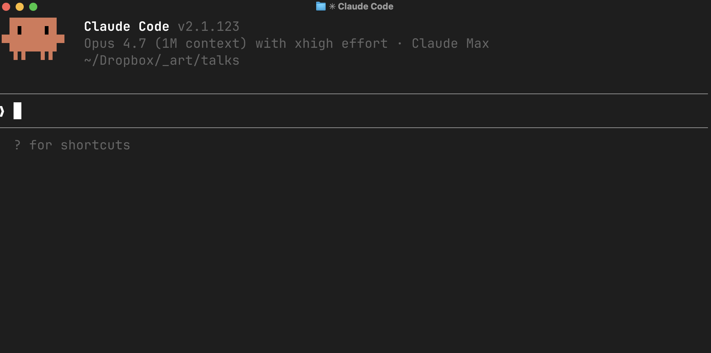

## {.split-images}




## Six ways I have used Claude Code (CC)

1. [Using CC to Develop Ideas (thinking partner)]{.red} — Ex: Using a Multi-Agent Tournament to select a paper to join a big collaboration replication exercise
2. [Build a Second Brain (RAG-Based) to support Claude Code and Me]{.red} — Ex: An MD Vault with structured literature notes, guides for writing and coding style, status for all my papers, daily diary update, and suggestions on what I should be working on
3. [Data-to-Paper Pipeline]{.red} — Full paper writing with Claude (helped me to not invest time on this project)
4. [Coding Tasks]{.red} — Currently supervising a 23 country RCT, CC helps me write code, verify merge issues, copy and paste across countries, write documentation and reusable workflows
5. [Pre-Submission Peer Review]{.red} — Four specialized review skills as an orchestrated system
6. [Building Skills to Manage Tasks I dislike]{.red} — Custom skills to write cover letters for paper submissions, social media threads, build presentations, all based on .tex files of papers.

# Using CC to Develop Ideas: Multi-Agent Tournament {background-color="#23395b"}

## The Problem

**Coppock & McGrath (2026)** launched a replication competition for survey experiments published in political science journals, and I wanted to find a survey experiment paper to join the team


::: {.incremental}
- I had some papers in mind, but not sold on anything. 

- My goal was to do a broad search on what could be an interesting paper to work on this task. But... I was [severely]{.red} time-constrained
:::

:::fragment
- Built a workflow in CC to: 

   - Search [hundreds of papers]{.red} across 8 political science journals
   - Score them on a detailed rubric [statistical power, effect sizes, replicability, team fit]{.red}
   - Make a **defensible, well-documented** decision, make the papers compete among each other
   - List **winning** papers for me to use in the replication
:::

## Claude Code Workflow

I (**CC**) wrote a ~900-line `instructions.md` with a process for this task: 

```
Your task (in phases):
0. Build a deep understanding of the RFP call
1. Build a deep understanding of my research
   pipeline and my-coauthor on this project
2. Search for high-impact survey experiments published
   across eight leading political science journals (2010-2025)
3. Evaluate papers as candidates for a replication exercise
4. Run a multi-agent tournament between the top papers
```

## Key Rules


```
## IMPORTANT: Stop-and-Check Points
At each of these points, you must:
1. Summarize what you have completed
2. Present key outputs for review
3. List any issues or concerns
4. Wait for human approval before proceeding

Do not proceed past a checkpoint without explicit approval.
```

## Phase 1 — Understand the RFP and My Research Pipeline

Before searching, CC read two things:

- **The RFP** (`rfp.pdf`): Coppock & McGrath (2026) competition rules — what counts as a valid replication, length constraints, submission format
- **My research pipeline**: CV, paper statuses, and co-author profile (Nejla Asimovic — intergroup relations, polarization) — to ground the *researcher fit* criterion before any paper was seen

- **Stop-and-check:** Claude summarized its understanding of the RFP constraints and the team's research areas before proceeding to search.


## Phase 2 — Finding the Papers

A systematic journal-by-journal search across **8 leading journals** (APSR, AJPS, JoP, JEPS, Political Behavior, Political Communication, BJPS, Political Psychology), 2010–2025.

- Filter applied at abstract level: paper must explicitly mention "survey experiment" — conjoint, list, field, and natural experiments excluded
- Per paper: authors, year, title, DOI, design, N conditions, N subjects, country, replication data URL
- Output: `candidate_papers.csv` — ~299 papers, then hard-filtered to 285 eligible


## Phase 3 — Cross-Model Deep Research

Before scoring, I used GPT Deep Research to run live web searches on every candidate paper.

- **`gpt-5-search-api`** evaluated each of the 285 papers using real-time web retrieval with deep-research

::: {.fragment}
- Each paper got a structured 6-section markdown assessment:
  - Design summary (arms, randomization, outcomes)
  - Key estimand + original effect size
  - Replication feasibility (can stimuli transfer?)
  - Data availability (public data + code?)
  - Effect sizes (Cohen's d, SE)
  - Power assessment (underpowered?)
:::


::: {.fragment}
Output: **285 individual .md files** — these files, not training data, fed the scoring step. This is already 285 lit reviews, for **"free"**.
:::

## The Scoring Rubric

Each paper scored on 8 criteria using the deep evaluation files as input:

| Criterion | Weight | What it captures |
|---|---|---|
| **S1** Theoretical importance | 20% | Does a null replication reshape a debate? |
| **S2** Design simplicity | 10% | <5 min, 2-arm, few outcomes |
| **S3** Replication feasibility | 15% | Can stimuli transfer to a US sample? |
| **S4** Data availability | 10% | Public data + code? |
| **S5** Researcher fit | 15% | Social media, misinformation, polarization |
| **S6** Impact & visibility | 10% | Top journal, citations, active debate |
| **S7** Low statistical power | 10% | Underpowered originals are worth verifying |
| **S8** Large effect sizes | 10% | Effects >0.3 SD worth checking |

Top 18 by weighted total → tournament shortlist.

## The Tournament

Top 18 papers compete in a two-stage multi-agent debate:

- **Champion agents** (one per paper, Claude Opus): write a 5–6 page advocacy brief arguing why their paper is the best replication candidate
- **Judge agent** (Claude Opus or GPT-5.2): reads both briefs head-to-head and picks a winner with written reasoning
- **Stage 1:** 18 papers → 3 groups of 6 → top 2 per group advance
- **Stage 2:** Full round-robin among 6 finalists (15 matches) → ranked by record
- **Three independent trials** with different models and filters — [P176 (Druckman et al. 2022)]{.red} placed top 3 in all three


## Prompt Refinement: Real Conversation Excerpts

The instruction file evolved through dialogue:

::: {.fragment}
> *"Even though the RFP talks about replication + extension, I want your focus to be only on the replication"* — scoping
:::

::: {.fragment}
> *Use deep-research from openAI via their API to summarize all the papers* — reduces hallucination
:::

::: {.fragment}
> *"Add as criteria to the soft scoring: a) experiment ran with low statistical power; b) effect sizes are larger than 0.3 sd"* — iterative rubric refinement
:::


::: {.fragment}
> *"Save for me two instructions.md files, one with the multi model competition, and one without it"* — multi-trial design
:::


# [Full Workflow](instructions_multimodel.html)


## Case Study 1: Lessons

- [The prompt was ~900 lines]{.red}:
   - My input to CC was much shorter. CC wrote most of the prompt
   - Plan-Mode + Refinement + Cross-checked with GPT.
   
- [Checkpoint architecture works]{.red}: mandatory stops kept Claude on track across a very long task

- [Multi-model tournament]{.red}: different models have different evaluation biases, running many with CC + Plugins is relatively easy.

- [Literature Reviews via web search sometimes hallucinated paper details]{.red}: deep research or better yet pdfs

- [Takeaway]{.red}: not a replacement, but it broadened the perspective on options for me to work on + opens up more diversity in the research pipeline
  


<!--
# Case Study 2: A Second Brain (RAG-Based) to support Claude Code and Me {background-color="#23395b"}


## The Problem

AJPS Reviewer 3 challenged the theoretical backbone of a WhatsApp paper — and demanded specific citations.

::: {.incremental}
- Reviewer named exact papers: Gursky et al. (2022), Nizaruddin (2021), Ozawa et al. — work Claude may know vaguely but hasn't *read*
- Default AI move: cite from training data, paraphrase without opening the paper, invent page numbers
- I needed grounded, verifiable responses to a reviewer who clearly knows this literature
- The vault had 154 annotated papers — but not the reviewer's specific ones. Yet.
:::

## The Setup: Notes Before Web

The vault's `context/lit_review.md` is wired into CLAUDE.md as an explicit protocol:

::: {.fragment}
| Step | Rule |
|---|---|
| **1** | Read `literature/README.md` — map query to one of 17 topic groups |
| **2** | Grep `source_topic:` and `tags:` in `literature/*.md` |
| **3** | Read every candidate note in full — body, not just frontmatter |
| **4** | Only then: `WebSearch` or `WebFetch` |
:::

::: {.fragment}
When a reviewer names specific papers, the workflow extends: **download PDF → write vault note → synthesize from the note**, never from training data.
:::

::: aside
[See: _art/context/lit_review.md]{.midgrey}
:::

## In Practice: One Session, 14 Papers

Reviewer 3 wanted engagement with the chat apps literature. Here's what one session looked like:

::: {.incremental}
- 29 Claude prompts, 14 new `literature/*.md` notes created
- Each note: YAML frontmatter, verbatim abstract, key findings, **exact quotes with page numbers**, and a `## Relevance to AJPS Reviewer 3 Concerns` section
- Notes tagged `context/ajps-rr-reviewer3` — grepable, scoped to the revision task
- But Claude tried to write notes without opening the PDFs. I caught it:
:::

::: {.fragment}
> *"How did you write the reviews without downloading the papers?"*
:::

::: {.fragment}
After correction: every claim traced to a page number in a downloaded file.
:::

::: aside
[See: _art/literature/GurskyEtAl2022-ChatAppsCascadeLogic.md]{.midgrey}
:::

## Case Study 6: Lessons

::: {.incremental}
- [The vault is a retrieval system, not memory]{.red}: Claude reads notes fresh each session — the knowledge lives in the files, not in the model
- ["Notes first, web second" must be explicit]{.red}: the default is to reach for training data or the web; the protocol has to override that in CLAUDE.md
- [Verbatim quotes with page numbers]{.red}: protect against paraphrase drift — if Claude can't cite a page number, it hasn't read the paper
- [Tag by revision task]{.red}: `context/ajps-rr-reviewer3` in frontmatter lets you grep all reviewer-relevant notes in one command
- [You still have to supervise]{.red}: Claude will shortcut the grounding step if unchallenged — "how did you write this without downloading the papers?" is a question worth asking
:::

-->

# Thank you! {background-color="#23395b"}

