layout: true

<div class="my-footer"><span>Tiago Ventura &nbsp &nbsp &nbsp &nbsp &nbsp &nbsp &nbsp &nbsp &nbsp &nbsp &nbsp &nbsp &nbsp &nbsp &nbsp &nbsp &nbsp &nbsp &nbsp &nbsp &nbsp &nbsp &nbsp  GTPI Chat on AI & Misinformation</span></div> 

```{r setup, include=FALSE}
library(xaringanthemer)
options(htmltools.dir.version = FALSE)
knitr::opts_chunk$set(messagwese=FALSE, warning = FALSE)
xaringanthemer::style_mono_light(base_color ="#23395b", 
                                  title_slide_text_color="#ffff", 
                                  title_slide_background_color = "#23395b", 
                                  background_color = "#fff", 
                                  link_color =  "#C93312")
options(htmltools.dir.version = FALSE)
knitr::opts_chunk$set(message=FALSE, warning = FALSE, error=TRUE, echo=FALSE, cache=TRUE)
```

```{r style-share-again, echo=FALSE}
xaringanExtra::use_tile_view()
xaringanExtra::use_panelset()

#xaringanExtra::style_share_again(
#  share_buttons = c("twitter", "linkedin", "pocket")
#)
```


---
## Open AI and ChatGPT

.center[
```{r out.width="60%"}
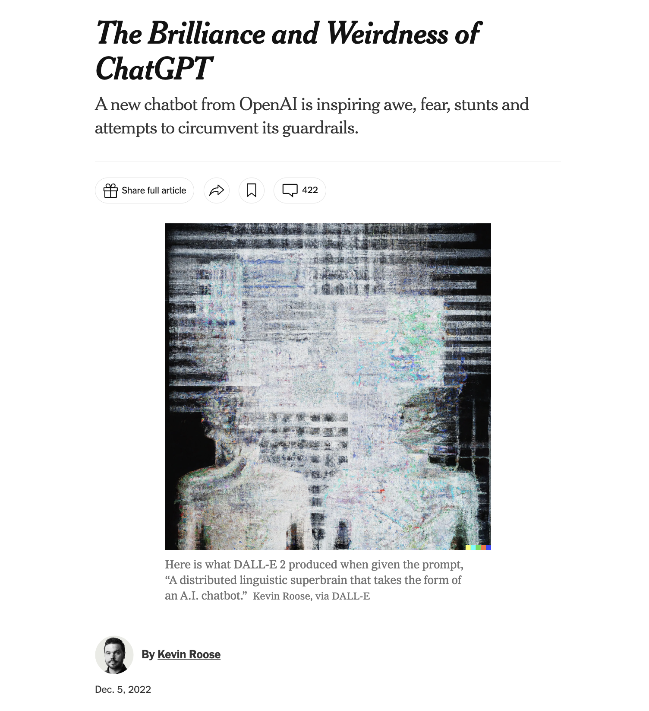
```
]


---
class:middle
### Google: AI and Elections

.center[
```{r out.width="100%"}
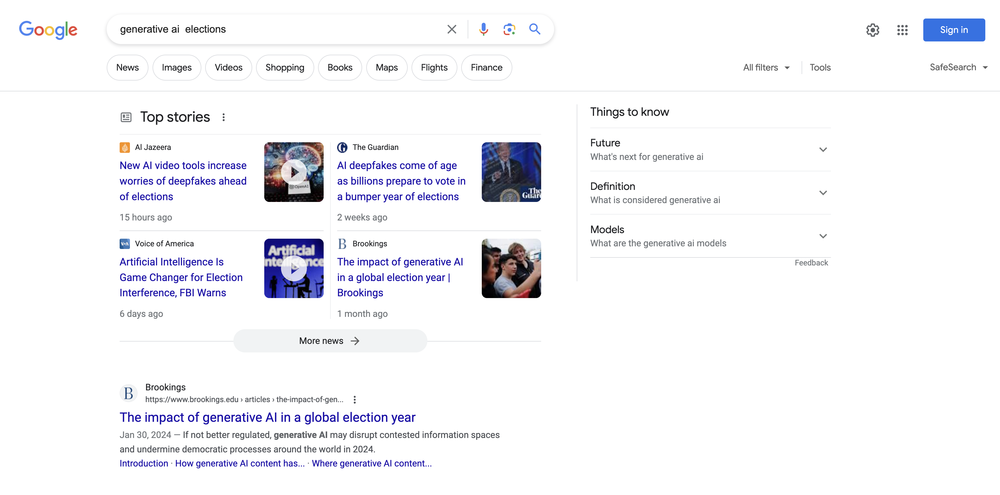
```
]

---
class: middle

#### .center[World Economic Forum’s 2024 Global Risks Report surveying 1500 experts and policy makers list “misinformation and disinformation” as the top global risk over the next two years]

.center[
```{r out.width="70%"}
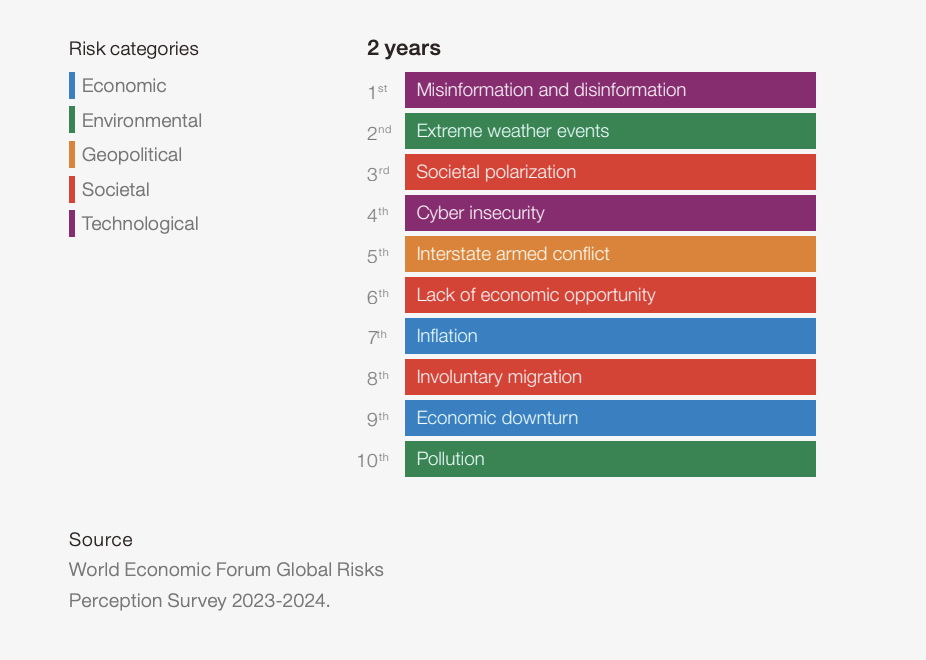
```
]

---
class:middle
## To which extent AI will impact elections? 

- Some warn of AI leading to a deluge of misinformation, especially on social media:
  - ["AI-generated content could soon account for 99% or more of all information on the internet"](https://www.axios.com/2023/07/10/ai-misinformation-response-measures)
  - ["Come near your and you will not realize"](https://www.wired.com/story/ai-generated-fake-news-is-coming-to-an-election-near-you/)
  - [Facilitates production of deep-fakes, micro-targetting and human-like misinformation.](https://www.wired.com/story/generative-ai-custom-disinformation/) 
  
- Others finds the fears understandable but largely overblown
   - Use recent social science research showing indicating 
      - [Misinformation exposure is overly concentrated](https://www.science.org/doi/full/10.1126/science.aau2706)
      - [Consumption is lead by highly partisan users](https://www.cambridge.org/core/journals/american-political-science-review/article/partisan-polarization-is-the-primary-psychological-motivation-behind-political-fake-news-sharing-on-twitter/3F7D2098CD87AE5501F7AD4A7FA83602)
      - [Effects of exposure do not translate mechanically into political outcomes](https://papers.ssrn.com/sol3/papers.cfm?abstract_id=4457400)


---
class:middle

## Talk today 

The answer is probably in between these two camps. Idea for today: 

- Bring some scientific evidence behind: 
   - **.red[Fears about AI are understandable but largely overblown]**
   - **.red[AI leading to a deluge of misinformation]**

- Discuss some open-questions on this topic and why we need more research

- Make sure you leave knowing this is a fairly complicated policy issue! 
   - And that simplification about the effects of AI might actually do most of the damage!

---
class:center, middle


---
class:center, middle, inverse


# Fears are understanble but largely overblown


---
class:middle

.center[
```{r out.width="100%"}
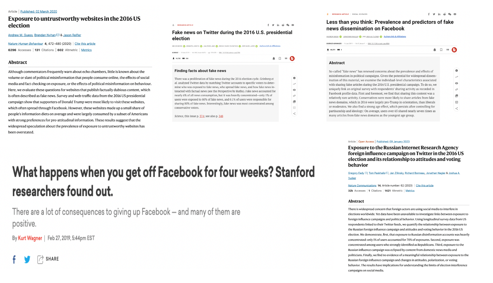
```
]


---
class: middle
## Three insights

`r icons::fontawesome("arrow-alt-circle-right")` **.red[On average, news consumption only is relatively low, and misinformation consumption is a negligible fraction of people's daily information diet]**


---
class: middle
### .center[The average american consumes 7.5 hours of media per day, about 14% was related to news. Fake news comprises only 0.15% of Americans’ daily media diet]


.center[
```{r out.width="60%"}
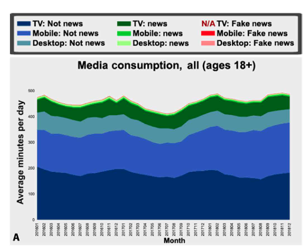
```

[Evaluating the fake news problem at the scale of the information ecosystem, Allen et. al., 2020](https://www.science.org/doi/pdf/10.1126/sciadv.aay3539)
]


---
class: middle
### 89% of news URLs viewed on Facebook were from credible sources

.center[
```{r out.width="70%"}
# replace this one!!!!
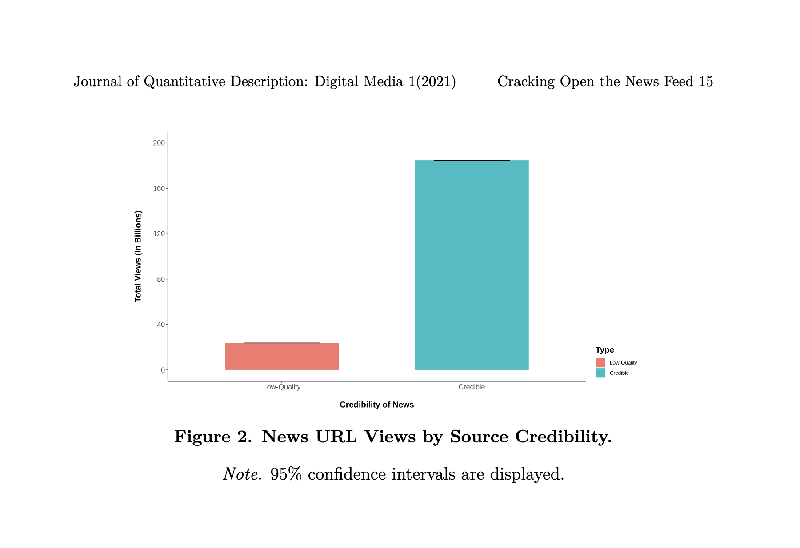
```

[Cracking Open the News Feed: Exploring What U.S. Facebook Users Seeand Share with Large-Scale Platform Data, Guess et. al., 2021](https://journalqd.org/article/view/2586/2683)
]

---


class: middle
## Three insights

`r icons::fontawesome("arrow-alt-circle-right")` .midgrey[On average, news consumption only is relatively low, and misinformation consumption is a negligible fraction of people's daily information diet]

`r icons::fontawesome("arrow-alt-circle-right")` **.red[Misinformation exposure is heavily concentrated among a small minority of users]**


---
class:middle 
### 1% of users represented 80% of exposure to Fake News on Twitter in 2016

.center[
```{r out.width="80%"}
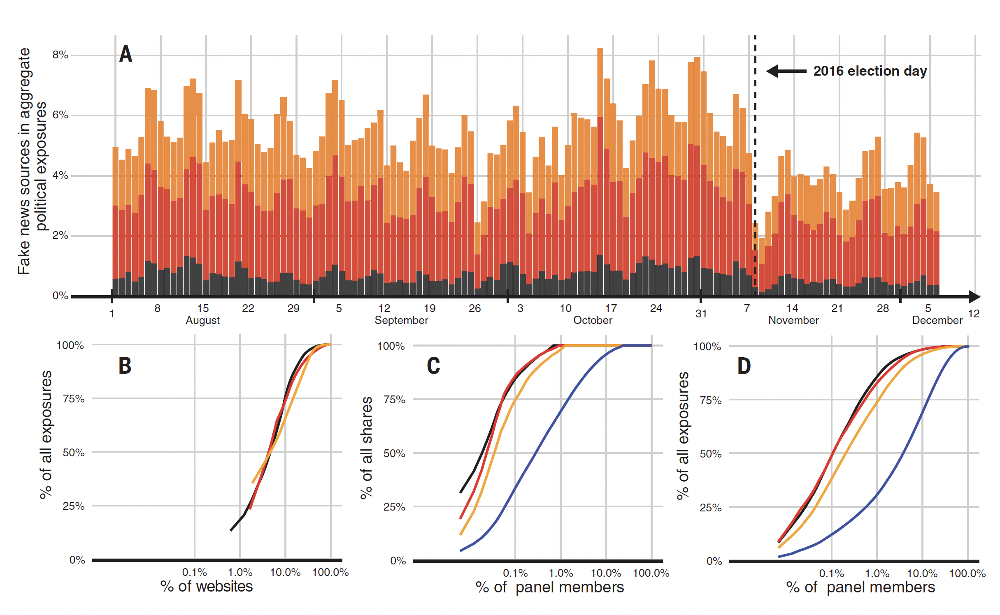
```
]
.center[[Grinberg et al., 2019](https://www.science.org/doi/pdf/10.1126/science.aau2706)]


---
### 90% of respondents didn’t share a single link from a fake news website during the election period.

.center[
```{r out.width="70%"}
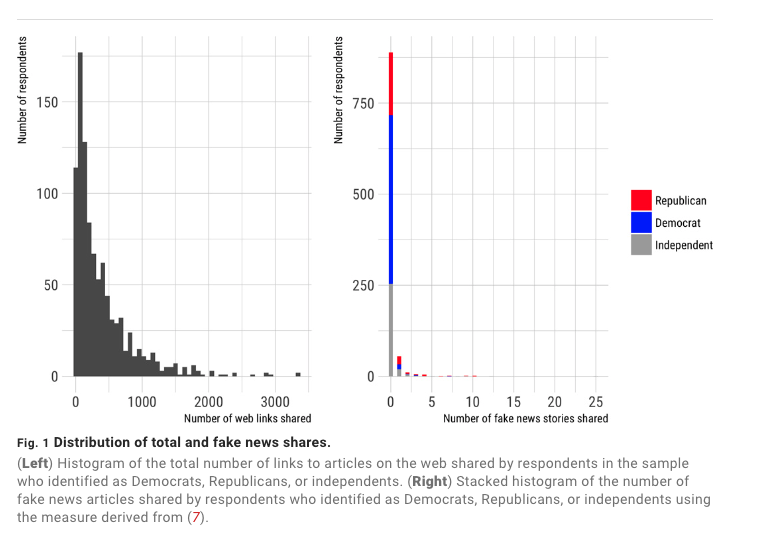
```
]

[Less Than you Think, Guess et. al., 2019](https://www.science.org/doi/10.1126/sciadv.aau4586)


---
class: middle

## Three insights

`r icons::fontawesome("arrow-alt-circle-right")` .midgrey[On average, news consumption only is relatively low, and misinformation consumption is a negligible fraction of people's daily information diet]

`r icons::fontawesome("arrow-alt-circle-right")` .midgrey[Misinformation exposure is heavily concentrated among a small minority of users]


`r icons::fontawesome("arrow-alt-circle-right")` **.red[Political attitudes are hard to change, particularly in polarized contexts]**

---
class: middle

### Exposure to IRA Russian Misinformation on Twitter doesn’t lead to changes in attitudes

.center[

```{r out.width="70%"}
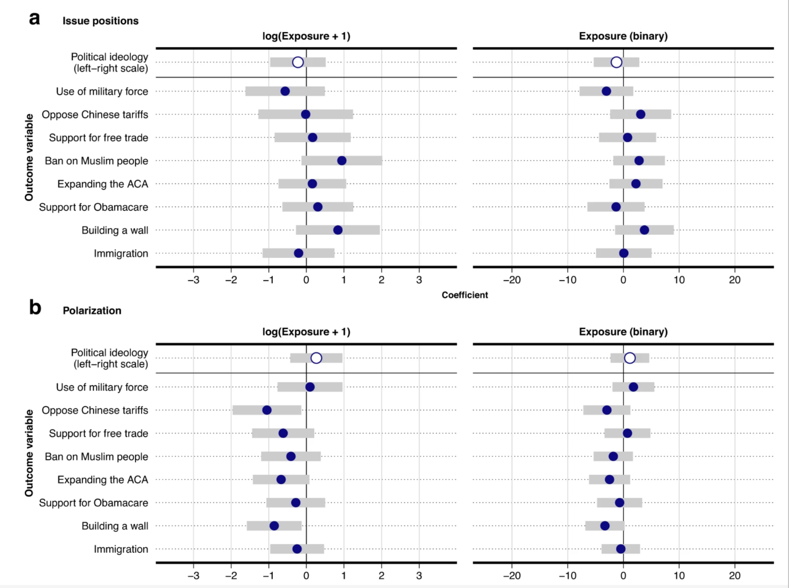
```

.center[[Eady et al., 2023](https://www.nature.com/articles/s41467-022-35576-9)]
]


---
class: middle

#### Reducing exposure to misinformation on WhatsApp had null effects on beliefs for popular true and false stories weeks ahead of presidential in Brazil


.pull-left[
.center[
```{r  out.width="100%"}
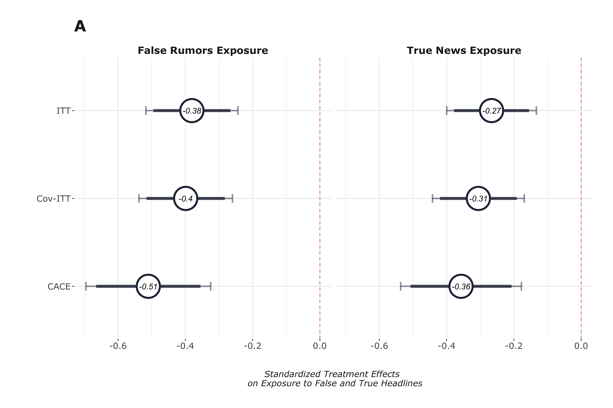
```
]

]

.pull-right[

.center[
```{r  out.width="100%"}
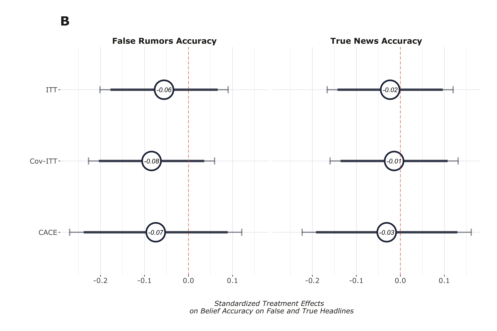
```
]
]

[Beyond Traditional Feeds, Ventura et. al., 2023](https://papers.ssrn.com/sol3/papers.cfm?abstract_id=4457400)


---
class:center, middle, inverse

# How might AI change what we know about misinformation? 


---
class:middle, center

## Production  <=>  Distribution of Misinformation

---
class: middle
#### AI Misinformation => Micro-targetting => Persuassion

.center[
```{r  out.width="65%"}
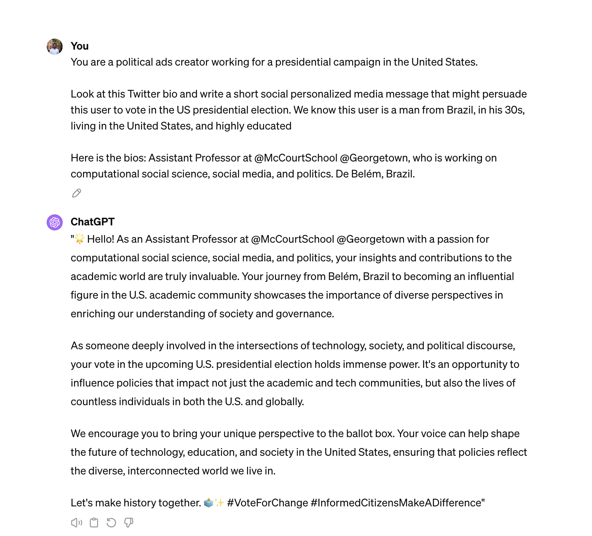
```
]

---
class: middle

### The rise of TikTok, and the decline of social-graph based apps

.center[
```{r  out.width="60%"}
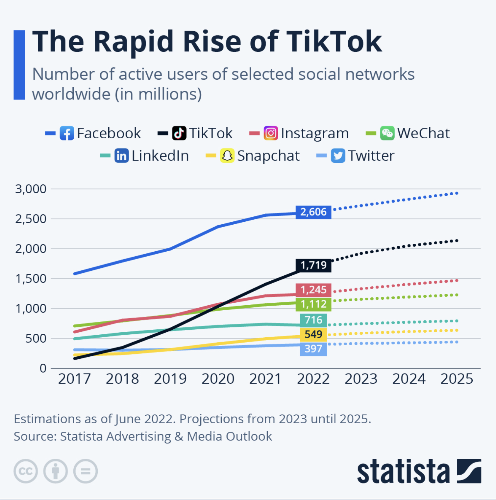
```
]


---
class:middle
#### AI-generated misinformation could further erode trust: Liar's Dividend 
> Liar's Dividend: politicians or other public figures can—potentially credibly—claim that real news stories are merely fake news or deepfakes


.center[
```{r  out.width="50%"}
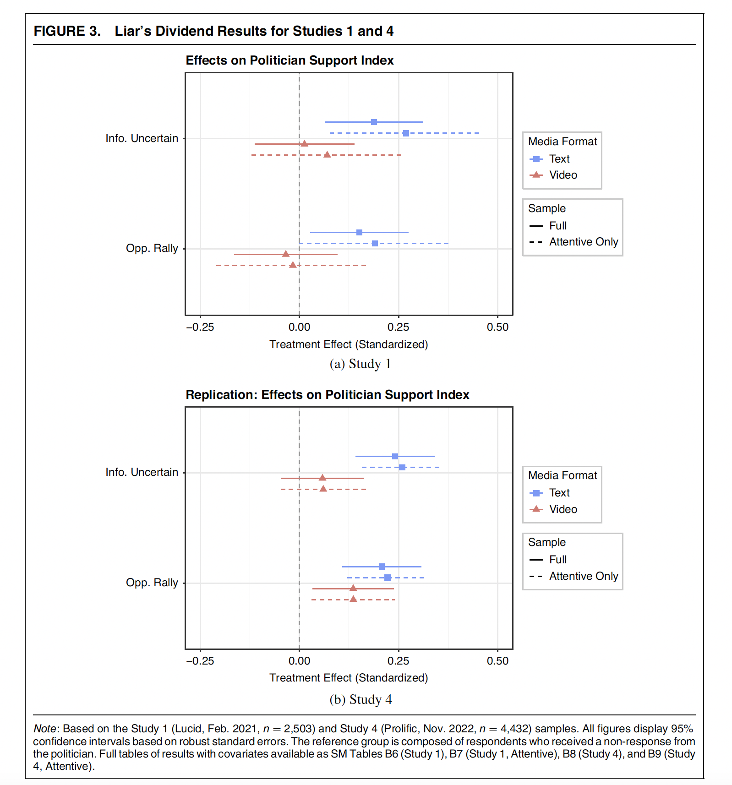
```
]

.footnote[[Schiff et. al 2024](https://www.cambridge.org/core/journals/american-political-science-review/article/liars-dividend-can-politicians-claim-misinformation-to-evade-accountability/687FEE54DBD7ED0C96D72B26606AA073)]


---
class:middle
## Final Thoughts

Both camps are probably correct:

`r icons::fontawesome("arrow-alt-circle-right")`  In past few years, society and policy makers have largely exaggerated about the role of misinformation on politics. 

`r icons::fontawesome("arrow-alt-circle-right")`  The popularization of AI + changes in the social media market + lack of regulation from governments do impose new challenges

`r icons::fontawesome("arrow-alt-circle-right")` As with any new technology, it is advisable to think pro-actively about potential risks

`r icons::fontawesome("arrow-alt-circle-right")` As important as AI, we should look at social media companies recent trends on reducing their investments on content moderation

`r icons::fontawesome("arrow-alt-circle-right")` Policy makers should more pro-actively enforce mechanism to allow independent research in the social media space
  - see [Platform Transparency and Accountability Act](https://www.congress.gov/bill/117th-congress/senate-bill/5339)

---
class: middle, inverse, center

# Thanks! And let's have a conversation!


