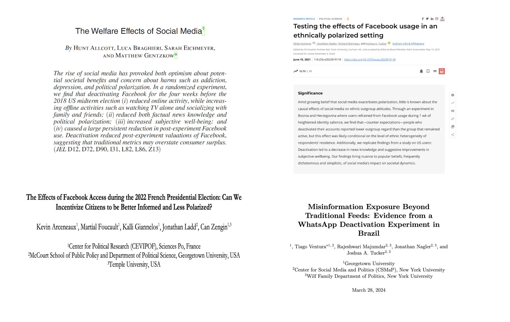

layout: true

<div class="my-footer"><span>Tiago Ventura &nbsp &nbsp &nbsp &nbsp &nbsp &nbsp &nbsp &nbsp &nbsp &nbsp &nbsp &nbsp &nbsp &nbsp &nbsp &nbsp &nbsp &nbsp &nbsp &nbsp &nbsp &nbsp &nbsp  iLCSS Talks </span></div> 

```{r setup, include=FALSE}
library(xaringanthemer)
options(htmltools.dir.version = FALSE)
knitr::opts_chunk$set(messagwese=FALSE, warning = FALSE)
xaringanthemer::style_mono_light(base_color ="#23395b", 
                                  title_slide_text_color="#ffff", 
                                  title_slide_background_color = "#23395b", 
                                  background_color = "#fff", 
                                  link_color =  "#C93312")
options(htmltools.dir.version = FALSE)
knitr::opts_chunk$set(message=FALSE, warning = FALSE, error=TRUE, echo=FALSE, cache=TRUE)
```

```{r style-share-again, echo=FALSE}
xaringanExtra::use_tile_view()
xaringanExtra::use_panelset()

#xaringanExtra::style_share_again(
#  share_buttons = c("twitter", "linkedin", "pocket")
#)
```

---
class: middle
### Our Team

.pull-left-narrow[

**Lead Authors:**

- Steve Rathje (NYU)
- Nejla Asimovic (Penn/Georgetown)
- Claire Robertson (NYU)
- Tiago Ventura (Georgetown)


**PIs:**

- Jay Van Bavel (Social Identity & Morality Lab - NYU)

- Joshua Tucker (CSMaP - NYU)

**Many other collaborators**

]

.pull-right-wide[

.center[
```{r out.width="100%"}

```
]

]
---
class: middle
### The Effects of Digital Media on Democracy

One of today’s most relevant issue is whether social media usage is causally related to political outcomes, such as beliefs for misinformation, episodes of offline violence, polarization, and subjective well-being.

A recent meta-analysis (.midgrey[Lorenz-Spreen et. al. 2022])  on this topic (496 articles) found:

- Social media as a "double-edge sword":
  - Overall .red[positive association] with information consumption and political participation
  - But it .red[erodes] trust in institutions and increases polarization

- Context Matters:
  - Positive outcomes, such as political participation, tends to have larger effects on autocracies and emerging democracies
  - Negative outcomes, such as decline in trust, were more pronounced in established democracies

---
class: middle
### Critical Gap I: Focus on W.E.I.R.D countries

.center[
```{r out.width="100%"}
knitr::include_graphics("output/map_social_media.png")
```
]


---
class: middle
### Critical Gap II: Evidence is mostly correlational

.center[
```{r out.width="70%"}
knitr::include_graphics("output/map_methods.png")
```
]

---
class: middle
### Social Media Deactivation Experiments

.center[
```{r out.width="100%"}

```
]

---
class: middle
### Global Social Media Experiment

`r icons::fontawesome("arrow-alt-circle-right")` A global study testing the .red[causal impact of social media] usages reduction around the globe.

`r icons::fontawesome("arrow-alt-circle-right")` Open call for collaborators: 

- Recruited more than 700 potential collaborators across 76 countries

`r icons::fontawesome("arrow-alt-circle-right")` In each country, participants will be randomly assigned to temporarily .red[reduce their social media usage] for two weeks 

`r icons::fontawesome("arrow-alt-circle-right")` Main Points: 

- Collects data across the .red[many countries] ~> better powered to measure contextual effects

- .red[Multi-platform design]: major social media app (Facebook, Instagram, TikTok, Youtube, Twitter/X)

---
class: middle

### Setting up a Global Collaboration

A large-scale project as this requires .red[substantive knowledge] and .red[scholars] on the ground across multiple countries:

- Inspired by prior "Global Studies": 
   - [International Collaboration on Social and Moral Psychology: Covid-19](https://icsmp-covid19.netlify.app/)
   - [International Collaboration to Understand Climate Action](https://manylabsclimate.wordpress.com/)
   
   
- On March 27, we launched an open call for collaborators:
   - Over 700 researchers residing in 76 countries signed up
   

- All researchers received a call to sign a [collaboration agreement](https://docs.google.com/document/d/1ddid4wZlDy9kazVcYYaW2nimCTzhyPGQ-QYCy2SLSW8/edit#heading=h.9vexkqhq787q)

- Next step: forming country teams and define roles:
  - Translation of surveys
  - Coordinating survey recruitment and quality checks
  - Preparing data analysis


---
class: middle
### Project Outputs

`r icons::fontawesome("arrow-alt-circle-right")` **Main Output**: Registered Report (Nature)/Global Meta Paper

- Leadership team: Drafting, revising, and submitting the manuscript with the help of collaborators

`r icons::fontawesome("arrow-alt-circle-right")` **Secondary Papers:**

- After data collection, up to 20% of the data will be made available to all for exploratory analysis. 
- After collaborators send us a pre-registration of the desired analysis for early access to the data. 
- Secondary papers can be submitted using the dataset after our main paper is accepted for publication.

`r icons::fontawesome("arrow-alt-circle-right")` **Country-Specific Paper:**

- Collaborators  are welcome to publish papers from the country data and add additional measures 

---
class: middle
### Design Workflow

```{r out.width="100%"}

```


---
class: middle
### Research Design


.panelset.sideways[

.panel[.panel-name[Recruitment]

Overall, our design combines a two-wave panel + time reduction interventions

- Recruitment through online survey panels

- Pre-screening survey:
  - use social media on their cellphones
  - adults older 18
  - willingness to join the experiment
  - willingness to upload screenshots 
  - pre-treatment measure for outcomes
  
]


.panel[.panel-name[Intervention]

A few days after responding to the pre-screening survey, participants will receive an invite to join the full study. 

**Baseline Survey:** only assign participants to their conditions

**Treatment Condition:**
 
 - **Duration**: .red[two weeks] intervention
 - **Apps**: Facebook, Instagram, Youtube, Tiktok, Twitter/X
 - **Reduction**: Five minutes each app per day
 
**Control Condition:**
 
 - **Duration**: .red[one day] time reduction
 - **Apps**: Facebook, Instagram, Youtube, Tiktok, Twitter/X
 - **Reduction**: Five minutes each app per day
 

]

.panel[.panel-name[Compliance]


.pull-left[

#### App Limits
```{r out.width="70%"}

```
]

.pull-right[

#### Screentime
```{r out.width="70%"}

```
]
]

.panel[.panel-name[Masa App]

.center[

```{r out.width="40%"}
knitr::include_graphics("output/masa.png")
```
]
]

.panel[.panel-name[Post-Treatment Survey]

Two weeks later, we invite participants to answer a post-treatment survey:

- Measure primary outcomes

- Secondary outcomes from other papers

- Country Specific Outcomes

- Compliance Checks


]
]

---
class: middle
### Outcomes and Hypotheses

Registered Report (to be submitred to Nature), looking at the impact of social media usage reduction on: 

- **News knowledge**
   - Battery of true headlines + false placebo headlines from the weeks of the intervention

- **Outgroup Polarization (Partisan and Ethnicity):**
   - Affective Polarization
   - Social Polarization
   - Misperceptions using traits polarization
   

- **Subjective well-being:**
  - Self-Reported feelings scale
  
---
class: middle
### Outcomes and Hypotheses

Our directional hypotheses are largely based on previous deactivation studies:

- H1: Social media usage reduction will decrease news knowledge.

- H2: Social media usage reduction will improve positive feelings toward political (and non-political) out-groups.

- H3: Social media usage reduction will improve subjective well-being. 

  
---
class: middle
### Heterogenous Effects

An exciting component of our study is to understand contextual variation of causal effects of social media. We plan to pre-register four other heterogeneous hypothesis

- H4: Stronger positive effects of News Knowledge conditional on high/low income countries .midgrey[(Reuters News Report, 2022)]

- H5: Stronger positive effects on outgroup feeling for participants embedded in heterogenous offline networks .midgrey[(Asimovic et. al. 2021)]

- H6: Stronger positive effects on outgroup feelings conditional on levels of democracy and high/low income .midgrey[(Lorenz-Spreen et. al. 2022)]

- H7: Positive effects on well-being will be larger in higher-income (as compared to lower-income) countries .midgrey[(Ghai et. al. 2022)]

---
class:middle

### Questions we would love to get feedback!

Some decision are still pretty much open for discussion:

- **Payment of the control group**

- **Duration of the intervention**

- **Substitution Effects**

- **Additional outcomes for secondary papers**

---
class:middle, center, inverse

# Thank you!


