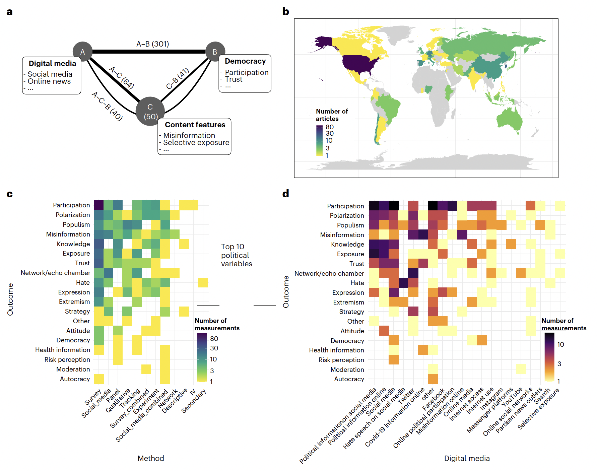

layout: true

<div class="my-footer"><span>Tiago Ventura &nbsp &nbsp &nbsp &nbsp &nbsp &nbsp &nbsp &nbsp &nbsp &nbsp &nbsp &nbsp &nbsp &nbsp &nbsp &nbsp &nbsp &nbsp &nbsp &nbsp &nbsp &nbsp &nbsp  Mewe & Georgetown Collaboration </span></div> 

```{r setup, include=FALSE}
library(xaringanthemer)
options(htmltools.dir.version = FALSE)
knitr::opts_chunk$set(messagwese=FALSE, warning = FALSE)
xaringanthemer::style_mono_light(base_color ="#23395b", 
                                  title_slide_text_color="#ffff", 
                                  title_slide_background_color = "#23395b", 
                                  background_color = "#fff", 
                                  link_color =  "#C93312")
options(htmltools.dir.version = FALSE)
knitr::opts_chunk$set(message=FALSE, warning = FALSE, error=TRUE, echo=FALSE, cache=TRUE)
```

```{r style-share-again, echo=FALSE}
xaringanExtra::use_tile_view()
xaringanExtra::use_panelset()

#xaringanExtra::style_share_again(
#  share_buttons = c("twitter", "linkedin", "pocket")
#)
```


---
class: middle
### The Effects of Digital Media on Democracy

.center[
```{r  out.width="70%"}

```
]

<br>
.footnote[[Lorenz-Spreen et. al. 2022, A systematic review of worldwide causal and correlational evidence on digital media and democracy](https://www.nature.com/articles/s41562-022-01460-1)]


---
class: middle
## Challenges to study the impacts of social media

`r icons::fontawesome("arrow-alt-circle-right")` Privacy and Data Access for Independent Researchers


`r icons::fontawesome("arrow-alt-circle-right")` Observational data can tell us little about causal effects of social media.

.red[Randomized interventions allow us to isolate causal effects. The most useful interventions come from collaborations between industry and independent researchers]

---
class: middle

## Meta 2020 Election Research

Large scale collaboration between Facebook internal researchers and outside scholars to study Facebook’s and Instagram’s impact on four key outcomes: 

- .midgrey[Political participation, Political polarization, Knowledge and misperceptions, and  Trust in US democratic institutions.]

Variety of experimental designs:

- Change from algorithmic news feed to chronological
- Downranking content from like-minded sources
- Remove re-shares
- Deactivate users from Facebook and Instagram


---
class: middle


## A Framework for Collaboration

`r icons::fontawesome("arrow-alt-circle-right")` Main points of the collaboration:

- Facebook no right of pre-publication approval

- None of the academic team will be financially compensated for their participation 

- To address privacy obligations, only Facebook employees were be able to “touch” the raw data.

- Explicit informed consent of study participants whose individual-level data will be collected and analyzed

- Pre-registration of study plans before data collection

---
class: middle

### What has our community learned so far from these studies? 

Four of the articles have been published so far (Science 3x and Nature):

- Removing reshared content substantially decreased the amount of political news and content from untrustworthy sources ([Guess et. al. 2023a](https://www.science.org/doi/full/10.1126/science.add8424))

- Chronological news feed decreased time and engagement in the platform, increased content from moderate friends and sources with ideologically mixed audiences ([Guess et. al. 2023b](https://www.science.org/doi/full/10.1126/science.abp9364))

- Most of the content people see on Facebook comes from like-minded ~ Echo Chambers do exist ([Nyhan et. al. 2023](https://www.nature.com/articles/s41586-023-06297-w))

- These interventions, including creaking the echo-chamber,  had no measurable effects on attitudinal political measures. 
  
---
class: middle

### What else can be learned with similar interventions?

- Are these patterns of news consumption stable across platforms?

- Are null effects constrained by high levels of polarization during elections?

- Are null effects constrained by the length of the interventions?

- What are the effects of direct interventions to counter beliefs for misinformation, such as, labels, pre-bunking, inoculation, etc.. ? Most of these have been tested in survey experiments, very little in the field. 


---
class: middle

## Data Infrastucture

In theory, it is beautiful. In practice, several layers of data are needed:

- User behavioral data, such as content produced, engagement, time in the platform, views, etc..

- User demographic, such as gender, age, race, and maybe first and last name so we can augment the data with voter files.

- User network information, mostly followers and followees. 

- Infrastructure to run A/B testing and assign users to different buckets. 

- Survey infrastructure to collect data + consent. 


 