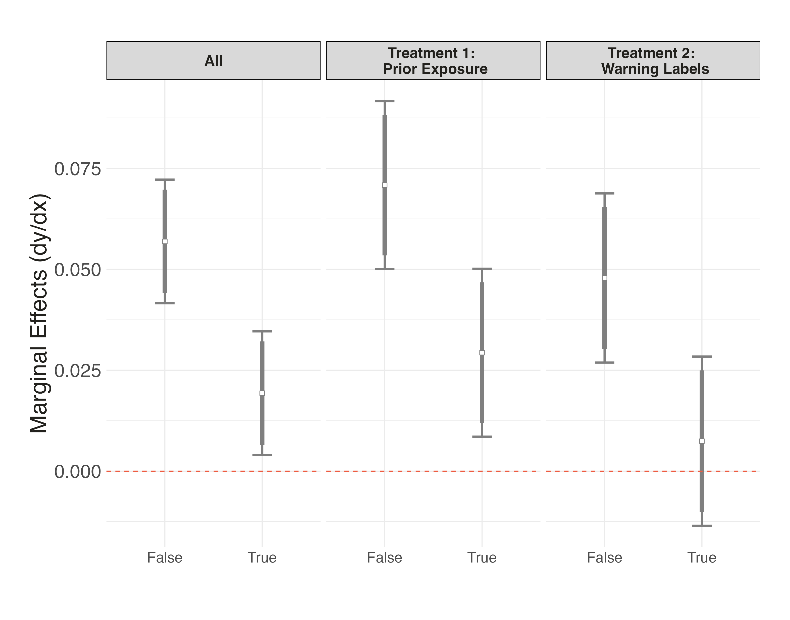

layout: true

<div class="my-footer"><span>Tiago Ventura (Georgetown University) &nbsp &nbsp &nbsp &nbsp &nbsp &nbsp &nbsp &nbsp &nbsp &nbsp &nbsp &nbsp &nbsp &nbsp &nbsp &nbsp &nbsp &nbsp &nbsp &nbsp &nbsp &nbsp &nbsp  APSA 2024 </span></div> 


```{r setup, include=FALSE}
library(xaringanthemer)
options(htmltools.dir.version = FALSE)
knitr::opts_chunk$set(messagwese=FALSE, warning = FALSE)
xaringanthemer::style_mono_light(base_color ="#23395b", 
                                  title_slide_text_color="#ffff", 
                                  title_slide_background_color = "#23395b", 
                                  background_color = "#fff", 
                                  link_color =  "#C93312")
options(htmltools.dir.version = FALSE)
knitr::opts_chunk$set(message=FALSE, warning = FALSE, error=TRUE, echo=FALSE, cache=TRUE)
```

```{r style-share-again, echo=FALSE}
xaringanExtra::use_tile_view()
xaringanExtra::use_panelset()

#xaringanExtra::style_share_again(
#  share_buttons = c("twitter", "linkedin", "pocket")
#)
```
---
class:middle
## Motivation

--

- Several claims about effects of exposure to online misinformation: 
  - Elections, turnout, and voting choices .midgrey[(Bovet and Makse, 2019; Recuero, Soares and Gruzd, 2020; Mello, 2020)]
  - Vaccine hesitancy and distrust in science .midgrey[(Loomba et al., 2021, Van der Linden et al., 2017)]
  - Episodes of offline violence against minority groups .midgrey[(Saha et al., 2021; Banaji et al., 2019)]
  
--

- Robust evidence that social media facilitates the spread of misinformation and polarizing content .midgrey[(Aruguete, Calvo and Ventura, 2021; Del Vicario et al., 2016; Nyhan et al., 2023; Eady et al., 2023)]. **.red[But]**:

--
  - Evidence for causal effects of exposure beliefs and attitudes is mixed .midgrey[Eady et al., 2023, Allen et. al. 2024, Ventura et. al. 2024)]
  - Exposure to misinformation is concentrated among small set of (heavily engaged) users .midgrey[()]
  - Still a small part of informational environment for most users .midgrey[()]
--


---
class:middle

## Exposure vs Directional Goals: Two distinct frameworks

--

`r icons::fontawesome("arrow-alt-circle-right")` **Cognitive Psychology - Illusory Truth Effects**: humans believe in information they have been exposed to before. 

--

-  **Pennycook, Cannon and Rand, 2018** on the effects of prior exposure to misinformation: 
  - "a single exposure increases subsequent perceptions of accuracy, both within the same session and after a week". 
  - This effect is not moderated by partisan motivations

--

`r icons::fontawesome("arrow-alt-circle-right")` **Political Science - Partisan Motivated Reasoning **: Directional goals dominate belief formation. 
  - Partisan-motivated reasoning dominate information consumption .midgrey[(Stroud, 2011)] and belief formation .midgrey[(Flynn, Nyhan and Reifler, 2017, Peterson and Iyengar, 2021)]

---
class:middle

### **Our Contributtion**:
 
- **To which degree prior exposure to false news online trump partisan-motivated beliefs for political misinformation?**

  - **Model:** Situate both frameworks in a common model of Bayesian belief formation AND 
  - **Experiments:** Measure the effect of both frameworks on belief for political misinformation through a set of survey experiments. 

--

---
class:middle
#### Bayesian Model for Belief Formation integrating both cognitive biases**

$$ 
\begin{align*}
    \pi_i(\mu|x) &\sim \mathcal{N}\left(\hat{\mu}_{i,0} + (\mu_x - \hat{\mu}_{i,0}) \left(\frac{\hat{\sigma}_{i,0}^2}{\hat{\sigma}_{i,0}^2 + \hat{\sigma}_{i,x}^2}\right),\frac{\hat{\sigma}_{i,0}^2\hat{\sigma}_{i,x}^2}{\hat{\sigma}_{i,0}^2 + \hat{\sigma}_{i,x}^2}\right)
\end{align*}
$$

- critical parameters are $\hat{\sigma}_{i,0}$ and $\hat{\sigma}_{i,x}$ which measures the (inverse) credibility of the signal

  - .red[PMR]: Source alignment `r icons::fontawesome("arrow-alt-circle-right")` credibility of the signal
  - .red[ITE]: Familiarity (or prior exposure) `r icons::fontawesome("arrow-alt-circle-right")` credibility of the signal

---
class:middle
## Design

- **Data:** Online survey fielded Qualtrics, with a nationally representative sample of Americans. 

- **Design:** Modeled after previous work examining ”illusory truth effects” .midgrey[(Pennycook, Cannon and Rand, 2018; Lyons, 2023)]

  - .red[Familiarization stage]: show .red[X] headlines with questions about participants' familiarization
  
  - .red[Distraction stage]: distract participants with survey questions
  
  - .red[Accuracy Stage]: show .red[X + Y] headlines with questions about accuracy beliefs
  
- **Measuring PMR**: In previous work, partisan leaning is manipulated only with content of the headlines .midgrey[(Pennycook, Cannon and Rand, 2018)]. We manipulate both the content and source (MSNBC, Democracy Now, Fox, Breitbart) 
---
class:middle
## Experiments

```{r echo=FALSE, out.width = "100%"}
 
```

---
class:middle
### Marginal Means ITE vs PMR for False Headlines


```{r echo=FALSE, out.width = "90%"}
 
```

---
class:middle
### Marginal Effects ITE vs PMR for False Headlines

```{r echo=FALSE, out.width = "90%"}
 
```

---
class:middle
### Effects of ITE vs PMR over Time for False Headlines

```{r echo=FALSE, out.width = "90%"}
 
```

---
class:middle
### Effects of ITE vs PMR over Time for False Headlines with Warning Labels


```{r echo=FALSE, out.width = "80%"}
 
```

---
class:middle
### Effects of ITE vs PMR over Time for TRUE Headlines

```{r echo=FALSE, out.width = "80%"}
 
```

---
class:middle
## Discussion 

-  Partisan motivated reasoning dominates illusory truth in the political realm

   - PMR has effect order of magnitude larger than PMR
   - PMR moderates ITE with prior exposure being larger among concordant sources
   - ITE decays after a single day of exposure
   
   
- Notes of optimism: Warning labels do reduce both processes (ITE and PMR)

- Next steps:
  
  - New experiment adding non-partisan headlines as baseline
  - Proper measure for familiarity (separate prior knowledge to the effects of familiarization)
  - New experiment with fabricated (but partisan) headlines
  
   
