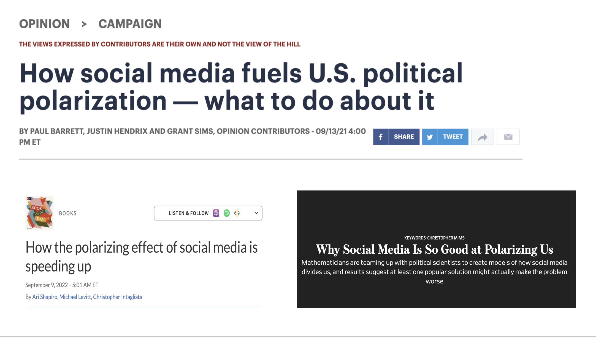
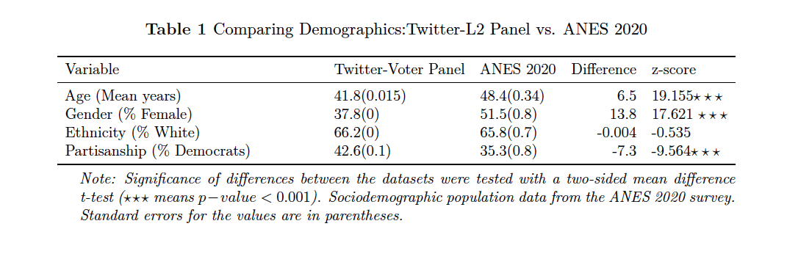
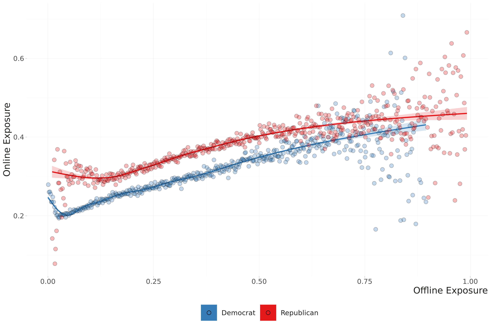
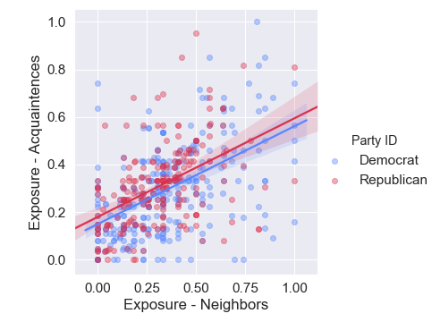
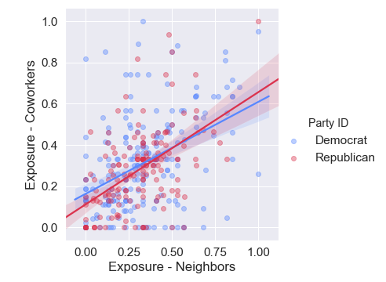

layout: true

<div class="my-footer"><span>Tiago Ventura (Georgetown University) &nbsp &nbsp &nbsp &nbsp &nbsp &nbsp &nbsp &nbsp &nbsp &nbsp &nbsp &nbsp &nbsp &nbsp &nbsp &nbsp &nbsp &nbsp &nbsp &nbsp &nbsp &nbsp &nbsp CSMaP Meeting, 2023</span></div> 

```{r setup, include=FALSE}
options(htmltools.dir.version = FALSE)
knitr::opts_chunk$set(messagwese=FALSE, warning = FALSE)
xaringanthemer::style_mono_light(base_color ="#23395b", 
                                  title_slide_text_color="#ffff", 
                                  title_slide_background_color = "#23395b", 
                                  background_color = "#fff", 
                                  link_color =  "#DA291C")
options(htmltools.dir.version = FALSE)
knitr::opts_chunk$set(message=FALSE, warning = FALSE, error=TRUE, echo=FALSE, cache=TRUE)
```

```{r style-share-again, echo=FALSE}
xaringanExtra::use_tile_view()
xaringanExtra::use_panelset()

#xaringanExtra::style_share_again(
#  share_buttons = c("twitter", "linkedin", "pocket")
#)
library(icons)
```

---
### Motivation

.center[
```{r out.width="100%"}

```
]


---
class:middle 

### .center[.blue[Social media]]

### .center[`r icons::fontawesome("arrow-alt-circle-down")`]

### .center[.blue[Echo Chambers]] 

### .center[`r icons::fontawesome("arrow-alt-circle-down")`]

### .center[.blue[Reduce cross-cutting exposure]]

### .center[`r icons::fontawesome("arrow-alt-circle-down")`]

### .center[.blue[Polarization]]


---
class: center, middle

### .center[.red[Social media]]

### .center[.red[`r  icons::icon_style(icons::fontawesome("arrow-alt-circle-down"))`] &nbsp;&nbsp;  `r icons::fontawesome("question")`]

### .center[.red[Echo Chambers] &nbsp;&nbsp;&nbsp; `r icons::fontawesome("question")`]

### .center[.red[`r  icons::icon_style(icons::fontawesome("arrow-alt-circle-down"))`  &nbsp;&nbsp; `r icons::fontawesome("question")`]]

### .center[.red[Reduce cross-cutting exposure]  &nbsp;&nbsp; `r icons::fontawesome("question")`]

### .center[.red[`r  icons::icon_style(icons::fontawesome("arrow-alt-circle-down"))`]  &nbsp;&nbsp; `r icons::fontawesome("question")`]

### .center[.red[Polarization]] 

<!--
-->
---
class: middle

### Are social media echo-chambers real? 

- Online Media Consumption  is similar to offline consumption .red[(Gentzkow and Shapiro, 2011; Wojcieszak  and  Mutz, 2009; Bisbee and Larsson, 2017)]

- Users' friendship networks are heterogeneous outside of politics .red[(Bakshy et. al. 2012; Barbéra  e.t  al.,  015)]

- Users’ digital media diets are balanced, and strongly influenced by big reputable outlets .red[(Guess 2021; Cardenal et. al., 2019)]

- Substantial amount of overlap in the ideological distributions of accounts followed by Twitter users (.red[Eady et. al. 2019])

---
class: middle, animated, slideInLeft

### These studies: 

#### .center[.palegrey[Social media]]

#### .center[.palegrey[`r  icons::icon_style(icons::fontawesome("arrow-alt-circle-down"), fill="#E8EDEE")`]]

### .center[.red[Echo Chambers]] 

#### .center[.palegrey[`r  icons::icon_style(icons::fontawesome("arrow-alt-circle-down"), fill="#E8EDEE")`]]

#### .center[.palegrey[Reduce cross-cutting exposure]]

#### .center[.red[`r  icons::icon_style(icons::fontawesome("arrow-alt-circle-down"), fill="#E8EDEE")`]]

#### .center[.palegrey[Polarization]] 

---
class: middle, animated, slideInLeft

### Our focus 

### .center[.blue[Social media]]

## .center[.palegrey[`r  icons::icon_style(icons::fontawesome("arrow-alt-circle-down"), fill="#DA291C")`]]

### .center[.blue[Echo Chambers]] 

#### .center[.palegrey[`r  icons::icon_style(icons::fontawesome("arrow-alt-circle-down"), fill="#E8EDEE")`]]

#### .center[.palegrey[Reduce cross-cutting exposure]]

#### .center[.palegrey[`r  icons::icon_style(icons::fontawesome("arrow-alt-circle-down"), fill="#E8EDEE")`]]

#### .center[.palegrey[Polarization]] 

---

## Our contributtion

--

`r icons::fontawesome("arrow-alt-circle-right")` **To solve the causal chain**, we need to measure online segregation  .red[relative] to other channels through which voters **consume information or interact** with ingroup and outgroup voters

--

`r icons::fontawesome("arrow-alt-circle-right")` **Previous related studies:**

  - Self-reported online vs offline networks .red[(Gentzkow and Shapiro 2011)]
  - TV news Consumption .red[(Muise et. al. 2022)]
  - **No studies looking at partisan geographical segregation and online behavior.**

--

`r icons::fontawesome("arrow-alt-circle-right")` We provide meaningful comparisons for the same social media users between levels of **offline and online segregation**

--

---

## Why it matters?

--

- American voters are highly sorted offline with respect to partisanship .red[(Brown and Enos, 2021)]

--

- Partisan geographical segregation affects mass and elite polarization .red[(Bonica, 2014)], willigness to cooperated  across        groups .red[(Enos and Gidron, 2016)],  trust in government and anti-system attitudes .red[(Cramer, 2016)], and health               behavior .red[(Baxter-King et al., 2022)]. 

--

- **No scholarly work focusing on the effects of partisan geographical segregation and online behavior.**

--

--

---
## Research Question 1 (Today)

<br>
<br>
<br>
<br>
.content-box-gray[1) What is the relationship between offline partisan sorting and online partisan sorting?]

---
## Research Question 2 (TBD)

<br>
<br>
<br>
<br>

.content-box-gray[2) How does offline political segregation influence online behavior?]

---
class:middle, inverse, center
##  Materials and Methods

---
## Data Infrastructure

.center[
```{r out.width="100%"}
knitr::include_graphics("datainfra.png")
```
]

---
## Simple Matching Procedure

--
**Step 1: Parse Voter File Data**

- For every voter in each US City, we collect unique: 
  - First name
  - Last name
  
--

**Step 2: Find Candidates on Twitter**

- For every month on API Decahose data:
  - Find matches with the three parsed data 
  - Keep all matches
  
--

**Step 3: Discard Repeated Matches**

- Multiple Jonh Does living in New York

--

**Step 4: Keep unique matches**

--

---
## Offline Information: Voter Files

.pull-left-narrow[

.center[
```{r out.width="100%"}
knitr::include_graphics("voterfile.png")
```
]

]

.pull-right-wide[

**Data Collection for every matched voters:**

- Voter file demographics (gender, race, partisanship, religion)

- Residential location (9 digits lat and long)

- Closest 1.000 neighboors + their partisanship.

]
---
## Online Information: Twitter Data

.pull-left-narrow[
<br>
.center[
```{r out.width="100%"}
knitr::include_graphics("twitter.png")
```
]

]

.pull-right-wide[

**Data Collection for every matched voters:**

- Collect their full network (people they follow and follow them) ~ 57M

- Collect their most recent timelines (3200 tweets) + 900k * 3,2k

- Parse their timelines.
]

---
## Measuring Partisan Identity

.pull-left[

**From voter file:**

- Precise measure for every matched users

**What about their friends:**

- Ideology estimation method employed by .red[Barbera, 2015]
- Homophily assumption: Following relationships between users and political elites to estimate ideology.

]

.pull-right[
.center[
```{r out.width="100%"}
knitr::include_graphics("twideo.png")
```
]

]

---
## Measuring Partisan Segregation: Offline


.pull-left[
<br>
<br>
<br>
.center[
$\text{Offline Outgroup Proximity}$ 

$\frac{\sum_{k=1}^{1000}\frac{1}{d+1}\mathbb(p_k=q_i)}{\sum_{k=1}^{1000}\frac{1}{d +1}}$
]
]

.pull-right[
Where:

- $i$ is a matched voters
- $k$ is a given neighbor
- $d$ is the distance in meters between the neighbor and the individual 
- $p_k$ is the partisanship of the neighbor
- $q_i$ is the opposite party of the individual whose exposure is being measured. 
]

---
class:middle 
## Online Partisan Segregation

.pull-left[
<br>
<br>
.center[

$\text{Online Outgroup Proximity}$ 

$\frac{\sum_{k=1}^{n}\log(a+1)\mathbb(p_k=q_i)}{\sum_{k=1}^{n}\log(a+1)}$

]
]

.pull-right[

**Where:**

- $i$ is a matched voter
- $k$ is a given neighbor
- $a$ is the number of interactions between the friend and a user $i$ 
- $p_k$ is the partisanship of the neighbor
- $q_i$ is the opposite party of the individual whose exposure is being measured. 
]

---

## Measurement Assumptions

- We are interested in the probability of the voter **i**  being exposed to an outgroup **j** online and offline. We assume this probability increases with the number of outgroup neighbors and users on user **i** networks.
  
- Two way to measure: 
  
  - **Naive:** count the number of nearest neighbors and users I follow. 
  
  - **Weighted:** use some transformation function. 
  
- We assume proximity matters: 

  - **Offline:** geographical (inverse distance)
  
  - **Online:** online interactions (retweets)

---
## As a consequence:

- These measures are not on the same scale. We cannot say .52>.50

- We argue they are however roughly proportional.

- And allow us to understand differences in orders of magnitude and their common correlation.

---

class:inverse, middle, center

## Results

---

## Demographics of Twitter Panel

<br><br><br>

.center[
```{r out.width="100%"}

```
]

---
## Online vs Offline Exposure

.center[
```{r out.width="100%"}
knitr::include_graphics("figs/radians_dens_exposure.png")
```
]


---
## Online vs Offline Exposure by Quantiles


---
## Comparing Offline and Online Exposure Across Subgroups

.center[
```{r out.width="100%"}
knitr::include_graphics("tabsubgroups_.png")
```
]

---
## Correlation between online and offline exposure

.center[
```{r out.width="80%"}

```
]

---
## Modeling Online Echo Chambers

.center[
```{r out.width="60%"}
knitr::include_graphics("tabmodels_.png")
```
]


---
class:middle

## Robustness Check : Yougov Survey

.pull-left[.center[
```{r out.width="100%"}

```
]]

.pull-right[.center[
```{r out.width="100%"}

```
]]

---
class:middle
## Challenges

--

- Joint Scaling Problem

  - Our assumption is that transformation functions provide a connection between composition and potential exposure. 
  - While these are not on the same scale, we argue these are comparable approximations. 

--

- Imputation Process

  - Offline: easy. Use Bayesian Process with Precinct data as priors
  - Online: Other strategies to measure partisan identity with Twitter data?

--

- Correlation between offline on online behavior: 
  - .red[What would you be interested in seeing here?]

---
class:middle

### Next Steps

- Focus on the effects of partisan segregation on online behavior

  - Toxicity
  - Outgroup Hostility
  - Sharing of low-quality content

- More methodological articles

  - Comparing different strategies to estimate ideology with online data
  - Use LLMs as an imputation technique and compare to traditional models. 

--

---

class:inverse, middle, center

# Thank you!
  


