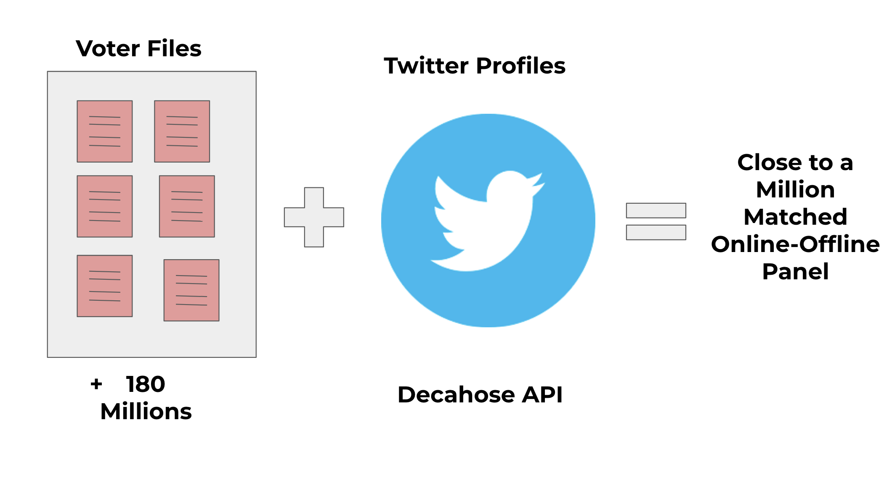
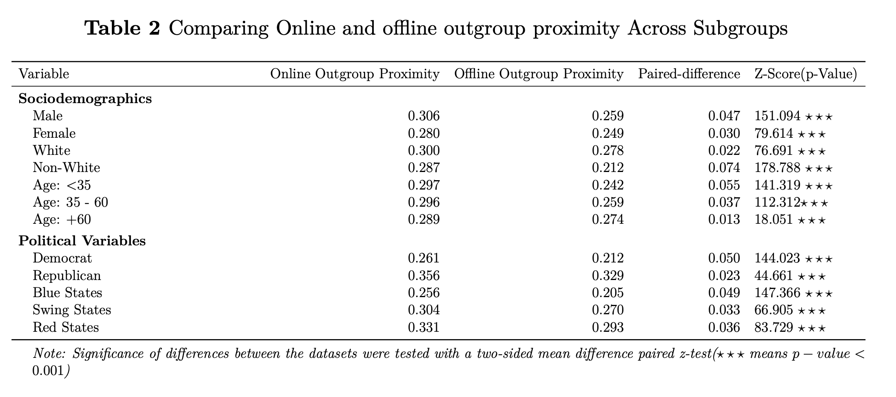

layout: true

<div class="my-footer"><span>Tiago Ventura (Georgetown University) &nbsp &nbsp &nbsp &nbsp &nbsp &nbsp &nbsp &nbsp &nbsp &nbsp &nbsp &nbsp &nbsp &nbsp &nbsp &nbsp &nbsp &nbsp &nbsp &nbsp &nbsp &nbsp &nbsp IC<sup>2</sup>S<sup>2</sup>, 2024</span></div> 

```{r setup, include=FALSE}
options(htmltools.dir.version = FALSE)
knitr::opts_chunk$set(messagwese=FALSE, warning = FALSE)
xaringanthemer::style_mono_light(base_color ="#23395b", 
                                  title_slide_text_color="#ffff", 
                                  title_slide_background_color = "#23395b", 
                                  background_color = "#fff", 
                                  link_color =  "#DA291C")
options(htmltools.dir.version = FALSE)
knitr::opts_chunk$set(message=FALSE, warning = FALSE, error=TRUE, echo=FALSE, cache=TRUE)
```

```{r style-share-again, echo=FALSE}
xaringanExtra::use_tile_view()
xaringanExtra::use_panelset()

#xaringanExtra::style_share_again(
#  share_buttons = c("twitter", "linkedin", "pocket")
#)
library(icons)
```

---
class:middle
### Motivation

.center[
```{r out.width="100%"}
knitr::include_graphics("socialmedia.png")
```
]


---

class:middle 

### .center[.blue[Social media]]

### .center[`r icons::fontawesome("arrow-alt-circle-down")`]

### .center[.blue[Echo Chambers]] 

### .center[`r icons::fontawesome("arrow-alt-circle-down")`]

### .center[.blue[Reduce cross-cutting exposure]]

### .center[`r icons::fontawesome("arrow-alt-circle-down")`]

### .center[.blue[Polarization]]


---
class:middle

### Most of the literature: 


### .center[.palegrey[Social media]]

### .center[`r icons::fontawesome("arrow-alt-circle-down")`]

## .center[.red[Echo Chambers]] 

### .center[`r icons::fontawesome("arrow-alt-circle-down")`]

### .center[.palegrey[Reduce cross-cutting exposure]]

### .center[`r icons::fontawesome("arrow-alt-circle-down")`]

### .center[.palegrey[Polarization]]


---
class:middle
## Our contributtion

--

`r icons::fontawesome("arrow-alt-circle-right")` **To solve the causal chain**, we need to measure online segregation  .red[relative] to other channels through which voters **consume information or interact** with ingroup and outgroup voters

--

`r icons::fontawesome("arrow-alt-circle-right")` **Previous related studies:**

  - TV news Consumption .red[(Muise et. al. 2022)]
  - Self-reported online vs offline networks .red[(Gentzkow and Shapiro 2011)]
  
--

`r icons::fontawesome("arrow-alt-circle-right")` We provide meaningful comparisons for the same social media users between levels of **offline and online segregation**

--

---
class:middle
## Research Question

.content-box-gray[What is the relationship between offline partisan sorting and online echo-chambers?]


---
class:middle
## Data Infrastructure

.center[
```{r out.width="100%"}

```
]

---
class:middle
## Offline Information: Voter Files

.pull-left-narrow[

.center[
```{r out.width="100%"}
knitr::include_graphics("voterfile.png")
```
]

]

.pull-right-wide[

**Data Collection for every matched voters:**

- Voter file demographics (gender, race, partisanship, religion)

- Residential location (9 digits lat and long)

- Closest 1.000 neighboors + their partisanship.

]
---
## Online Information: Twitter Data

.pull-left-narrow[
<br>
.center[
```{r out.width="100%"}
knitr::include_graphics("twitter.png")
```
]

]

.pull-right-wide[

**Data Collection for every matched voters:**

- Collect their full network (people they follow and follow them) ~ 57M

- Collect their most recent timelines (3200 tweets) + 900k * 3,2k

- Parse their timelines.
]


---
class:middle

## Offline Partisan Segregation


$$\text{Offline Outgroup Proximity}= \frac{\sum_{k=1}^{1000}\frac{1}{d+1}\mathbb(p_k=q_i)}{\sum_{k=1}^{1000}\frac{1}{d +1}}$$


**Where:**

- $i$ is a matched voters
- $k$ is a given neighbor
- $d$ is the distance in meters between the neighbor and the individual 
- $p_k$ is the partisanship of the neighbor
- $q_i$ is the opposite party of the individual whose exposure is being measured. 

---
class:middle 
## Online Partisan Segregation

 

$$\text{Online Outgroup Proximity} = \frac{\sum_{k=1}^{n}\log(a+1)\mathbb(p_k=q_i)}{\sum_{k=1}^{n}\log(a+1)}$$

**Where:**

- $i$ is a matched voter
- $k$ is a friend (followed by) the matched voter
- $a$ is the number of interactions between the friend and a user $i$ 
- $p_k$ is the partisanship of the friend
- $q_i$ is the opposite party of the individual whose exposure is being measured. 
]


---
## Online vs Offline Proximity

.center[
```{r out.width="100%"}
knitr::include_graphics("figs/radians_dens_exposure.png")
```
]


---
## Online vs Offline Proximity by Quantiles


---
## Comparing Offline and Online Proximity Across Subgroups

.center[
```{r out.width="100%"}

```
]

---
## Correlation between online and offline proximity

.center[
```{r out.width="80%"}
knitr::include_graphics("figs/radians_only_by_party_online_offline.png")
```
]

---
## Modeling Online Echo Chambers

.center[
```{r out.width="60%"}
knitr::include_graphics("tabmodels_.png")
```
]


---
class:middle

## Robustness Check : Yougov Survey

.pull-left[.center[
```{r out.width="100%"}
knitr::include_graphics("figs/acquaintences.png")
```
]]

.pull-right[.center[
```{r out.width="100%"}
knitr::include_graphics("figs/coworkers.png")
```
]]

---
class:middle
## Discussion and Next Steps

--

- We provide initial evidence that: 
 
 - Twitter users indeed live in segregated online communities with overall lower levels of exposure to outgroup users in their networks; 
 
 - But these levels of segregation are not particularly distinct from their geographical offline levels of proximity to outgroup voters; 
 
 - These differences hold across distinct political, racial, ethnical and age groups. 


--

- Future work: Focus on the effects of partisan segregation on online behavior

  - Toxicity
  - Outgroup Hostility
  - Sharing of low-quality content
--


---

class:inverse, middle, center

# Thank you!
  


