layout: true

<div class="my-footer"><span>Tiago Ventura (CSMaP) &nbsp &nbsp &nbsp &nbsp &nbsp &nbsp &nbsp &nbsp &nbsp &nbsp &nbsp &nbsp &nbsp &nbsp &nbsp &nbsp &nbsp &nbsp &nbsp &nbsp &nbsp &nbsp &nbsp Siegel Fellows Workshop</span></div> 

```{r setup, include=FALSE}
options(htmltools.dir.version = FALSE)
knitr::opts_chunk$set(messagwese=FALSE, warning = FALSE)
xaringanthemer::style_mono_light(base_color ="#23395b", 
                                  title_slide_text_color="#ffff", 
                                  title_slide_background_color = "#23395b", 
                                  background_color = "#fff", 
                                  link_color =  "#DA291C")
options(htmltools.dir.version = FALSE)
knitr::opts_chunk$set(message=FALSE, warning = FALSE, error=TRUE, echo=FALSE, cache=TRUE)
```

```{r style-share-again, echo=FALSE}
xaringanExtra::use_tile_view()
xaringanExtra::use_panelset()

#xaringanExtra::style_share_again(
#  share_buttons = c("twitter", "linkedin", "pocket")
#)
```


---
class:middle
## Motivation

--
**Heightened levels of polarization are a striking feature of contemporary politics. Although the causes are a contested topic, its effects are largely documented,  affecting, for example: **. 

--
  - .midgrey[Citizens’ support for democratic norms (.red[Graham and Svolik, 2020])]
  
--

  - .midgrey[objective perceptions about the economy (.red[Enns et al., 2012])]
--

  - .midgrey[levels of hostility, anger, and adversarial animus towards outgroup .red[(Mason, 2018; Webster, 2020)]] 
  
--

  - .midgrey[Health behavior and attitudes (.red[Baxter-King et al., 2022; Druckman et al., 2021])]

--

---
class:middle

## Motivation

**And even non-political outcomes:**

--
  - .midgrey[dating decisions and attractiveness (.red[Huber and Malhotra, 2017; Nicholson et al., 2016])]
  
--

  - .midgrey[interpersonal economic relations (.red[McConnell et al., 2018])]
  
--

  - .midgrey[labor market transactions (.red[Gift and Gift, 2015])]

--


---
### The Role of Social Media

.center[
```{r out.width="100%"}
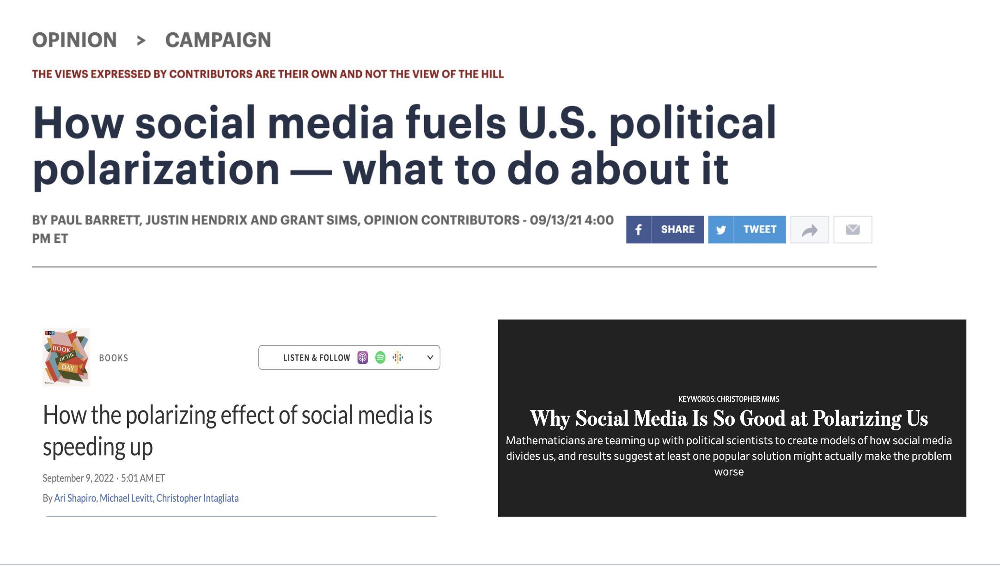
```
]


---
class:middle 

### .center[.blue[Social media increases sorting]]

### .center[`r icons::fontawesome("arrow-alt-circle-down")`]

### .center[.blue[Echo Chambers]]

#### .center[`r icons::fontawesome("arrow-alt-circle-down")`]

### .center[.blue[Reduce cross-cutting exposure]]

### .center[`r icons::fontawesome("arrow-alt-circle-down")`]

### .center[.red[Polarization]]

---
class: middle

### Are social media echo-chambers real? 

- Online Media Consumption  is similar to offline consumption .red[(Gentzkow and Shapiro, 2011; Wojcieszak  and  Mutz, 2009; Bisbee and Larsson, 2017)]

- Users' friendship networks are heterogeneous outside of politics .red[(Bakshy et al. 2012; Barbéra  et  al., 2 015)]

- Users’ digital media diets are balanced, and strongly influenced by big reputable outlets .red[(Guess 2021; Cardenal et. al., 2019)]

---
class: middle

## Puzzle

--

`r icons::fontawesome("arrow-alt-circle-right")` **The existence of online echo-chambers have been largely overstate.** 

--

`r icons::fontawesome("arrow-alt-circle-right")` **Yet the consolidation of social media  and the internet has been shown to indeed exacerbate political polarization**

--

- .midgrey[Allcott et al., 2020: Deactivation Experiment]
- .midgrey[Bail et al., 2018: Bot Experiment]
- .midgrey[Settle, 2018: Increasing capacity to identify out partisans]
- .midgrey[Lelkes et al., 2017: Effects of early adoption on internet]

--

#.center[ `r icons::fontawesome("question")`]

--

---
class:middle

## Turning the echo chamber on its head

--

**Offline Partisan Segregation**:

-  American voters are highly sorted offline with respect to partisanship .red[(Brown and Enos, 2021)]

--

**Online Environments**:

- Rather than isolating users in homogeneous online echo chambers, social media actually exposes users content that they would hardly be exposed outside of social media. 

- *it is not isolation from opposing views that drives polarization but precisely the fact that digital media bring us to interact outside of local bubbles (.red[Tornberg 2022, pp2])*

---
class:middle

### Social media studies have focused so much on levels of online partisan sorting, but in the process, we lost sight of our local bubbles and how they interact with how users behave online. 

---
## Research Questions
<br>
<br>
<br>
<br>
<br>
.content-box-gray[1) What is the relationship between offline partisan sorting and online partisan sorting?]

---
## Research Questions
<br>
<br>
<br>
<br>
<br>

.content-box-gray[2) How does offline political segregation influence online behavior?]

---
class:middle
### Our approach


We link a novel dataset of the offline networks and online networks of ~1m Twitter users.  We measure or have plans to measure: 

--

- Levels of offline partisan segregation for all users

--

- Levels of online partisan segregation on online networks from Twitter

--

- Provide meaningful comparisons across different geographical units

--

- Estimate the correlation between online and offline segregations

--

- .red[For the future:] Estimate the effects of online segregation on online behavior: 

  - outgroup animosity 
  - toxicity
  - sharing of misinformaiton

--

---
class:middle, inverse, center
##  Materials and Methods

---
## Data Infrastructure

.center[
```{r out.width="100%"}
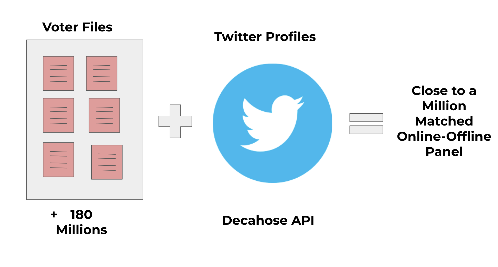
```
]

---
## Simple Matching Procedure

--
**Step 1: Parse Voter File Data**

- For every voter in each US City, we collect unique: 
  - First name
  - Last name
  
--

**Step 2: Find Candidates on Twitter**

- For every month on Decahose data:
  - Find matches with the three parsed data 
  - Keep all matches
  
--

**Step 3: Discard Repeated Matches**

- Multiple Jonh Does living in New York

--

**Step 4: Keep unique matches**

--

---
## Offline Information: Voter Files

.pull-left-narrow[

.center[
```{r out.width="100%"}
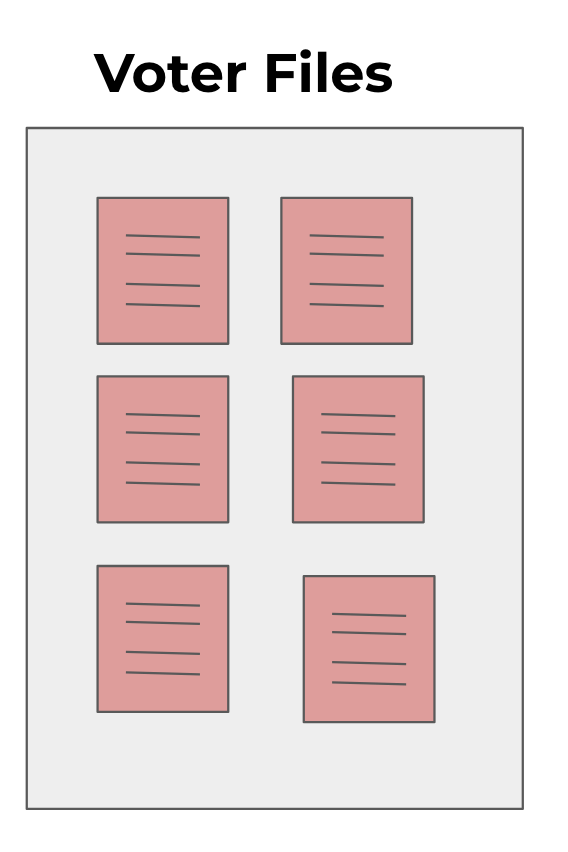
```
]

]

.pull-right-wide[

**Data Collection for every matched voters:**

- Voter file demographics (gender, race, partisanship, religion)

- Residential location (9 digits lat and long)

- Closest 1.000 neighboors + their partisanship.

]
---
## Online Information: Twitter Data

.pull-left-narrow[
<br>
.center[
```{r out.width="100%"}

```
]

]

.pull-right-wide[

**Data Collection for every matched voters:**

- Collect their full network (people they follow and follow them) ~ 57M

- Collect their most recent timelines (3200 tweets) + 900k * 3,2k

- .red[TODO:] Parse the timelines.
]

---
## Measuring Ideology using Online Data

.pull-left[

**From voter file:**

- Precise measure of matched users

**What about their friends:**

- Ideology estimation method employed by .red[Barbera, 2015]
- Homophily assumption: Following relationships between users and political elites to estimate ideology.

]

.pull-right[
.center[
```{r out.width="100%"}
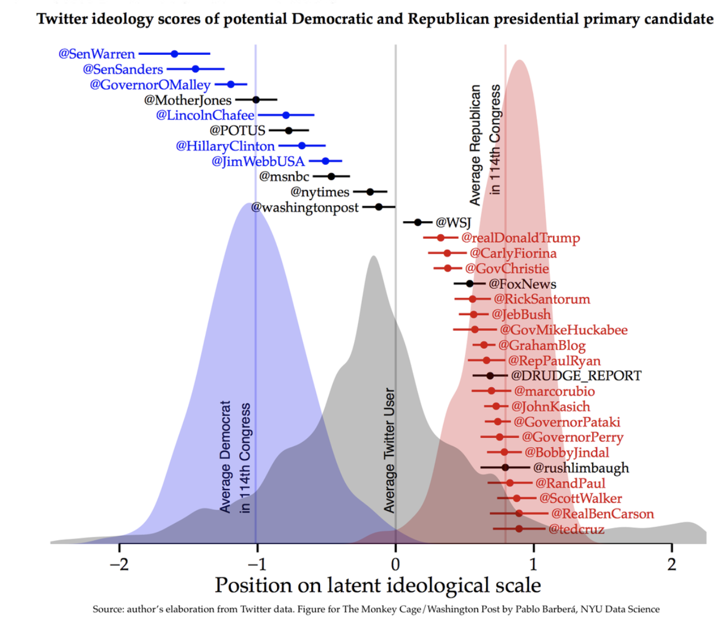
```
]

]

---
## Measuring Partisan Segregation

.center[
```{r out.width="75%"}
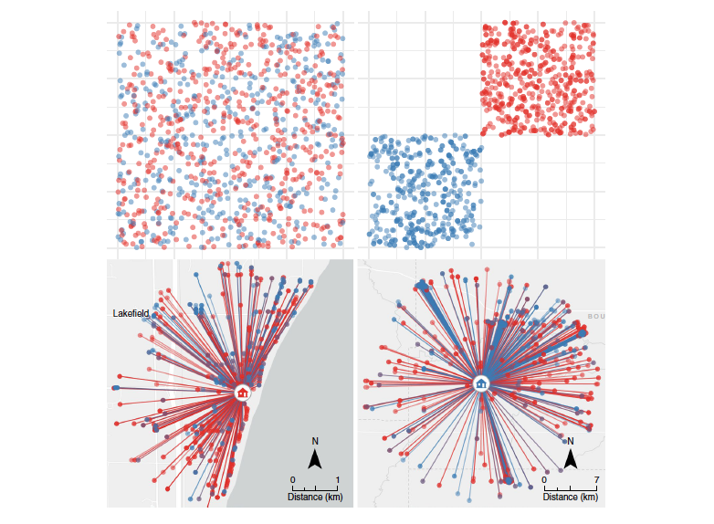
```

.footnote[[Source: Brown and Enos, 2021](https://www.nature.com/articles/s41562-021-01066-z)]

]

---
class:middle 
## Offline Partisan Segregation

.pull-left[
<br>
<br>
<br>
.center[
$\text{Offline Exposure} = \frac{\sum_{k=1}^{1000}\frac{1}{d+1}\mathbb(p_k=q_i)}{\sum_{k=1}^{1000}\frac{1}{d +1}}$
]
]

.pull-right[
Where:

- $i$ is a matched voters
- $k$ is a given neighbor
- $d$ is the distance in meters between the neighbor and the individual 
- $p_k$ is the partisanship of the neighbor
- $q_i$ is the opposite party of the individual whose exposure is being measured. 
]

---
class:middle 
## Online Partisan Segregation

.pull-left[
<br><br><br>
.center[
$\text{Online Exposure} =\frac{\sum_{k=1}^{n}\log(a+1)\mathbb(p_k=q_i)}{\sum_{k=1}^{n}\log(a+1)}$
]
]

.pull-right[

**Where:**

- $i$ is a matched voter
- $k$ is a given neighbor
- $a$ is the number of interactions between the friend and a user $i$ 
- $p_k$ is the partisanship of the neighbor
- $q_i$ is the opposite party of the individual whose exposure is being measured. 
]


---
class:inverse, middle, center

## Results

---

## Demographics of Twitter Panel

<br><br><br>

.center[
```{r out.width="100%"}
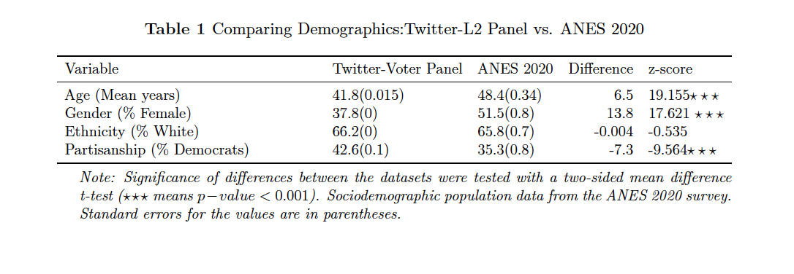
```
]

---
## Online vs Offline Exposure

.center[
```{r out.width="100%"}
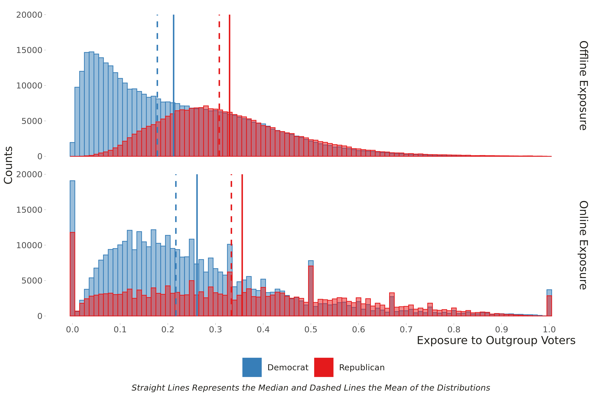
```
]


---
## Online vs Offline Exposure by Quantiles

.center[
```{r out.width="100%"}
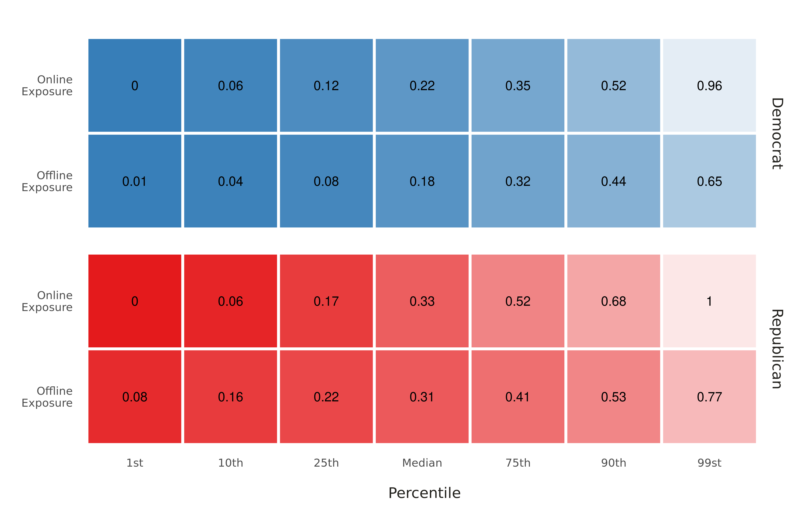
```
]

---
## Comparing Offline and Online Exposure Across Subgroups

.center[
```{r out.width="100%"}
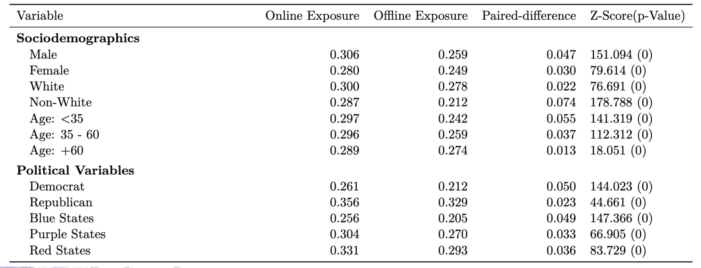
```
]

---
## Correlation between online and offline exposure

.center[
```{r out.width="80%"}
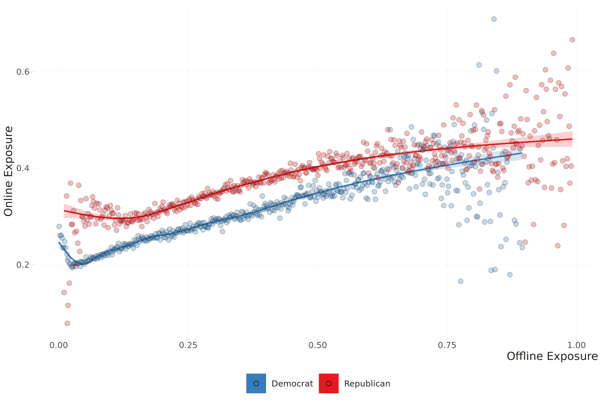
```
]
---
## Modeling Online Echo Chambers

.center[
```{r out.width="65%"}
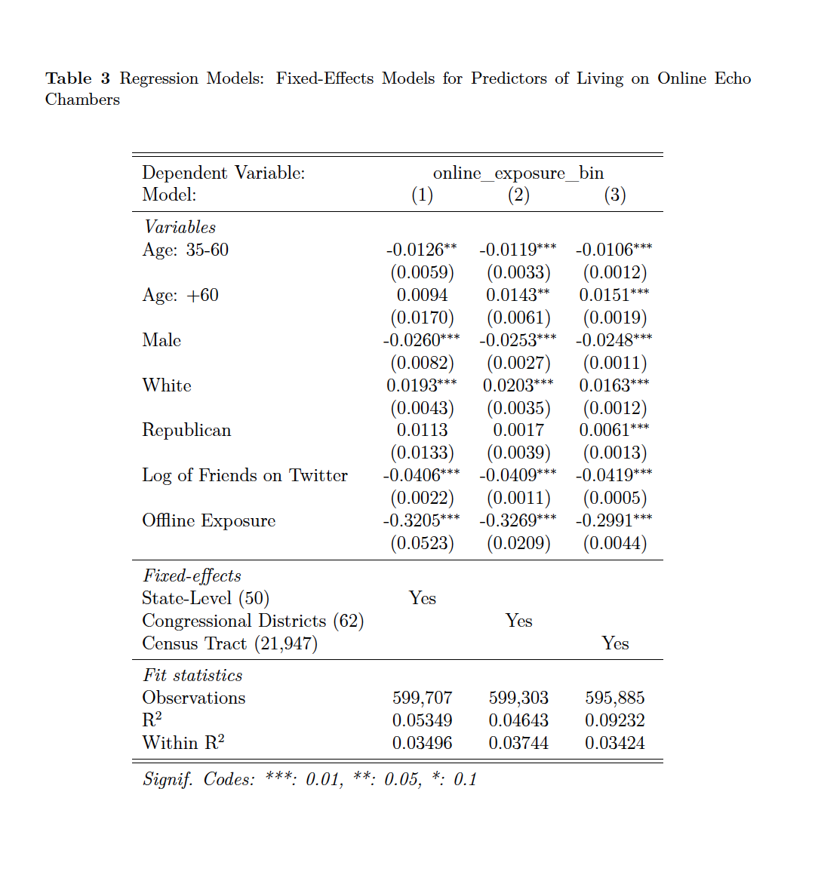
```
]

---
class:middle
## Next Steps

--

- Estimating Partisanship for all matched voters

--

- Processing interactions data

--

- Estimate the effects of offline on online behavior: 
  - .red[what would you be interested in seeing here?]

-- 

- .red[Any other research ideas to pursue with this dataset?]

--

---

class:inverse, middle, center

# Thank you!
  


