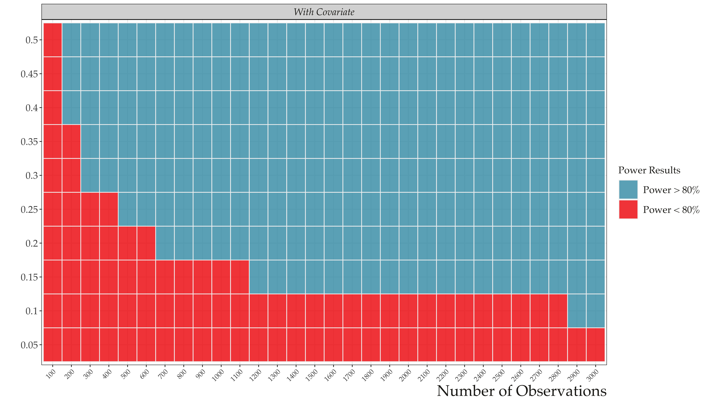
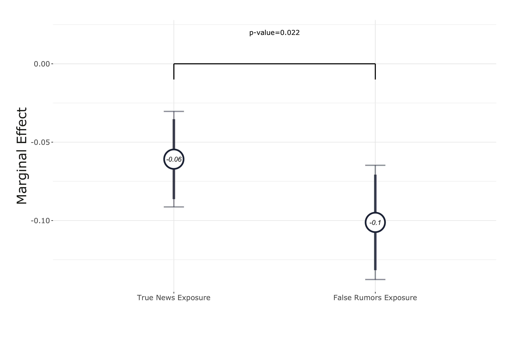
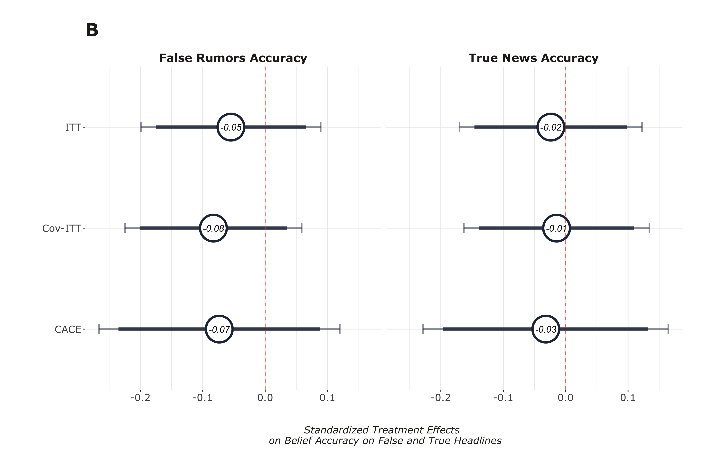
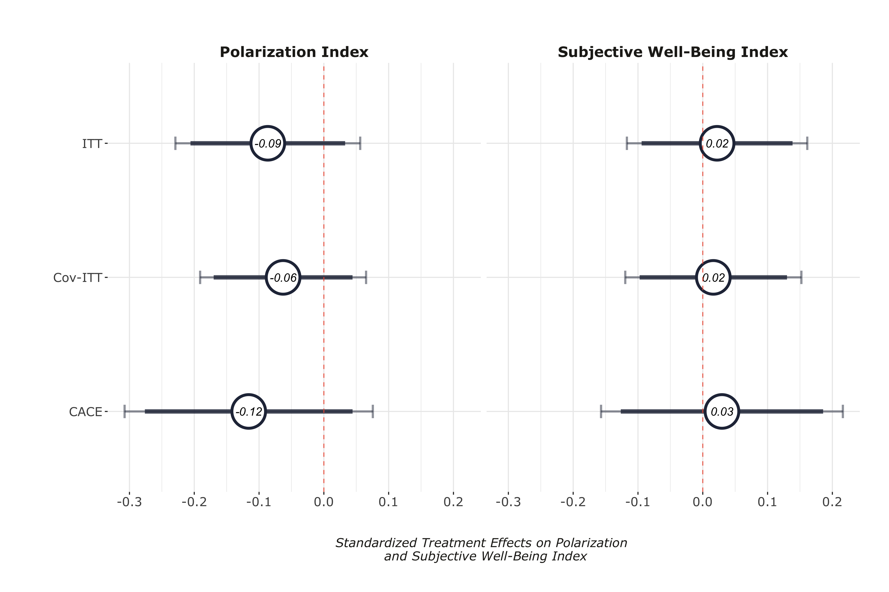
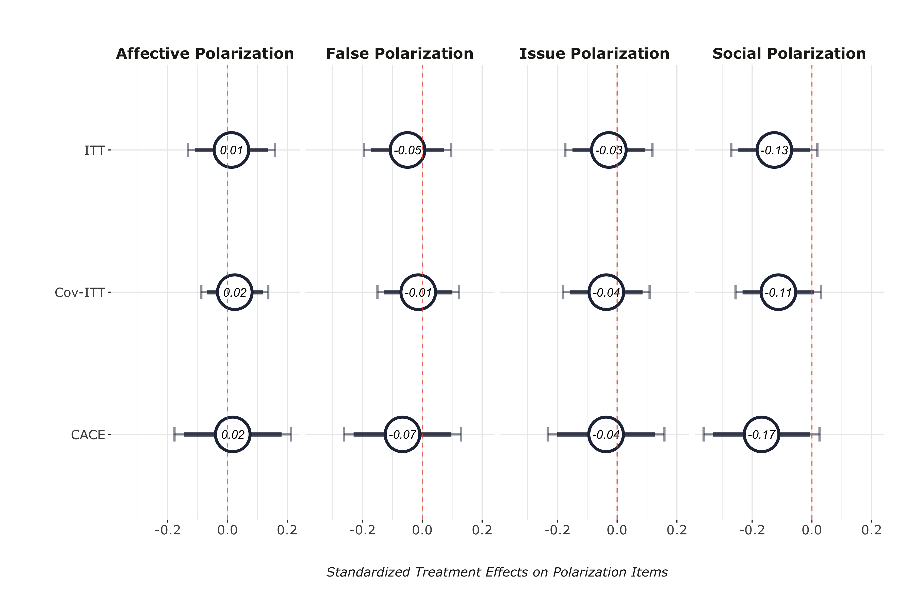

layout: true

<div class="my-footer"><span>Tiago Ventura (CSMaP) &nbsp &nbsp &nbsp &nbsp &nbsp &nbsp &nbsp &nbsp &nbsp &nbsp &nbsp &nbsp &nbsp &nbsp &nbsp &nbsp &nbsp &nbsp &nbsp &nbsp &nbsp &nbsp &nbsp CSMaP Conference</span></div> 

```{r setup, include=FALSE}
options(htmltools.dir.version = FALSE)
knitr::opts_chunk$set(messagwese=FALSE, warning = FALSE)
xaringanthemer::style_mono_light(base_color ="#23395b", 
                                  title_slide_text_color="#ffff", 
                                  title_slide_background_color = "#23395b", 
                                  background_color = "#fff", 
                                  link_color =  "#23395b")
options(htmltools.dir.version = FALSE)
knitr::opts_chunk$set(message=FALSE, warning = FALSE, error=TRUE, echo=FALSE, cache=TRUE)
```

```{r style-share-again, echo=FALSE}
xaringanExtra::use_tile_view()
xaringanExtra::use_panelset()

#xaringanExtra::style_share_again(
#  share_buttons = c("twitter", "linkedin", "pocket")
#)
```

---
class:middle
## Motivation


```{r out.width="100%"}
knitr::include_graphics("./presentation/nyt.png")
```

---
### Research Goal

<br>
<br>
<br>
<br>

.content-box-gray[Provide causal estimates for the effects of exposure to misinformation on WhatsApp on political outcomes.]

---
class: inverse, center, middle

## WhatsApp Multimedia Deactivation Field Experiment during the three weeks leading up to the 2022 Presidential Election in Brazil.

---
class: middle

`r icons::fontawesome("arrow-alt-circle-right")` **Our Design:** Cut the primary channels through which users are exposed to misinformation and polarizing content: videos, images and audios .red[(Machado et al., 2019; Resende et al., 2019; Garimella and Tyson, 2018; Garimella and Eckles, 2020; Batista Pereira et al., 2023).]

--

`r icons::fontawesome("arrow-alt-circle-right")` **Experiment:** Offer respondents a monetary incentive to

- Disable their automatic download of media on WhatsApp.
- Do not purposefully click and watch any media on WhatsApp.

--

`r icons::fontawesome("arrow-alt-circle-right")` **Treatment Period:** Three weeks:

- **Start:** Three weeks before general election in Brazil.
- **End:** three days after the voting day.

---
class:center, middle, inverse

## Overview of the Experiment

---

## Treatment Assignment

.pull-left[

**Start**: September 15.

**Treatment**:

- Turn off the automatic download.
- Three .red[weeks] without consuming any multimedia.
  
**Control**: Three .red[days] without consuming any multimedia.

**Invited**: 1,135 respondents 

**Completed**: 773 respondents
]


.pull-right[
.center[
```{r  out.width="80%"}
knitr::include_graphics("./output/iphone_deact.jpeg")
```
]
]

---

## Compliance Checks


.pull-left[

**Compliance Tasks:**

- Screenshots of WhatsApp storage intormation 

- Every week + final survey

- After the  first compliance check, the control group was activated

]


.pull-right[
.center[
```{r  out.width="80%"}
knitr::include_graphics("./output/iphone_compliance.jpeg")
```
]
]

---
class:middle
## Outcomes

--

**Self-Reported Exposure and Accuracy Judgment**

  - False Rumors published on fact-checking webpages during the month of the experiment + True News stories headlines from mainstream media.

--

**Polarization**

  - Affective polarization (Feeling Thermometer).
  - Social Polarization (Willingness to engage with outgroup voter).
  - Issue Polarization (Abortion, gun control, etc..).
  - Perceptions about ideological polarization ('Where do I observe the two main candidates?').

--

**Subjective Well-being**

  - How did you feel for the past three weeks? (Happy, Anxious, etc...).

--

---

## Recruitment and Power Analysis


.pull-left[
**Complete Responses:** 732.
]

.pull-right[

**Attrition Rate:** 5.3%.

]

.center[

```{r  out.width="70%"}

```

]

---
class: center, middle, inverse

# Results

---

### First-Stage Results

.center[
```{r  out.width="90%"}
knitr::include_graphics("./output/models_compliance.png")
```
]

---
### Effects on Exposure to Misinformation Rumors (H1)

.center[
```{r  out.width="90%"}
knitr::include_graphics("./output/exposure_h1.png")
```
]

---
### Reduction in exposure is large for false news (H1)

.center[
```{r  out.width="90%"}

```
]

---
### Effects on Belief Accuracy (H2)

.center[
```{r  out.width="90%"}

```
]

---

### Belief Accuracy Conditional on WhatsApp usage for Politics

.center[
```{r  out.width="90%"}
knitr::include_graphics("./output/sif_het_use_whatsapp_fac.png")
```
]


---
### Effects on Polarization & Subjective Well-Being (H3 & H4)

.center[
```{r  out.width="90%"}

```
]

---
### Polarization Outcomes

.center[
```{r  out.width="90%"}

```
]

---

class: middle

## Discussion


--

`r icons::fontawesome("arrow-alt-circle-right")` **WhatsApp is an important vector through which voters receive misinformation in Brazil at .red[a higher rate] compared to true news.**

--

`r icons::fontawesome("arrow-alt-circle-right")` **The null results provide support for a .red[minimalist view of the short-term causal effects] of exposure to misinformation on WhatsApp on political attitudes.**
--

`r icons::fontawesome("arrow-alt-circle-right")`  **Exposure to misinformation .red[does not] mechanically affect attitudes**

--

---
class:middle

## Limitations

--

- Scope conditions: focus on direct effects of WhatsApp. 

--

- Larger effect might exist exactly in hard to reach groups.

--

- Small effect size vs power

--

---
class: middle

## Next steps. 

--

### Replication, Replication, Replication

--

---
class:middle, center

## Thank you!

---

## Examples of Misinformation Outcomes

### False Item: 

_Only complete votes are counted by the electoral justice. If the voter only votes for the President, and votes blank for all the other races, the vote is considered a partial vote, and will be annulled_

### True Item:

_After consecutive reductions, the current oil price in Brazil is below the global average value_


