layout: true

<div class="my-footer"><span>Tiago Ventura &nbsp &nbsp &nbsp &nbsp &nbsp &nbsp &nbsp &nbsp &nbsp &nbsp &nbsp &nbsp &nbsp &nbsp &nbsp &nbsp &nbsp &nbsp &nbsp &nbsp &nbsp &nbsp &nbsp  REU 2024 </span></div> 

```{r setup, include=FALSE}
library(xaringanthemer)
options(htmltools.dir.version = FALSE)
knitr::opts_chunk$set(messagwese=FALSE, warning = FALSE)
xaringanthemer::style_mono_light(base_color ="#23395b", 
                                  title_slide_text_color="#ffff", 
                                  title_slide_background_color = "#23395b", 
                                  background_color = "#fff", 
                                  link_color =  "#C93312")
options(htmltools.dir.version = FALSE)
knitr::opts_chunk$set(message=FALSE, warning = FALSE, error=TRUE, echo=FALSE, cache=TRUE)
```

```{r style-share-again, echo=FALSE}
xaringanExtra::use_tile_view()
xaringanExtra::use_panelset()

#xaringanExtra::style_share_again(
#  share_buttons = c("twitter", "linkedin", "pocket")
#)
```

---
name: about-me
layout: false
class: middle, center

## About me


### Tiago Ventura [`r icons::ionicons("logo-twitter")`](https://twitter.com/_Tiagoventura) [`r icons::ionicons("logo-github")`](https://github.com/TiagoVentura) [`r icons::ionicons("mail")`](tv186@georgetown.edu) [`r icons::ionicons("link-outline")`](https://www.venturatiago.com) 

#### Assistant Professor in Computational Social Science

--

.fade[Postdoc NYU's Center for Social Media and Politics]

--

.fade[Misinformation Researcher at Twitter]

--

.fade[PhD in Political Science, University of Maryland, College Park]

--

---
class:middle

### My Research

I am **Computational Social Scientist**, which means I mix **computer science/data science** techniques applied to **social science** questions (mostly politics), and vice-versa. 

--

- **Using Twitter data**: understand why people [share content on online](https://journals.sagepub.com/doi/abs/10.1177/19401612211057068?journalCode=hijb#core-collateral-metrics) and formation of [ideological bubbles](https://academic.oup.com/joc/article-abstract/73/1/14/6767335?redirectedFrom=fulltext&login=false#377639098) on social media, and the composition of online and offline echo-chambers 

--

- **Using Facebook Data + Experiments**: the effects of exposure to [streaming chats on perceptions of public debates](https://academic.oup.com/joc/article-abstract/71/6/947/6415947?redirectedFrom=fulltext&login=false) and partisan and [toxicity dynamics](https://journalqd.org/article/view/2573/1820) on streaming chats (twitch or facebook lives)

--

- **Using Survey Experiments**: sharing of vaccine fact-checking corrections online due to [framing effects](https://www.nature.com/articles/s41598-024-53337-0) and [partisan identity](https://journals.sagepub.com/doi/10.1177/14614448231193709)

--

- **Using large-scale field experiments**: how social media usage affects politics - on [WhatsApp](https://papers.ssrn.com/sol3/papers.cfm?abstract_id=4457400) and [across feed based apps](https://globalsocialmediastudy.com/)

--

- **Ongoing projects:** using LLMs to help people identify misinformation rumors, measuring the prevalence of human-generated vs ai-generated content on social media, and developing methods to incorporate metadata from text on LLM models.

--

---
class: middle

## Plans for today:

- What do we know about the role of social media on society?

- Experimentation as an approach: the role of deactivation designs

- Exposure Beyond Traditional Feeds: WhatsApp Multimedia Deactivation Experiments

- Ongoing project: 

  - Multi-Country WhatsApp Deactivation
  
  - Global Social Media Screen time Experiment 

- Break

- WhatsApp Data Donation Tool

- In-class Activity: Designing your own experiment

---
class: middle
### The Effects of Social Media: What Do We (Think We) Know?

Recent meta-analysis (.midgrey[Lorenz-Spreen et. al. 2022])  on this topic (496 articles).


- **Social media as a "double-edge sword"**:
   - .red[Positive associations] with information consumption & political participation 
   - .red[Negative associations] with trust in institutions and polarization


- **Context Matters**:
   - Some evidence of more positive outcomes in autocracies and emerging
democracies vs. established ones
  - Negative outcomes, such as decline in trust, were more pronounced in established democracies
  - Other characteristics may matter, i.e. offline networks and activities,
linguistic diversity

---
class: middle
### Critical Gap I: Focus on W.E.I.R.D countries

.center[
```{r out.width="100%"}
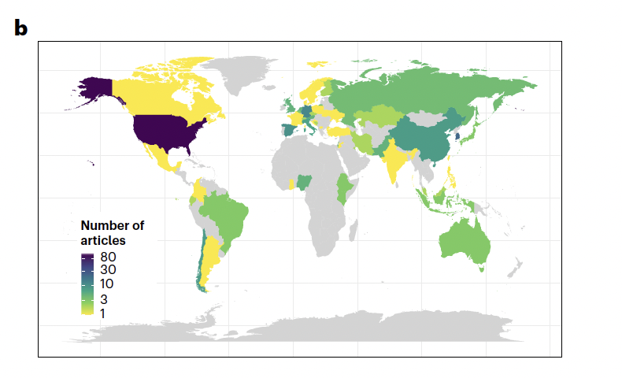
```
]


---
class: middle
### Critical Gap II: Evidence is mostly correlational

.center[
```{r out.width="70%"}
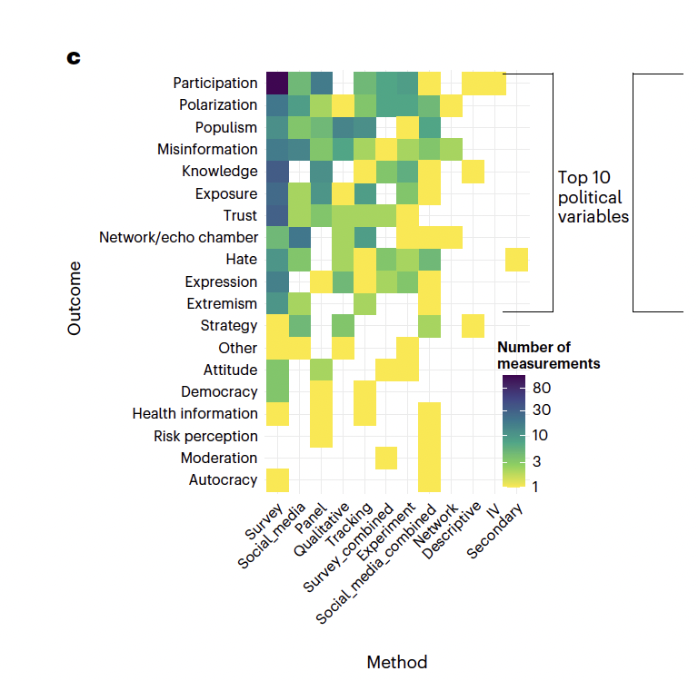
```
]

---
class: middle
## Challenges to study the impacts of social media

`r icons::fontawesome("arrow-alt-circle-right")` Privacy and Data Access for Independent Researchers


`r icons::fontawesome("arrow-alt-circle-right")` Observational data can tell us little about causal effects of social media.

`r icons::fontawesome("arrow-alt-circle-right")` .red[Randomized interventions allow us to isolate causal effects.] 

`r icons::fontawesome("arrow-alt-circle-right")`  Not many interventions are possible for researchers without collaboration with the industry

---
class: middle
### Social Media Deactivation Experiments

- Consider an .red[hypothetical world] in which: 

  - one population where social media has been adopted and widely used as we know
  - another population where social media does not exist. 

- In the .red[absence of this perfect counterfactual], researchers have  proxied for this scenario by deploying a class of experimental designs commonly referred to as .red[deactivation studies]

- Users are randomly instructed to temporarily reduce/deactivated their social media usage 

   - Facebook in US, Bosnia, France and Cyprus
   - Instagram and Facebook in the recent 2020 US election
   - WhatsApp Multimedia in Brazil, 2022. 

---
class: middle, center
# US Facebook Deactivation

```{r out.width="70%"}
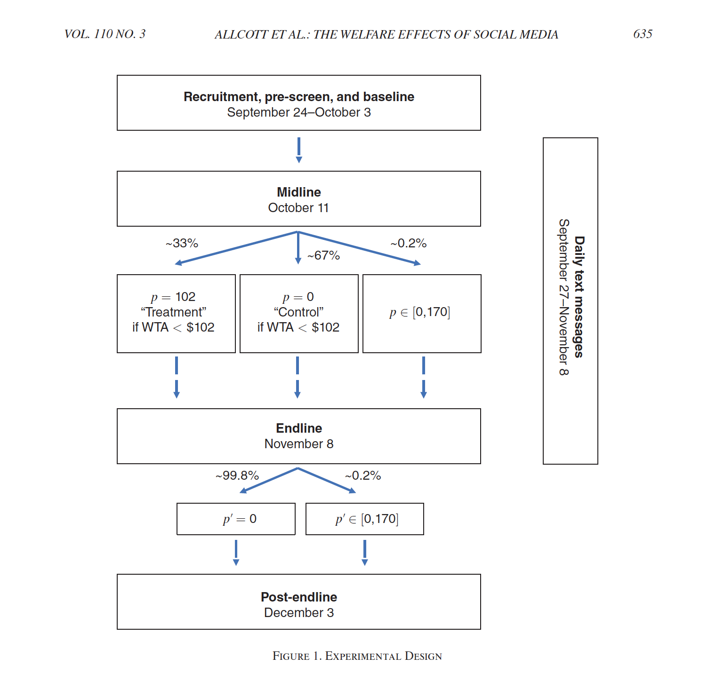
```

---
class:middle
## WhatsApp & Misinformation

```{r out.width="100%"}
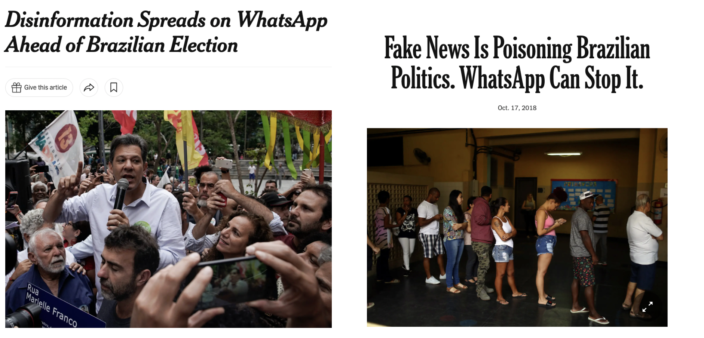
```

---
class:middle

### WhatsApp Multimedia Deactivation Experiment

--

`r icons::fontawesome("arrow-alt-circle-right")` **Our Design:** Cut the primary channels through which users are exposed to misinformation and polarizing content: videos, images and audios .midgrey[(Machado et al., 2019; Resende et al., 2019; Garimella and Tyson, 2018; Garimella and Eckles, 2020; Batista Pereira et al., 2023).]

--

`r icons::fontawesome("arrow-alt-circle-right")` **Experiment:** Offer respondents a monetary incentive to

- Disable their automatic download of media on WhatsApp.
- Do not purposefully click and watch any media on WhatsApp.

--

`r icons::fontawesome("arrow-alt-circle-right")` **Treatment Period:** Three weeks:

- **Start:** Three weeks before general election in Brazil.
- **End:** three days after the voting day.

--

`r icons::fontawesome("arrow-alt-circle-right")` **Outcomes:** 
- Exposure and Beliefs to online misinformation, 
- Outgroup polarization 
- Subjective well-being. 

--

---
class:center, middle
# In practice...

```{r out.width="35%"}
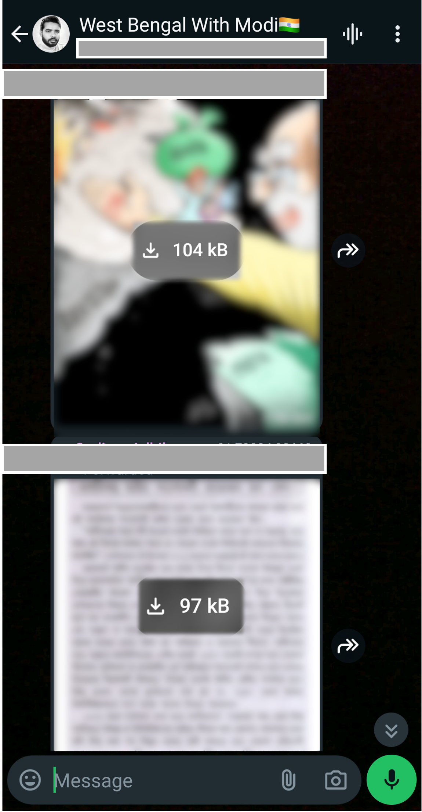
```


---
class:center, middle
# it is just friction!!

```{r out.width="35%"}
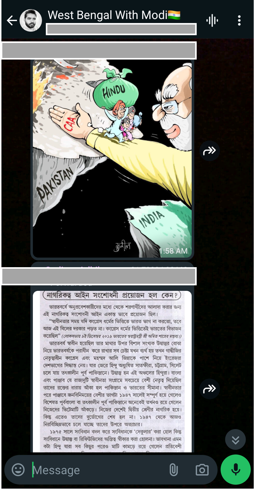
```

---

### First-Stage Results

.center[
```{r  out.width="90%"}
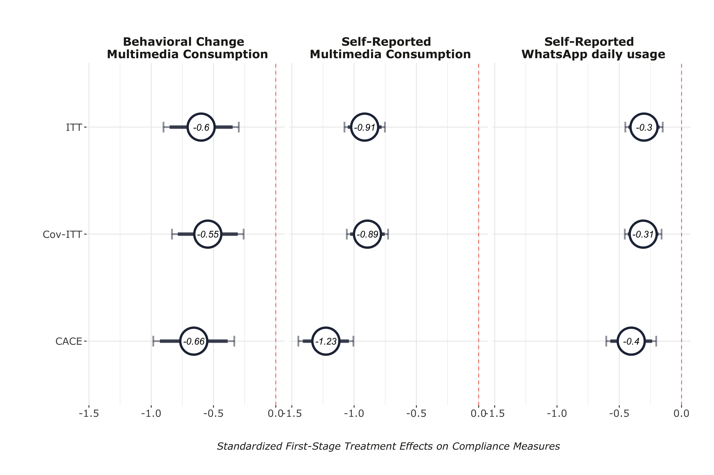
```
]

---
### Effects on Exposure to Misinformation Rumors (H1)

.center[
```{r  out.width="90%"}
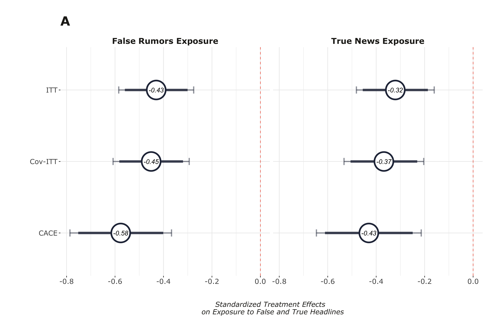
```
]

---
### Effects on Belief Accuracy (H2)

.center[
```{r  out.width="90%"}
knitr::include_graphics("outputs/belief_accuracy_h2.png")
```
]

---
### Effects on Polarization & Subjective Well-Being (H3 & H4)

.center[
```{r  out.width="90%"}
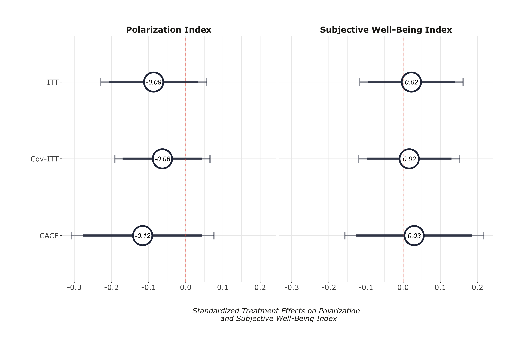
```
]

---
class: center, middle, inverse

# Ongoing Research

---
class: middle

## More WhatsApp Experiments: is Brazil just a fluke?


`r icons::fontawesome("arrow-alt-circle-right")` **Extend our previous design to two other elections**: India and South Africa, 2024

`r icons::fontawesome("arrow-alt-circle-right")` **Two distinct interventions:** 

-  Time: Limit daily WhatsApp usage to 10 minutes
-  Media: Do not consume multimedia content received via WhatsApp 
  
`r icons::fontawesome("arrow-alt-circle-right")` **Treatment and control**

- Treatment: Change settings and behavior for 4 weeks (one month)
leading up to election
- Control: Change only behavior for 3 days a month before election


---
class: middle
## Early Results


.pull-left[
```{r  out.width="90%"}
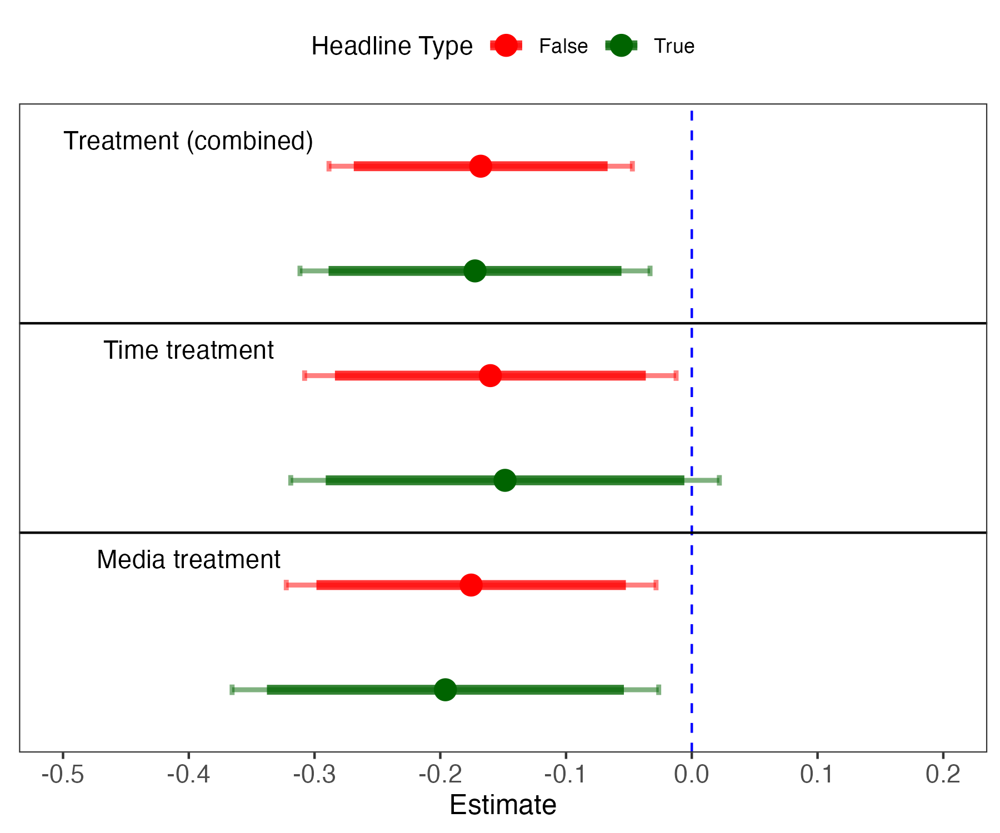
```
]

.pull-right[
```{r  out.width="90%"}
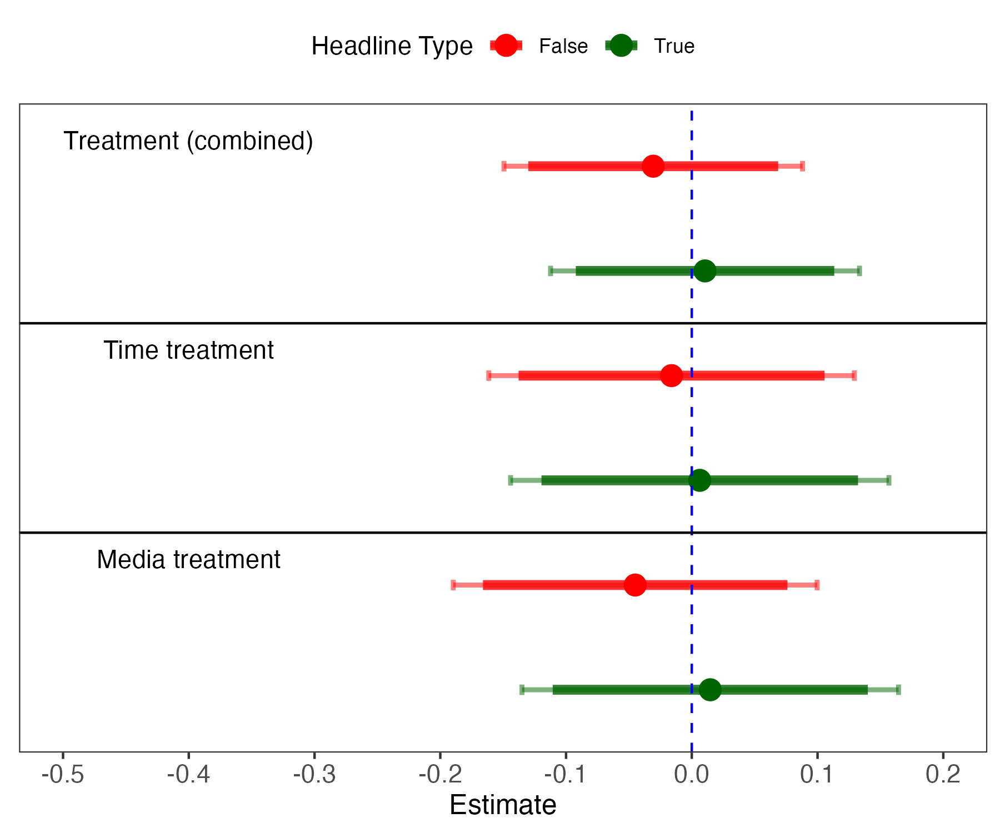
```
]

---
class: middle, inverse

# What about other social media platforms? Maybe WhatsApp is just another simple messasging app...


---
class: middle
### Global Social Media Experiment

`r icons::fontawesome("arrow-alt-circle-right")` A global study testing the .red[causal impact of social media] usages reduction around the globe.

`r icons::fontawesome("arrow-alt-circle-right")` Open call for collaborators: 

- Recruited more than 700 potential collaborators across 76 countries

`r icons::fontawesome("arrow-alt-circle-right")` In each country, participants will be randomly assigned to temporarily .red[reduce their social media usage] for two weeks 

`r icons::fontawesome("arrow-alt-circle-right")` Main Points: 

- Collects data across the .red[many countries] ~> better powered to measure contextual effects

- .red[Multi-platform design]: major social media app (Facebook, Instagram, TikTok, Youtube, Twitter/X)

---
class: middle

### Setting up a Global Collaboration

A large-scale project as this requires .red[substantive knowledge] and .red[scholars] on the ground across multiple countries:

- Inspired by prior "Global Studies": 
   - [International Collaboration on Social and Moral Psychology: Covid-19](https://icsmp-covid19.netlify.app/)
   - [International Collaboration to Understand Climate Action](https://manylabsclimate.wordpress.com/)
   
   
- On March 27, we launched an open call for collaborators:
   - Over 700 researchers residing in 76 countries signed up
   

- All researchers received a call to sign a [collaboration agreement](https://docs.google.com/document/d/1ddid4wZlDy9kazVcYYaW2nimCTzhyPGQ-QYCy2SLSW8/edit#heading=h.9vexkqhq787q)


---
class: middle
### Design Workflow

```{r out.width="100%"}
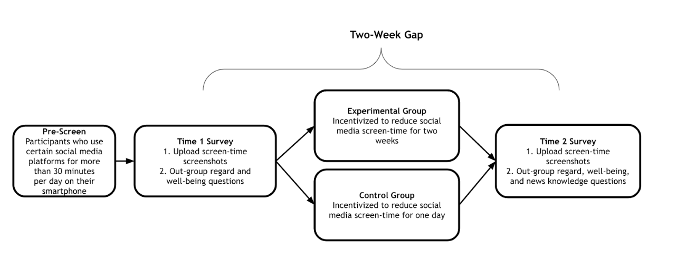
```

---
class: middle
### Outcomes


- **News knowledge**
   - Battery of true headlines + false placebo headlines from the weeks of the intervention

- **Outgroup Polarization (Partisan and Ethnicity):**
   - Affective Polarization
   - Social Polarization
   - Misperceptions using traits polarization
   

- **Subjective well-being:**
  - Self-Reported feelings scale
  
---
class: inverse, middle, center
## Results?

---
class: inverse, middle, center
## Send me an email in a year!

---
class: middle

## What to take from this?

--
`r icons::fontawesome("arrow-alt-circle-right")` **Substantively:** The role of social media on shaping political attitutes is likely more nuanced than we see in the news. 
  
   - Bad content is overly concentrated on a community of users who are seek for this content. 
      -  and social media tends to make bad content more visible
      
   - People still watch a lot of TV!
   - On average, effects are probably just null. 

--

`r icons::fontawesome("arrow-alt-circle-right")` **As a scientific enterprise:**
  
   - More research collecting non-western data
   - More creative experiments
   - More alternative ways to collect data (while social media companies are not regulated)

--
   
---
class:center, middle, inverse

## WhatsApp Data Donation Pipeline
   

---
class:middle

## Designing your own experiment

In the next 30 minutes, I want you to think about an experimental design you would like to design. Here are the instructions: 

- Topics: must be about misinformation and the digital world
    - e.g interventions to reduce beliefs
    - e.g. interventions to understand what make people more willing to beleif or share or receiving misinfo
    - e.g. other deactivation designs

- Design: you .red[must] clearly articulate what treatment and control would be

- Outcomes: you .red[must] define which outcomes you want to measure. 

- Example: read this [grant proposal](https://docs.google.com/document/d/1KYF7EGBx2wKrSj3fWbYIbEAT5C1qgN67d9zCY6L-qOc/edit) I am working on. Feel free to use this proposal as a baseline for you to design your own interventions. 

