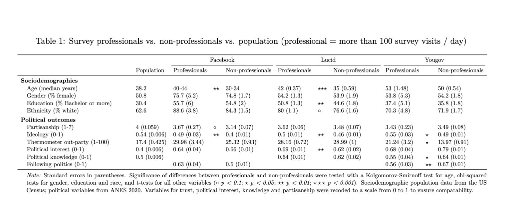

layout: true

<div class="my-footer"><span>Tiago Ventura (Georgetown University) &nbsp &nbsp &nbsp &nbsp &nbsp &nbsp &nbsp &nbsp &nbsp &nbsp &nbsp &nbsp &nbsp &nbsp &nbsp &nbsp &nbsp &nbsp &nbsp &nbsp &nbsp &nbsp &nbsp  APSA 2024 </span></div> 


```{r setup, include=FALSE}
library(xaringanthemer)
options(htmltools.dir.version = FALSE)
knitr::opts_chunk$set(messagwese=FALSE, warning = FALSE)
xaringanthemer::style_mono_light(base_color ="#23395b", 
                                  title_slide_text_color="#ffff", 
                                  title_slide_background_color = "#23395b", 
                                  background_color = "#fff", 
                                  link_color =  "#C93312")
options(htmltools.dir.version = FALSE)
knitr::opts_chunk$set(message=FALSE, warning = FALSE, error=TRUE, echo=FALSE, cache=TRUE)
```

```{r style-share-again, echo=FALSE}
xaringanExtra::use_tile_view()
xaringanExtra::use_panelset()

#xaringanExtra::style_share_again(
#  share_buttons = c("twitter", "linkedin", "pocket")
#)
```

---
class:middle
## Motivation


.center[
```{r out.width="80%"}
knitr::include_graphics("output/survey-ad.png")
```
]


---
class:middle

## Potential Issues with Online Samples

--

- **Inference**:
   - Representativeness of online surveys .red[(Ansolabehere and Schaffner 2014, Baker et. al 2014, Castorena et. al 2023)]
   - Inference from survey experiments .red[(Berinsky et al 2012, Coppock 2019)]

--

- **Quality issues**:
   - Low attentiveness, speeding and straightlinning .red[(Krupnikov, Nam, and Style 2021; Cornesse and Blom 2023)]
   - Cheating on surveys .red[(Munzert et. al 2022, Clifford, S and Jerit, 2016)]

--

- **Professionalism**:
   - How many surveys participants are completing per days? 
   - Does it matter for inference? 
   - Data Quality?
--


---
class:middle
### Contributtions and Research Questions

**Our contribution**: We use high-quality digital trace data to identify the prevalence of survey professionalism, and then its consequences for data quality and inference from online surveys. 

- **RQ1:** What is the degree of survey professionalism among online panel members? 

- **RQ2:** Do survey professionals differ from non-professionals sociodemographically and politically?

- **RQ3:** Do survey professionals exhibit higher between-waves response instability than non-professionals? 

- **RQ4:** What is the extent to which participants take the same questionnaire more than once, and do survey professionals engage in more repeated participation than non-professionals?


---
class:middle, center

# Data, Measurement and Design

---
class:middle

## Data

We collect web-browsing (digital trace data), .red[roughly 90 days of data], from participants across three U.S. samples: 

- **Facebook**: participants recruited through Meta Ads; install web-historian app; decide to donate/or not their digital trace data; 707 participants, 16.4 million visits, .red[90 days of data]


- **Lucid**: online market place for surveys; install web-historian app; decide to donate/or not their digital trace data; 2,222 participants, 73.8 million visits, .red[90 days of data]

- **Yougov**: high-quality survey provides; use their own data donation system; users decide to register with the data donation; 957 participants, 6.4 million, only .red[up to 60 days]


---
class:middle

## Definying a survey visit

#### Three-steps to define what counts as a survey url using their domain names:

- **Step 1:** Pre-Curated list of survey platforms (Bevec et al, 2021). We manually verify all the links, and end up with 229 platforms. 

- **Step 2:** Classify all hosts that contained the word ``survey'' as survey; Identify another 2,714 URL hosts. 

- **Step 3:**  Manually coded the 500 most frequently visited hosts from each of our three datasets; identify 291 additional URL hosts 


---
class:middle

## Survey Professionals

We provide four categories of survey professionalism. All results in the presentation us our first category. Results are largely robust across the different categorization. 


- **Definition 1:** a respondent that  has .red[on average more than 100 survey visits] per browsing active day

- **Definition 2:** a respondent that spends .red[more than 50 percent of all browsing time] on survey sites

- **Definition 3:** a respondent that has .red[more than 50 percent of all visits] to survey sites

- **Definition 4:** any of the three categories above.


---
class:middle, center

# Results

---
class:middle

#### RQ1: Time Spent on Survey Platforms vs Popular Domains

.center[
```{r out.width="90%"}
knitr::include_graphics("output/desc_prop_survey_visits_blues.png")
```
]

---
class:middle

#### RQ1: Prevalence of Survey Professionals Across The Three Online Panels

.center[
```{r out.width="90%"}
knitr::include_graphics("output/desc_survey_profesionals_all4.png")
```
]

---
class:middle

#### RQ2: Demographics and Political Differences Between Professionals and Non-Professionals

.center[
```{r out.width="90%"}

```
]

---
class:middle

#### RQ3: Data Quality Between Professionals and Non-Professionals

.center[
```{r out.width="90%"}
knitr::include_graphics("output/tab2.png")
```
]


---
class:middle

#### RQ3: Stability of Responses Across Survey Waves Between Professional and Non-Professionals 

.center[
```{r out.width="90%"}
knitr::include_graphics("output/between_waves_effects_no_controls.png")
```
]

---
class:middle

#### RQ3: Empirical p-value for the Stability of Responses Across Survey Waves Between Professional and Non-Professionals 

.center[
```{r out.width="90%"}

```
]

---
class:middle

#### RQ4: Repeated Survey Taking Comparion Professionals and Non-Professionals

.center[
```{r out.width="90%"}
knitr::include_graphics("output/tab3.png")
```
]

---
class:middle

## Discussion

--

- **Professional survey taking represents a .red[substantial portion] of the online activity of the analyzed samples**

   - 34.3% of Lucid,  7.9% of YouGov, 1.7% of Facebook

--

- **Although prevalent, they .red[do not introduce substantive inferential problems]**

   - lack of robust cross-sample difference suggests that survey professionalism does not introduce systematic demographic or political bias

   - Professionals speed through survey, and are more likely to straightline
      - Observable behaviors:Easy to detect and control for
   
   - No evidence of random responses over time

--

-  **One problematic consequence: many participants take one and the .red[same questionnaire repeatedly]**

--

---
class:middle, center

## Thank you!


