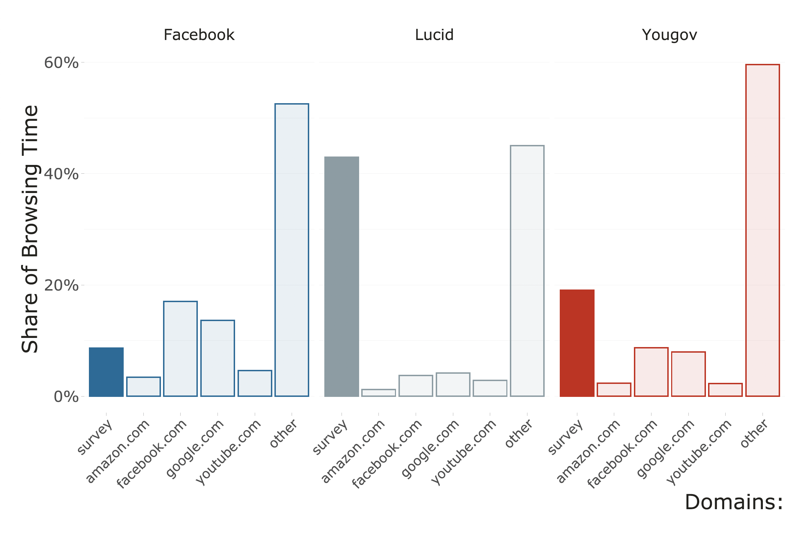
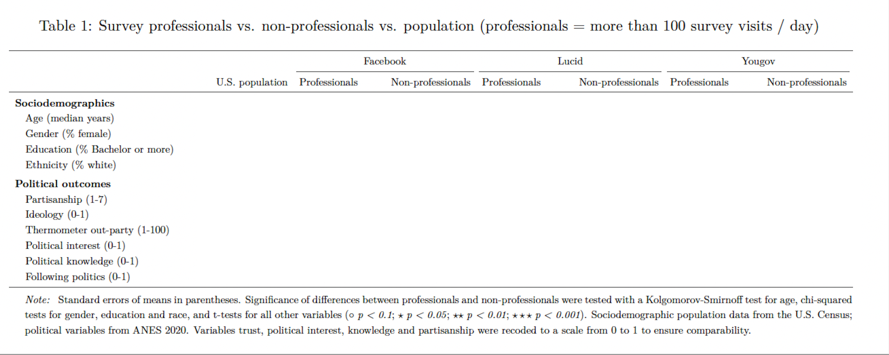
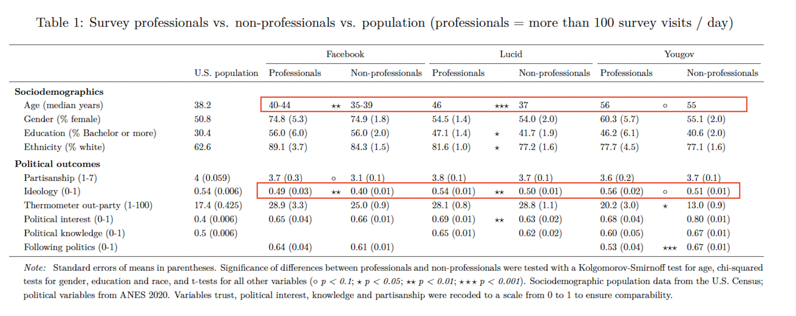
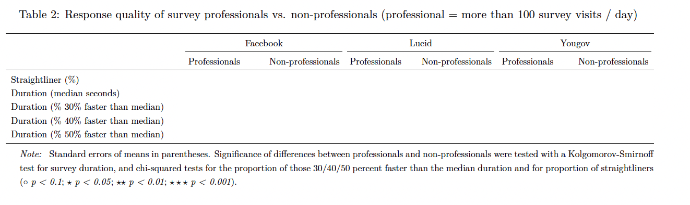
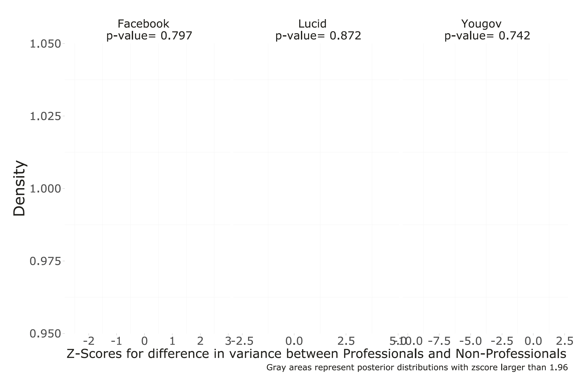
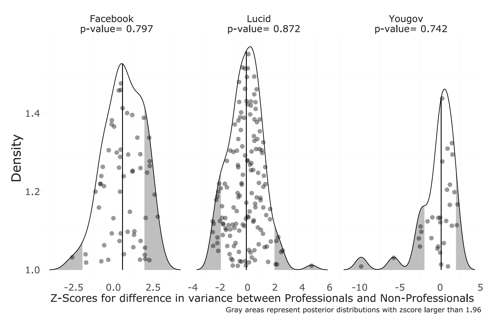

layout: true

<div class="my-footer"><span>Tiago Ventura (Georgetown University) &nbsp &nbsp &nbsp &nbsp &nbsp &nbsp &nbsp &nbsp &nbsp &nbsp &nbsp &nbsp &nbsp &nbsp &nbsp &nbsp &nbsp &nbsp &nbsp &nbsp &nbsp &nbsp &nbsp PaCSS/PolNet 2025</span></div> 

```{r setup, include=FALSE}
library(xaringanthemer)
options(htmltools.dir.version = FALSE)
knitr::opts_chunk$set(messagwese=FALSE, warning = FALSE)
xaringanthemer::style_mono_light(base_color ="#23395b", 
                                  title_slide_text_color="#ffff", 
                                  title_slide_background_color = "#23395b", 
                                  background_color = "#fff", 
                                  link_color =  "#C93312")
options(htmltools.dir.version = FALSE)
knitr::opts_chunk$set(message=FALSE, warning = FALSE, error=TRUE, echo=FALSE, cache=TRUE)
```

```{r style-share-again, echo=FALSE}
xaringanExtra::use_tile_view()
xaringanExtra::use_panelset()

#xaringanExtra::style_share_again(
#  share_buttons = c("twitter", "linkedin", "pocket")
#)
```


---
class:middle
## Social Science Research x Online Surveys

The vast possibility of recruiting participants online to take surveys or complete labeling tasks has profoundly affect social science research: 

--

- Reducing the costs of running surveys using high-quality survey panels


--

- Rely less on students' samples for survey experiments 

--

- Allowed the use of easy to recruit samples to deploy online field experiments 

--

- And facilitated combination of surveys + collection of digital trace data 

--

---
class:middle

## Professional Survey Takers


```{r  echo=FALSE, out.width = "80%", fig.align="center"}
knitr::include_graphics("output/survey-ad.png") 
```

---
class:middle
### Contributtions and Research Questions

**Our contribution**: We use high-quality digital trace data to identify the prevalence of survey professionalism, and then its consequences for data quality and inference from online surveys. 

--

- **RQ1:** What is the prevalence of survey professionalism among online panel members? 

--

- **RQ2:** Do survey professionals differ from non-professionals sociodemographically and politically?

--

- **RQ3:** Do survey professionals exhibit higher between-waves response instability than non-professionals? 

--

- **RQ4:** What is the extent to which participants take the same questionnaire more than once, and do survey professionals engage in more repeated participation than non-professionals?

--

---
class:middle, center

# Data, Measurement and Design

---
class:middle

## Data

We collect web-browsing (digital trace data), .red[roughly 90 days of data], from participants across three U.S. samples around 2019-2020: 

--

- **Facebook**: participants recruited through Meta Ads; install web-historian app; decide to donate/or not their digital trace data; 707 participants, 16.4 million visits, .red[90 days of data]

--

- **Lucid**: online market place for surveys; install web-historian app; decide to donate/or not their digital trace data; 2,222 participants, 73.8 million visits, .red[90 days of data]

--

- **Yougov**: high-quality survey provides; use their own data donation system; users decide to register with the data donation; 957 participants, 6.4 million, only .red[up to 60 days]

--
---
class:middle

## Definying a survey visit

#### Three-steps to define what counts as a survey url using their domain names:

--

**Step 1:** Pre-Curated list of survey platforms (Bevec et al, 2021). We manually verify all the links, and end up with 229 platforms. 

--

**Step 2:** Classify all hosts that contained the word ``survey'' as survey; Identify another 2,714 URL hosts. 

--

**Step 3:**  Manually coded the 500 most frequently visited hosts from each of our three datasets; identify 291 additional URL hosts 

--

---
class:middle

## Survey Professionals

We provide four categories of survey professionalism. All results in the presentation us our first category. Results are largely robust across the different categorization.

--

- **Definition 1:** a respondent that  has .red[on average more than 100 survey visits] per browsing active day

--

- **Definition 2:** a respondent that spends .red[more than 50 percent of all browsing time] on survey sites

--

- **Definition 3:** a respondent that has .red[more than 50 percent of all visits] to survey sites

--

- **Definition 4:** any of the three categories above.

--

---
class:middle, center

# Results


---
class:middle, center

## **RQ1:** What is the prevalence of survey professionalism among online panel members? 

---
class:middle

## Percent of all visits

.center[
```{r out.width="80%"}
knitr::include_graphics("output/visits.png")
```
]


---
class:middle

## Browsing Time

.center[
```{r out.width="80%"}

```
]


---
class:middle

## Prevalence of survey professionals

.center[
```{r out.width="90%"}
knitr::include_graphics("output/prevalence.png")
```
]


---
class:middle, center

## **RQ2:** Do survey professionals differ from non-professionals sociodemographically and politically?

---
class:middle

## RQ2: Demographics and Political Differences


.center[
```{r out.width="100%"}

```
]


---
class:middle

## RQ2: Demographics and Political Differences

.center[
```{r out.width="100%"}

```
]


---
class:middle, center

## **RQ3:** Do survey professionals exhibit higher between-waves response instability than non-professionals? 


---
class:middle

## RQ3: Quality of Responses 

.center[
```{r out.width="100%"}

```
]

---
class:middle

## RQ3: Quality of Responses 

.center[
```{r out.width="100%"}
knitr::include_graphics("output/tab2.png")
```
]

---
class:middle

## Response Stability

One critical threat to inference is if professionals show low quality in their responses, speeding through, and responding almost at random to complete more surveys. We measure this by: 

- Collect all questions asked in two-waves of our surveys. 

- Assume professionals and non-professionals should have similar levels of stability over time

- Estimate a bayesian heterocesdastic model, allows us to model variance over time, and identify if professionals vs non-professionals show difference variance between the waves


---
class:middle

### Professionals show similar levels of response stability than non-professionals

.center[
```{r out.width="90%"}

```
]

---
class:middle

### Professionals show similar levels of response stability than non-professionals

.center[
```{r out.width="90%"}

```
]

---
class:middle

### RQ3: Stability Over-Time II

.center[
```{r out.width="100%"}
knitr::include_graphics("output/stability2.png")
```
]

---
class:middle, center

## **RQ4:** What is the extent to which participants take the same questionnaire more than once, and do survey professionals engage in more repeated participation than non-professionals?

---
class:middle

## Online respondents attempt to take the same survey multiple times

.center[
```{r out.width="80%"}
knitr::include_graphics("output/rep.png")
```
]

---
class:middle

## Professionals do so more often

.center[
```{r out.width="100%"}
knitr::include_graphics("output/rep_professionals.png")
```
]

---
class:middle

## Discussion

--

`r icons::fontawesome("arrow-alt-circle-right")` **Professional survey taking represents a .red[substantial portion] of the online activity of the analyzed samples**

- 34.3% of Lucid,  7.9% of YouGov, 1.7% of Facebook

--

`r icons::fontawesome("arrow-alt-circle-right")` **Although prevalent, they .red[do not introduce substantive inferential problems]**

- lack of robust cross-sample difference suggests that survey professionalism does not introduce systematic demographic or political bias

- Professionals speed through survey, and are more likely to straightline
   - Observable behaviors: Easy to detect and control for
   
- No evidence of random responses or more variability  over time

--

`r icons::fontawesome("arrow-alt-circle-right")`  **One problematic consequence: many participants take one and the .red[same questionnaire repeatedly]**

--

---
class:middle, center

## Limitation: Surveys in the GenAI Era

.center[
```{r out.width="100%"}
knitr::include_graphics("ai_models.jpg")
```
]


---
class:middle, center

## Thank you!


