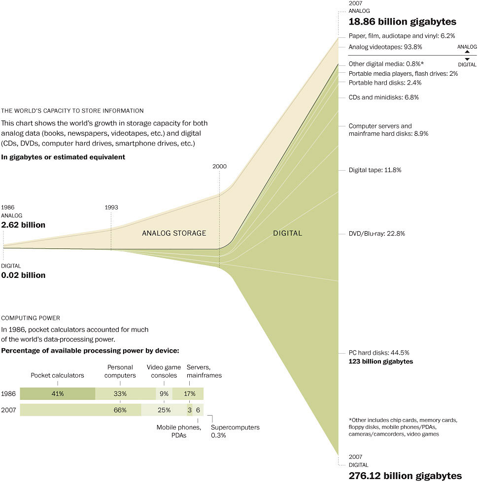
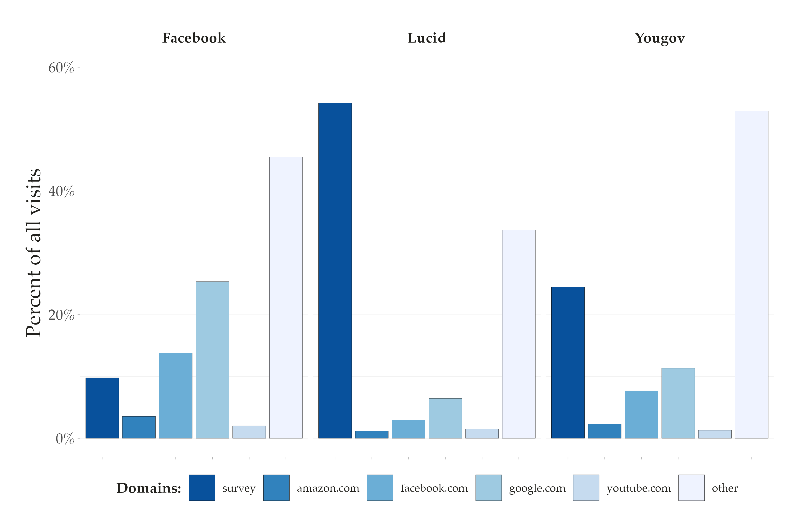
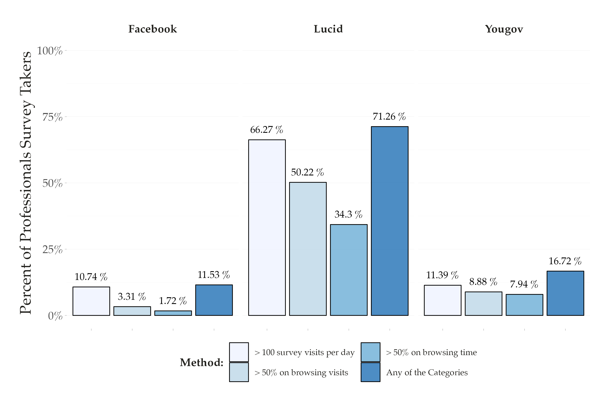
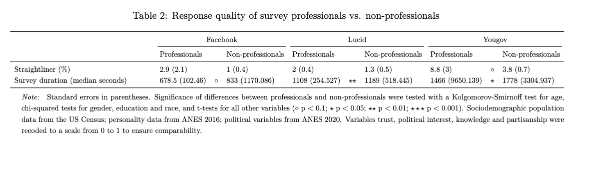
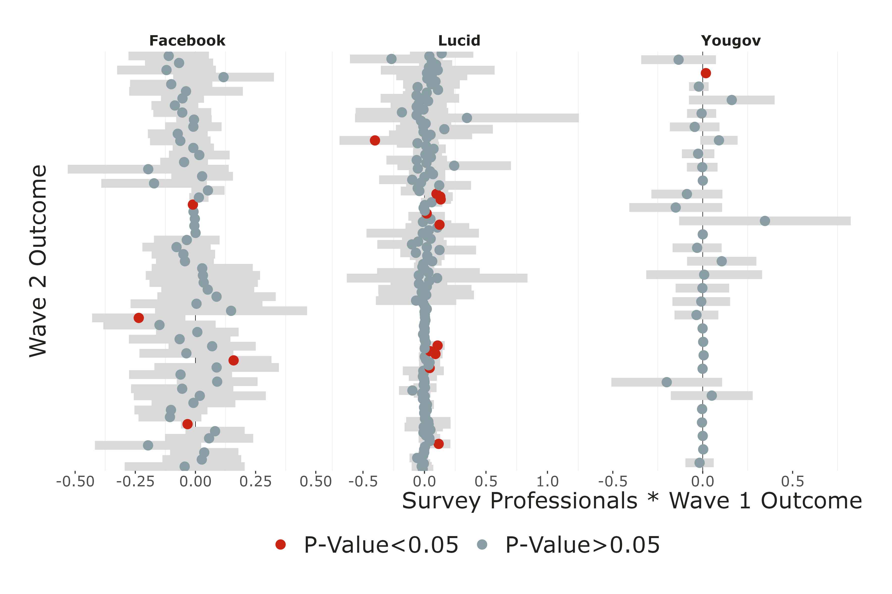
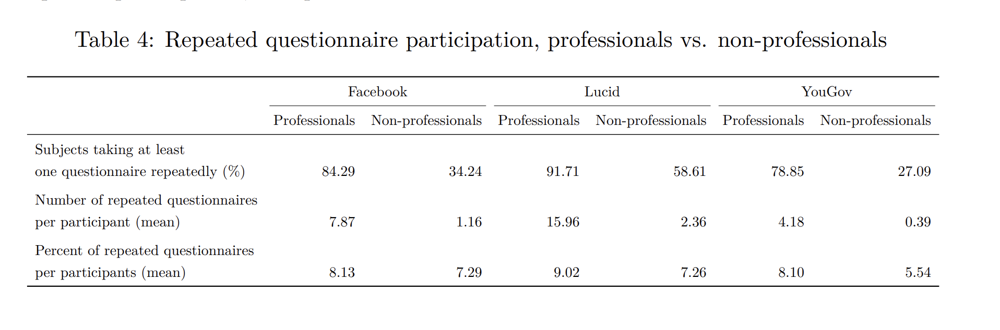

name: about-me
layout: false
class: about-me-slide, middle, center

## About me


### Tiago Ventura

#### Assistant Professor in Computational Social Science

[`r icons::ionicons("logo-twitter")` @TiagoVentura_](https://twitter.com/_Tiagoventura)
[`r icons::ionicons("logo-github")` TiagoVentura](https://github.com/TiagoVentura)
[`r icons::ionicons("mail")` tv186@georgetown.edu](tv186@georgetown.edu)
[`r icons::ionicons("link-outline")`https://www.venturatiago.com/](https://www.venturatiago.com/)

.fade[SICSS 2019 Alumni and organizer of two editions in Brazil]

---
class: middle
layout: true

<div class="my-footer"><span>Tiago Ventura &nbsp &nbsp &nbsp &nbsp &nbsp &nbsp &nbsp &nbsp &nbsp &nbsp &nbsp &nbsp &nbsp &nbsp &nbsp &nbsp &nbsp &nbsp &nbsp &nbsp &nbsp &nbsp &nbsp  SICSS Rutgers 2024 </span></div> 

```{r setup, include=FALSE}
library(xaringanthemer)
options(htmltools.dir.version = FALSE)
knitr::opts_chunk$set(messagwese=FALSE, warning = FALSE)
xaringanthemer::style_mono_light(base_color ="#23395b", 
                                  title_slide_text_color="#ffff", 
                                  title_slide_background_color = "#23395b", 
                                  background_color = "#fff", 
                                  link_color =  "#C93312")
options(htmltools.dir.version = FALSE)
knitr::opts_chunk$set(message=FALSE, warning = FALSE, error=TRUE, echo=FALSE, cache=TRUE)
```

```{r style-share-again, echo=FALSE}
xaringanExtra::use_tile_view()
xaringanExtra::use_panelset()

#xaringanExtra::style_share_again(
#  share_buttons = c("twitter", "linkedin", "pocket")
#)
```

---
## Digital Information Age


```{r  echo=FALSE, out.width = "70%", fig.align="center"}
 
```

---
## Online Surveys


```{r  echo=FALSE, out.width = "80%", fig.align="center"}
knitr::include_graphics("output/survey.png") 
```

---
## Social Science Research x Online Surveys

The capacity to recruit participants online to answer surveys/complete tasks has profoundly affect social sciences: 

--
- Reducing the costs of running surveys using high-quality survey panels

--

- Recruit participants from convenience samples ~ Facebook Ads, MTurk, Google ADs, Lucid, etc...

--

- Rely less on students' samples for experiments & be more creative with online experiments. 

--

- Use surveys to collect digital trace data ~ augmenting survey data with social media/online behavioral data

--

---
## Challenges: Professional Survey Takers


```{r  echo=FALSE, out.width = "80%", fig.align="center"}
knitr::include_graphics("output/survey-ad.png") 
```

---
## Our contributtion

#### User high-quality digital trace data to  identify the prevalence of survey professionalism, and then its consequences for researcher:

--
-  Previous research has relied entirely on self-reports, asking participants how often they do surveys or how many panels they belong to (e.g., Zhang et al. 2020; Matthijsse, De Leeuw, and Hox 2015)
  - Affected by social desirability bias: participants have incentices to hide

--

- We use three samples, recruited through distinct methods (online panel, social media, and market place), combining: 
  - multiple survey waves in each sample
  - Up to 90 days of browsing data for participants. 

--

---
class:middle
## Research Questions

- **RQ1** What is the degree of survey professionalism among online panel members? 

- **RQ2** Do survey professionals differ from non-professionals sociodemographically and politically?

- **RQ3** Do survey professionals exhibit higher between-waves response instability than non-professionals? 

- **RQ4** What is the extent to which participants take the same questionnaire more than once, and do survey professionals engage in more repeated participation than non-professionals?


---
class:middle, center

# Data, Measurement and Design

---
## Data

We collect web-browsing (digital trace data), .red[roughly 90 days of data], from participants across three U.S. samples: 

- **Facebook**: participants recruited through Meta Ads; install web-historian app; decide to donate/or not their digital trace data; 707 participants, 16.4 million visits, .red[90 days of data]


- **Lucid**: online market place for surveys; install web-historian app; decide to donate/or not their digital trace data; 2,222 participants, 73.8 million visits, .red[90 days of data]

- **Yougov**: high-quality survey provides; use their own data donation system; users decide to register with the data donation; 957 participants, 6.4 million, only .red[up to 60 days]


---
## Definying a survey visit

#### Three-steps to define what counts as a survey url using their domain names:

- **Step 1:** Pre-Curated list of survey platforms (Bevec et al, 2021). We manually verify all the links, and end up with 229 platforms. 

- **Step 2:** Classify all hosts that contained the word ``survey'' as survey; Identify another 2,714 URL hosts. 

- **Step 3:**  Manually coded the 500 most frequently visited hosts from each of our three datasets; identify 291 additional URL hosts 


---
## Survey Professionals

We provide four categories of survey professionalism. All results in the presentation us our first category. Results are largely robust across the different categorization. 


- **Definition 1:** a respondent that  has .red[on average more than 100 survey visits] per browsing active day

- **Definition 2:** a respondent that spends .red[more than 50 percent of all browsing time] on survey sites

- **Definition 3:** a respondent that has .red[more than 50 percent of all visits] to survey sites

- **Definition 4:** any of the three categories above.


---
class:middle, center

# Results

---

## RQ1: Time Spent on Survey Platforms

.center[
```{r out.width="80%"}

```
]

---
## RQ1: Distribution of Survey Professionals


.center[
```{r out.width="80%"}

```
]

---
## RQ1: Prevalence of survey professionals

.center[
```{r out.width="90%"}

```
]

---
## RQ2: Demographics and Political Differences

.center[
```{r out.width="100%"}
knitr::include_graphics("output/tab1.png")
```
]

---
## RQ3: Quality of Responses

.center[
```{r out.width="100%"}

```
]

---
## RQ3: Stability Over-Time

.center[
```{r out.width="100%"}
knitr::include_graphics("output/between_waves_density_controls.png")
```
]

---
## RQ3: Stability Over-Time II

.center[
```{r out.width="100%"}

```
]

---
## RQ4: Repeated Survey Taking

.center[
```{r out.width="100%"}

```
]

---
## Discussion


--

`r icons::fontawesome("arrow-alt-circle-right")` **Professional survey taking represents a .red[substantial portion] of the online activity of the analyzed samples**

- 34.3% of Lucid,  7.9% of YouGov, 1.7% of Facebook

--

`r icons::fontawesome("arrow-alt-circle-right")` **Although prevalent, they .red[do not introduce substantive inferential problems]**

- lack of robust cross-sample difference suggests that survey professionalism does not introduce systematic demographic or political bias

- Professionals speed through survey, and are more likely to straightline
   - Observable behaviors:Easy to detect and control for
   
- No evidence of random responses over time

--

`r icons::fontawesome("arrow-alt-circle-right")`  **One problematic consequence: many participants take one and the .red[same questionnaire repeatedly]**

--

---
class:middle, center

## Thank you!


