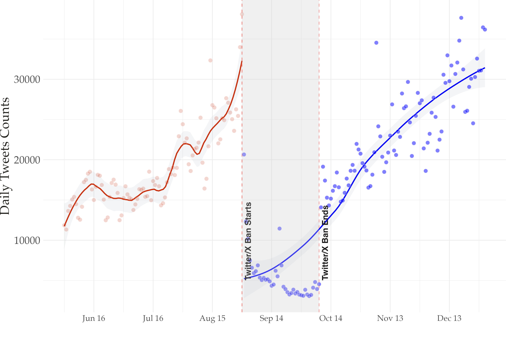
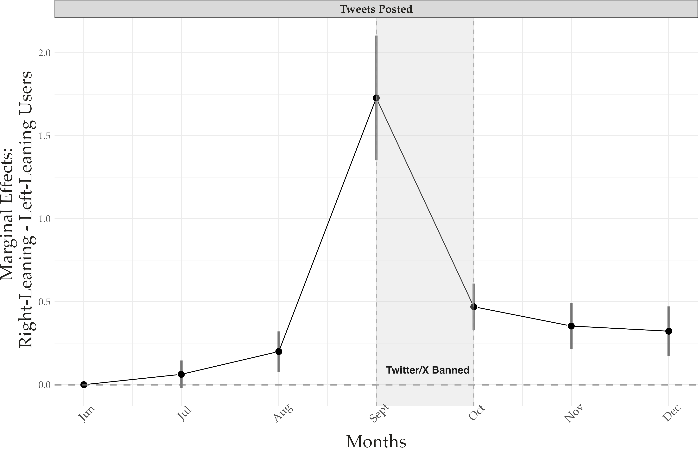
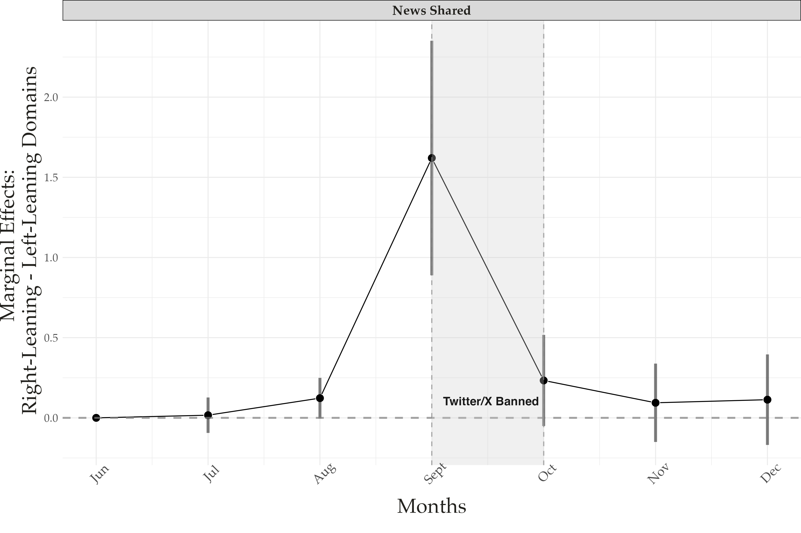
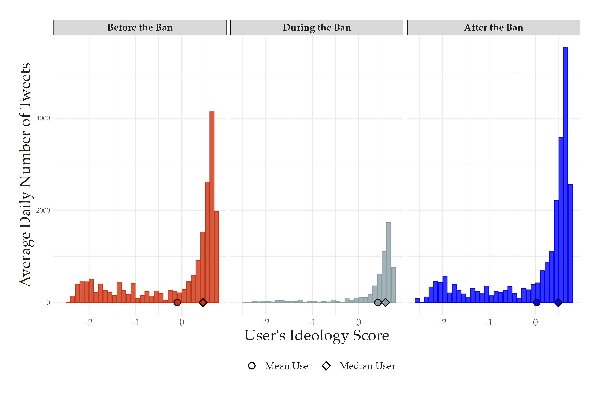
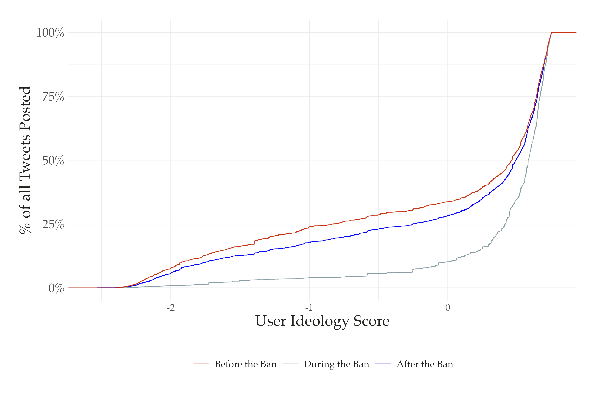
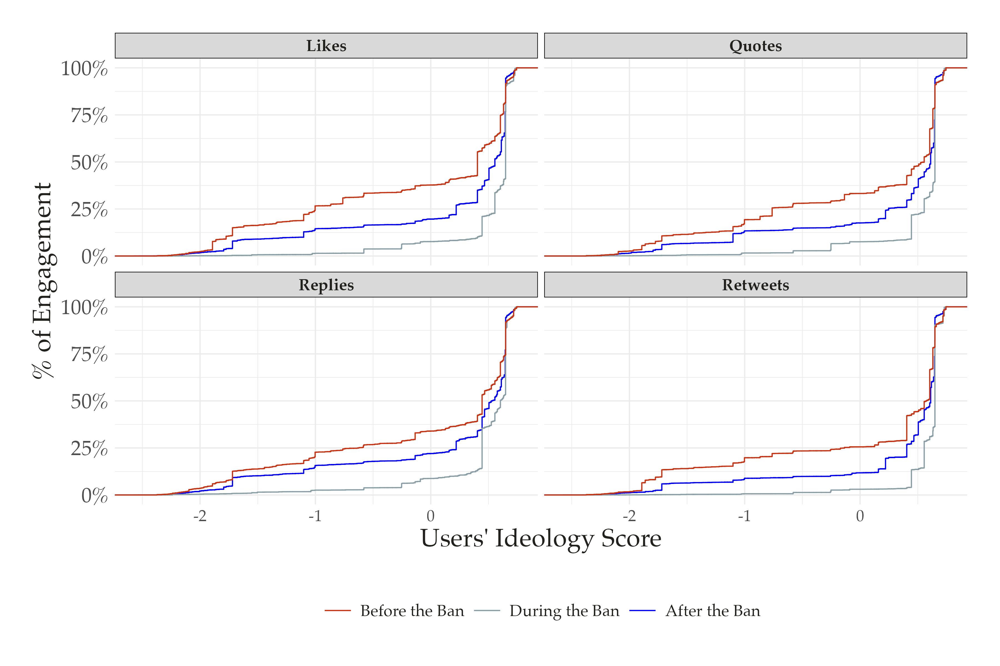
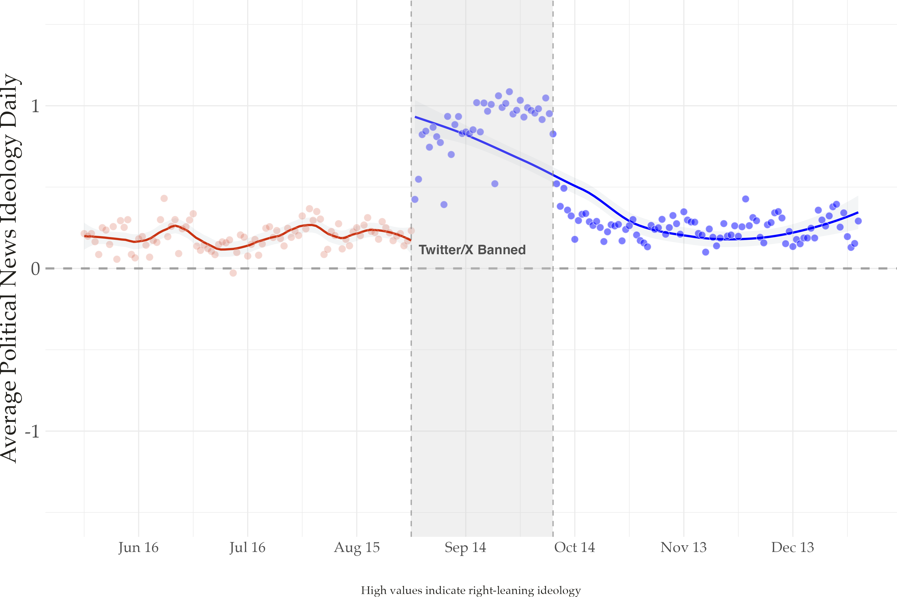

layout: true
<div class="my-footer"><span>Tiago Ventura (Georgetown University) &nbsp &nbsp &nbsp &nbsp &nbsp &nbsp &nbsp &nbsp &nbsp &nbsp &nbsp &nbsp &nbsp &nbsp &nbsp &nbsp &nbsp &nbsp &nbsp &nbsp &nbsp &nbsp &nbsp APSA 2025</span></div> 
```{r setup, include=FALSE}
library(xaringanthemer)
options(htmltools.dir.version = FALSE)
knitr::opts_chunk$set(messagwese=FALSE, warning = FALSE)
xaringanthemer::style_mono_light(base_color ="#23395b", 
                                  title_slide_text_color="#ffff", 
                                  title_slide_background_color = "#23395b", 
                                  background_color = "#fff", 
                                  link_color =  "#C93312")
options(htmltools.dir.version = FALSE)
knitr::opts_chunk$set(message=FALSE, warning = FALSE, error=TRUE, echo=FALSE, cache=TRUE)
```

```{r style-share-again, echo=FALSE}
xaringanExtra::use_tile_view()
xaringanExtra::use_panelset()

#xaringanExtra::style_share_again(
#  share_buttons = c("twitter", "linkedin", "pocket")
#)
```


---
class:middle

## Motivation

Democratic governments often exert power over social media platforms. In recent years, these conflicts have escalated to full-scale block. 

--

- Block of Russian website VKontakte in Ukraine; 

--

- India and Nepal have blocked access to TikTok;

--

- US vs TikTok

--

Despite this increasing trend, we know little about the effects of these - often temporary -  blocks on the information environment in democracies and how voters react to them: 

--

   - Information control in authoritarian contexts .midgrey[(Roberts, 2018;  Boxell and Steinert-Threlkeld, 2022; Pan and Siegel, 2020; Lutscher, 2023)]

--
   -  .midgrey[Golovchenko (2022)]: looks at the block of VKontakte in Ukraine in 2017, and finds no partisan effects on compliance with the block

--


---
class: middle
## Research Questions

- **RQ1:** How do partisan dynamics shape compliance with a state-imposed platform ban to social media platforms?

- **RQ2:** What are the consequences for information environments in a polarized democracy? 

---
class: no-footer
background-image: url("motivation_tw.jpg")
background-size: cover
background-position: center


---
class: middle

# Design and Methods

--

- **Use X/Twitter data from Brazil from months before and after the Ban**

--

- **Pre-Ban Sharing Data:** 90 days of data, starting before August 30, via the X Decahose API. 

    - Use this data to estimate the ideology of media organizations and politically engaged users in Brazil 

--

- **Ideology Estimation:** News sharing scores .midgrey[(Eady et. al 2024)]
    
    - Columns: Political news organizations ~ 242 domains
    - Rows: Politically engaged users who share news often (>5 unique)~ 9061

--

- **Users Timeline:** Scrappe the timelines for these politically engaged users (~ 7,000 users)

--

---
class: middle, center, inverse

# Validation

---
class: middle, center
## Top-20 Domains: Ideology Score

```{r out.width="90%"}
knitr::include_graphics("output/fig2_ideo_news.png")
```

---
class: middle, center
## Validating with survey data

```{r out.width="80%"}
knitr::include_graphics("output/fig_validation.png")
```

---

class: middle, center, inverse
# Results

---
class: middle, center
## The Effects of the Ban on Posting Frequency

```{r out.width="100%"}

```
---
class: middle

## Event Study Estimates: User posts


```{r out.width="100%"}

```


## Event Study Estimates: News Sharing

```{r out.width="100%"}

```
]

---
class: middle, center

## Tweets Posted Conditional on Users' Ideological Position

```{r out.width="100%"}

```

---
class: middle, center
## Concentration of Tweet Activity and News Sharing

```{r out.width="100%"}

```
---
class: middle, center
## Concentration of Tweet Engagement
```{r out.width="100%"}

```


---
class: middle, center
## Changes Informational Environment

```{r out.width="100%"}

```
---
class:middle
## Conclusion

--

The ban substantially reduced use of the platform. **But** compliance with the ban was strongly driven by partisan dynamics

- Right-leaning users were the primary group to remain active
   
- After the ban: 
       
    - the information environment on X was still more conservative, 
    - right-leaning users more active, 
    - tweeting more frequently, and receiving a higher share of the engagement

--

- Bans in polarized society can backfire, increase fragmentation and create platform echo-chambers

--

- Even short bans can have long-lasting effects on information environments.

--

- Future research: multi-platform effects, user migration, separate effects on political elites.

--
---
class: middle, inverse, center

# Thank you!
