## Democracies are banning social media platforms {.center}

::: {.nonincremental}

- **Ukraine (2017):** Blocked VKontakte to curb Russian propaganda

- **India & Nepal:** Repeated large-scale blocks during political turmoil

- **United States:** Threatened TikTok ban over national security concerns

- **Brazil (2024):** Supreme Court ordered a nationwide ban on X

:::

::: aside
[What happens to information environments when governments pull the plug?]{.midgrey}
:::

---

## How do partisan dynamics shape compliance with platform bans? {.center}

::: {.fragment}

And what are the consequences for the information environment in a polarized democracy?

:::

## Why Brazil's X ban matters {.center}

::: {.nonincremental}

- ~40 million Brazilians used X at least monthly

- The ban lasted ~5 weeks (August 30 -- October 8, 2024)

- Triggered by a politicized conflict between the Supreme Court and X's leadership

- One of the first cases where we can study a democratic platform ban with granular behavioral data

:::

## The ban created a "sorting ratchet" {.center}

::: {.fragment}
Right-leaning users **circumvented** the ban.
:::

::: {.fragment}
Left-leaning users **went silent**.
:::

::: {.fragment}
The information environment shifted **sharply right** -- and didn't fully snap back.
:::

# Data & Design {background-color="#23395b"}

## We track 7,500 politically engaged users across 7 months {.center}

:::: {.columns}

::: {.column width="50%"}

**Pre-ban: Ideology estimation**

- X Decahose API (10% of all tweets)
- 90 days before ban
- ~14 million tweets in Portuguese with URLs
- Built user-domain sharing matrix

:::

::: {.column width="50%"}

**Panel: Effects of the ban**

- Scraped timelines via Nitter instances
- June 1 -- December 31, 2024
- 7,471 users, ~6.7 million tweets
- ~430,000 political news shares

:::

::::

::: {.fragment}

**Event study model (Poisson, user + day FE):**

$$\lambda_{ij} = \exp\left(\alpha_i + \tau_j + \sum_{t=1}^{6} \beta_t \cdot \text{Right-leaning}_i \cdot \text{Month}_t\right)$$

:::

## Correspondence Analysis recovers ideology from news-sharing behavior {.center}

:::: {.columns}

::: {.column width="55%"}

- Matrix of 9,061 users x 242 political news domains
- Each cell = count of shares by user $i$ of domain $j$
- First dimension of CA = ideological placement
- Filtered to: domains with >100 shares, shared by >10 users; users sharing >5 distinct news domains

:::

::: {.column width="45%"}

::: {.fragment}
**Intuition:** Users who share from the same outlets cluster together. Domains shared by similar users cluster together. The first dimension separates left from right.
:::

:::

::::

## Ideology scores have strong face validity {.center}

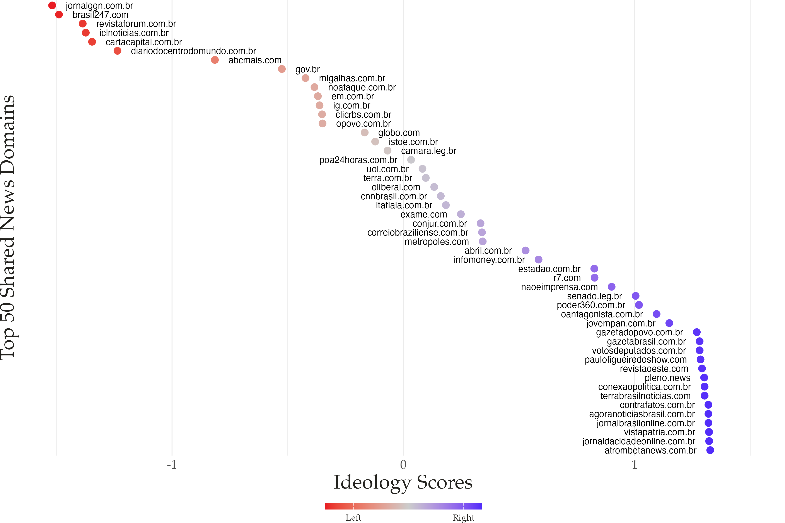{fig-align="center" width="85%"}

## Behavioral scores correlate at r = 0.85 with survey-based measures {.center}

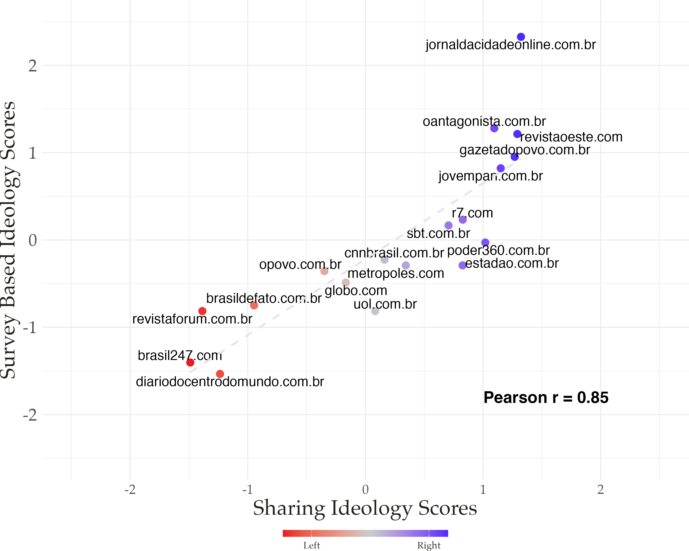{fig-align="center" width="65%"}

::: aside
[Survey-based ideology from Mont'Alverne et al. (2024), matched on 24 organizations]{.midgrey}
:::

# Effects of the Ban {background-color="#23395b"}

## The ban cut daily tweets by 70% and news shares by 85% {.center}

:::: {.columns}

::: {.column width="50%"}

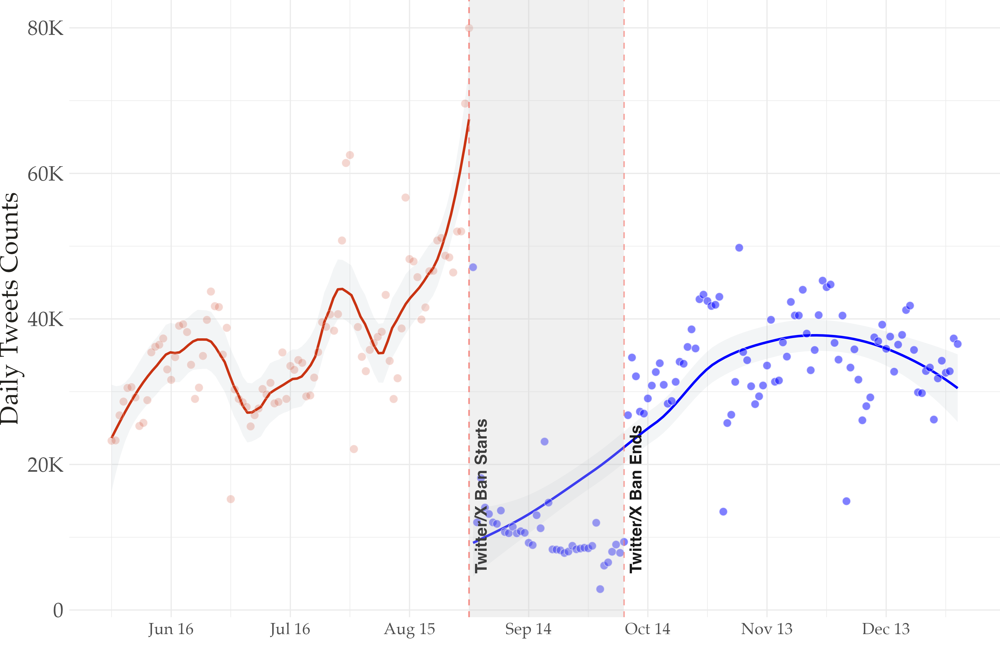{fig-align="center" width="100%"}

:::

::: {.column width="50%"}

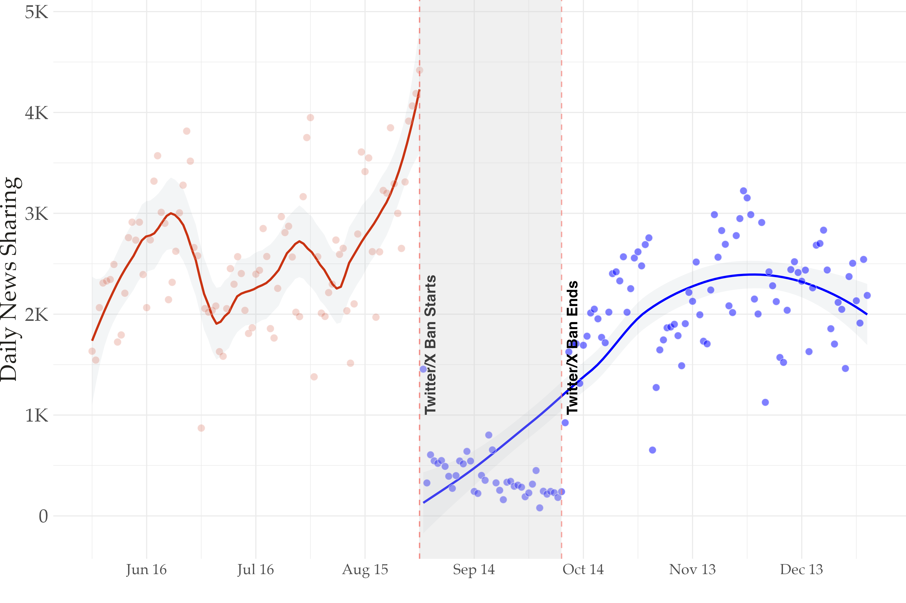{fig-align="center" width="100%"}

:::

::::

::: aside
[Daily averages dropped from 37,207 to 11,305 tweets, and from 2,587 to 395 news shares]{.midgrey}
:::

## Right-leaning users posted at 5.8x the rate of left-leaning users during the ban {.center}

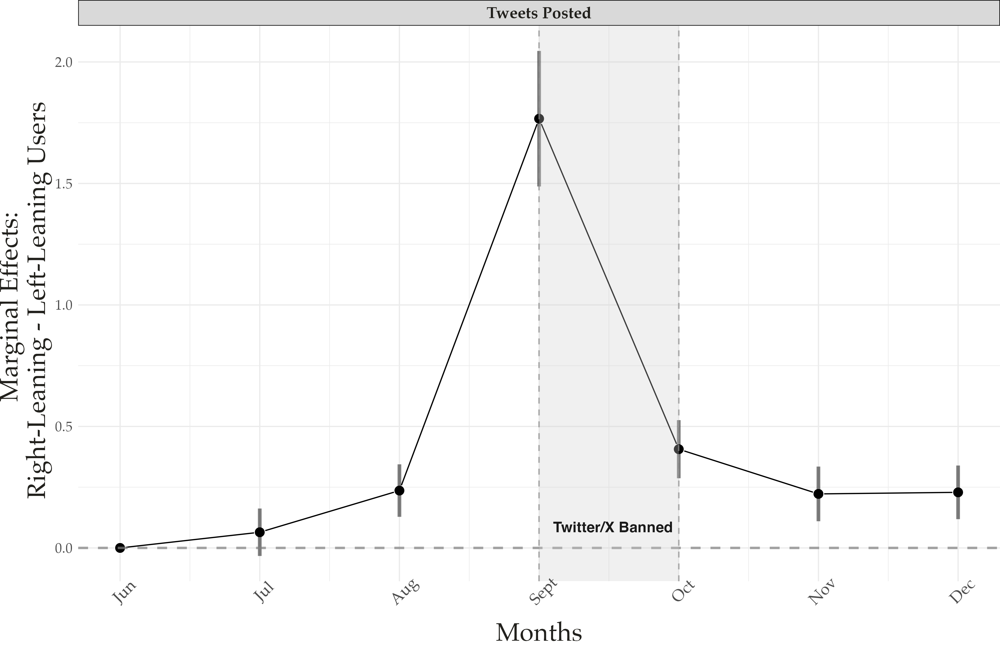{fig-align="center" width="85%"}

::: aside
[Poisson event study, user + day FE, errors clustered at user level. Baseline = June.]{.midgrey}
:::

## Right-leaning domains also became more prevalent {.center}

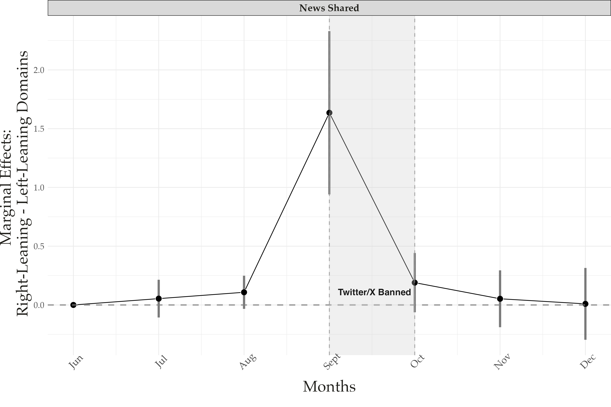{fig-align="center" width="85%"}

::: aside
[Same specification at the domain level. Less precise due to smaller N, but consistent pattern.]{.midgrey}
:::

## 32% of users fully complied with the ban -- left-leaning users dropped out at higher rates {.center}

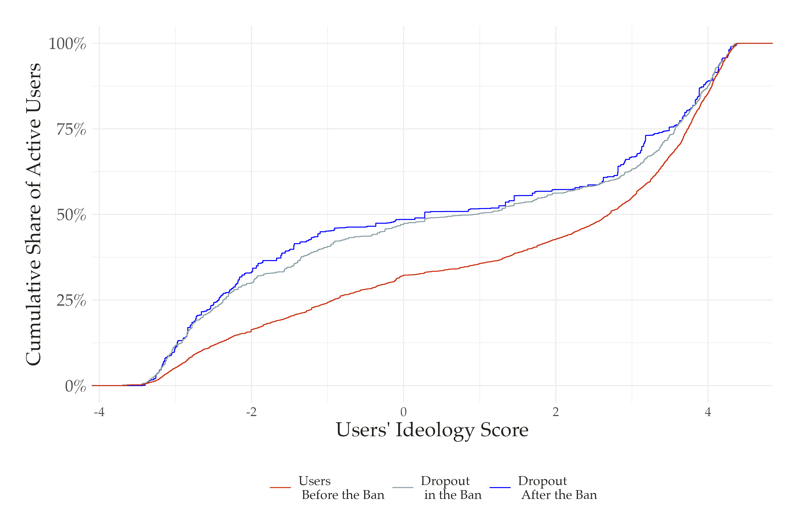{fig-align="center" width="75%"}

::: aside
[Pre-ban: 7,291 active users. During ban: 4,945. After ban: 6,635. 656 users never returned.]{.midgrey}
:::

## The ban shifted the platform's user composition rightward {.center}

:::: {.columns}

::: {.column width="50%"}

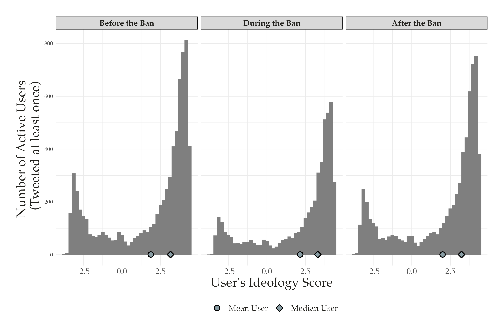{fig-align="center" width="100%"}

:::

::: {.column width="50%"}

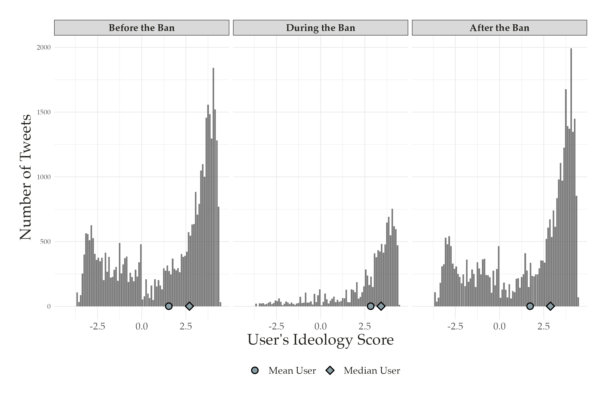{fig-align="center" width="100%"}

:::

::::

::: aside
[Left: active users by ideology. Right: total tweets by ideology. Before, during, and after the ban.]{.midgrey}
:::

## The news environment shifted 1.05 SD rightward during the ban {.center}

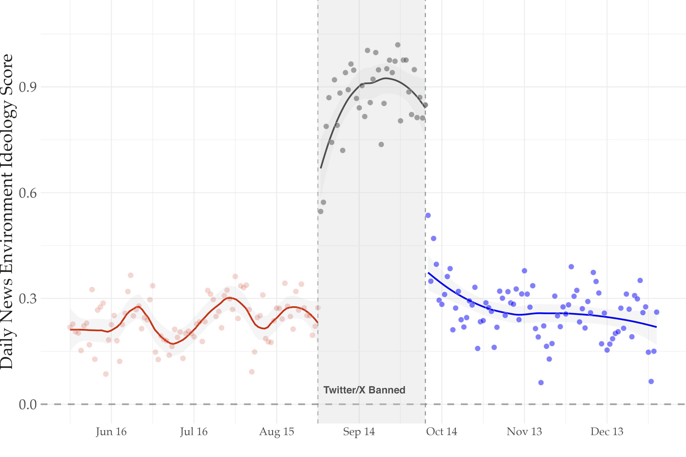{fig-align="center" width="80%"}

::: aside
[Median ideology: 0.27 (pre-ban) to 1.26 (ban) to 0.30 (post-ban). Before the ban, news resembled centrist outlet Metropoles. During the ban, it resembled far-right Jornal da Cidade Online.]{.midgrey}
:::

## Engagement became concentrated among right-leaning users -- and stayed that way {.center}

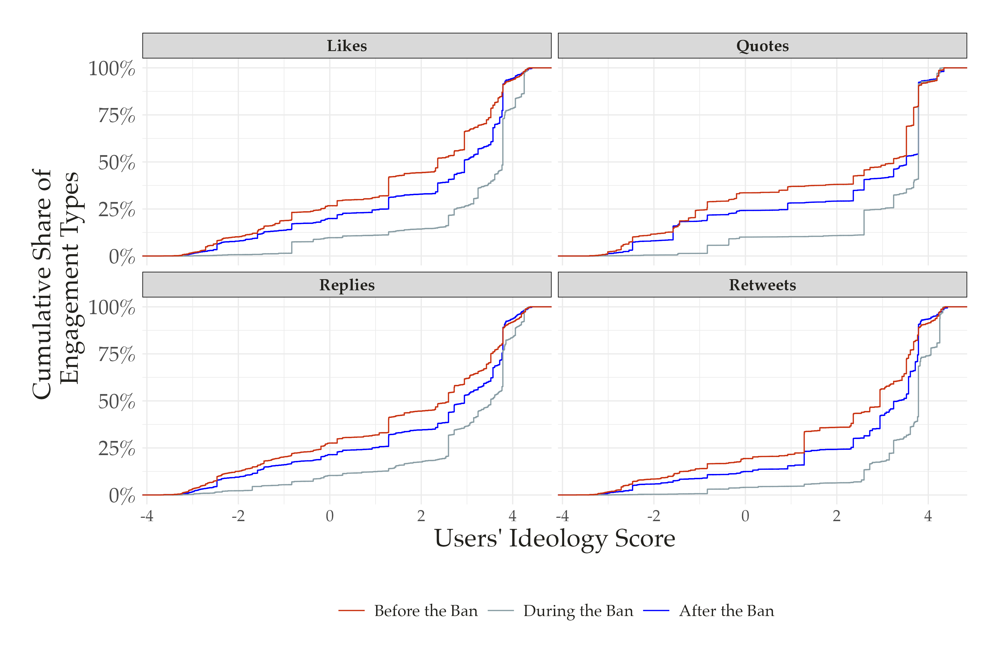{fig-align="center" width="80%"}

::: aside
[Right-leaning users received 73% of all likes pre-ban, 90% during, and 80% after. Similar for retweets, quotes, and replies.]{.midgrey}
:::

# The Sorting Ratchet {background-color="#23395b"}

## Asymmetric compliance + selective dropout = lasting partisan segmentation {.center}

::: {.nonincremental}

1. **The ban is politicized:** Right-leaning users opposed the court decision. Left-leaning users supported it.

2. **Compliance diverges:** Conservatives circumvent; progressives comply or exit to alternatives (e.g., Bluesky).

3. **The platform tilts right:** Content, news, and engagement all shift toward conservative users.

4. **The ratchet locks in:** Even after the ban lifts, habits and networks have changed. Left-leaning users don't fully return. The rightward shift persists.

:::

## Implications {.center}

::: {.nonincremental}

- Platform bans in democracies can **deepen polarization** rather than contain it

- Even **temporary bans** produce durable effects on who participates and what content circulates

- Politicized enforcement creates **reputational and instrumental incentives** that sort users by ideology

- Democratic platform governance faces a **central trade-off**: curbing misinformation vs. reallocating control over the information environment

:::

## Limitations and next steps {.center}

::: {.nonincremental}

- Sample of politically engaged users -- effects on casual users may differ

- Platform-specific: we can't observe spillovers to Bluesky, Threads, or other alternatives

- Single case: the Brazilian context (polarization, judicial politics) shapes these dynamics

- Future work: cross-platform migration data, comparative cases, elite vs. mass behavior

:::

##  {background-color="#23395b"}

::: {.centered}

 

### [Platform bans don't just reduce activity -- they sort who stays and who leaves, reshaping information environments along partisan lines.]{style="color: #FFFFFF; font-size: 1.3em;"}

 
 

[tiago.ventura@georgetown.edu]{style="color: #BBBBBB; font-size: 0.8em;"}

:::
