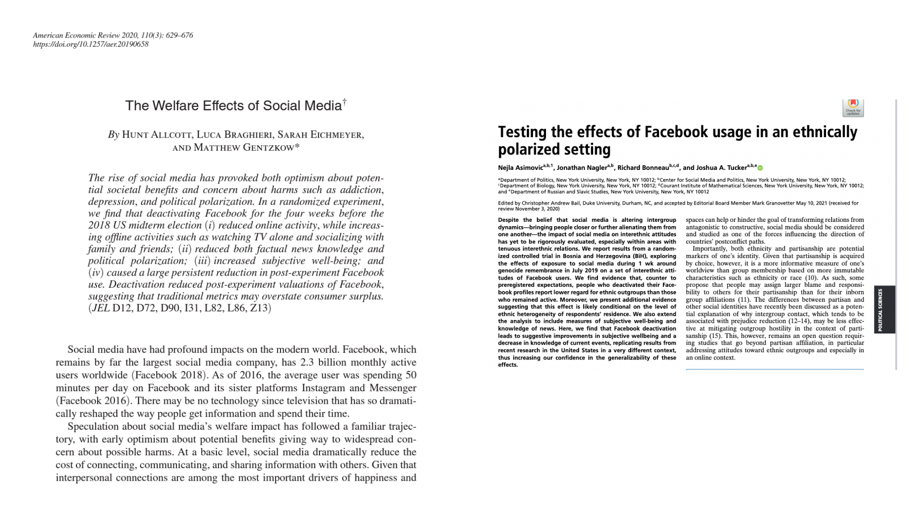
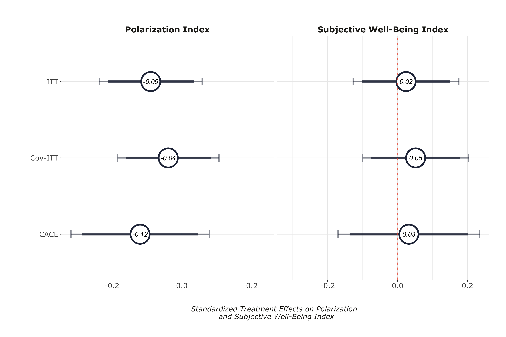
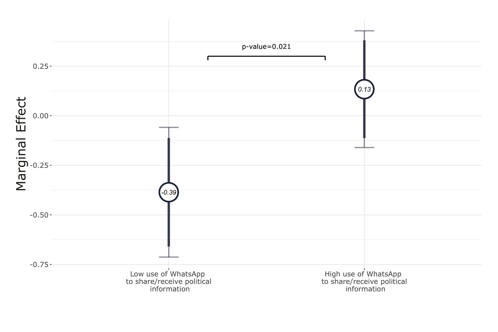
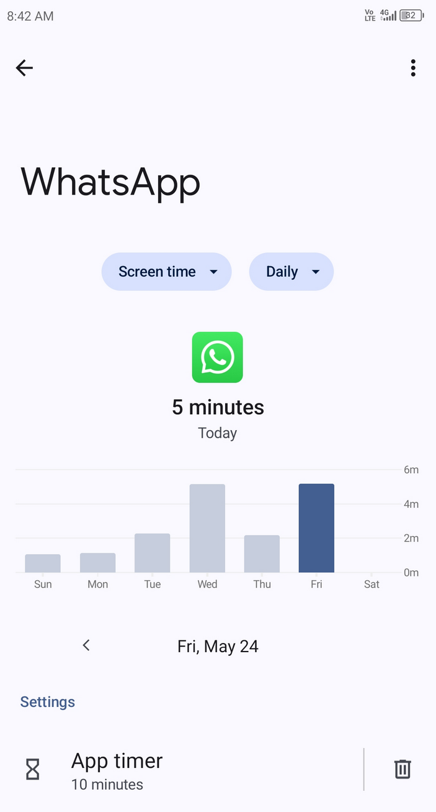

layout: true

<div class="my-footer"><span>Tiago Ventura (Georgetown University) &nbsp &nbsp &nbsp &nbsp &nbsp &nbsp &nbsp &nbsp &nbsp &nbsp &nbsp &nbsp &nbsp &nbsp &nbsp &nbsp &nbsp &nbsp &nbsp &nbsp &nbsp &nbsp &nbsp CSMaP Meeting</span></div> 

```{r setup, include=FALSE}
library(xaringanthemer)
options(htmltools.dir.version = FALSE)
knitr::opts_chunk$set(messagwese=FALSE, warning = FALSE)
xaringanthemer::style_mono_light(base_color ="#23395b", 
                                  title_slide_text_color="#ffff", 
                                  title_slide_background_color = "#23395b", 
                                  background_color = "#fff", 
                                  link_color =  "#23395b")
options(htmltools.dir.version = FALSE)
knitr::opts_chunk$set(message=FALSE, warning = FALSE, error=TRUE, echo=FALSE, cache=TRUE)
```

```{r style-share-again, echo=FALSE}
xaringanExtra::use_tile_view()
xaringanExtra::use_panelset()

#xaringanExtra::style_share_again(
#  share_buttons = c("twitter", "linkedin", "pocket")
#)
```

---
class:middle

## Presentation Today

`r icons::fontawesome("arrow-alt-circle-right")` .red[Misinformation Exposure Beyond Traditional Feeds: Evidence from a WhatsApp Deactivation Experiment in Brazil] (With Rajeshwari Majumdar, Jonathan Nagler, and Joshua A. Tucker)

`r icons::fontawesome("arrow-alt-circle-right")` .red[Reducing WhatsApp Usage to Mitigate Misinformation Exposure During Elections: Evidence from a Multi-Country Experiment] (With Rajeshwari Majumdar, Shelley Liu, Carolina Torreblanca, and Joshua A. Tucker)

`r icons::fontawesome("arrow-alt-circle-right")` .red[WhatsApp Links Explorer: Data Donation Pipeline for WhatsApp Data] (With Jonathan Nagler, and any others interested in collecting WhatsApp data)

---
class:middle, inverse

# Motivation

---
class:middle
### Social Media, Politics and Misinformation

`r icons::fontawesome("arrow-alt-circle-right")` **Prevalence of misinformation**: 
   -  People aren’t actually exposed to a lot of misinformation – but exposure is heavily concentrated. .midgrey[(Grinberg et. al. 2019, Guess et. al. 2019)]


`r icons::fontawesome("arrow-alt-circle-right")` **Downstream effects on attitudes: less than you think**: 
   - Null effects of exposure to misinformation campaigns from Russian bots on Twitter .midgrey[(Eady et al. 2023)]
   - Mixed evidence from deactivating users from Facebook .midgrey[(Asimovic et. al. 2022, Alcott et. al. 2020, Arcenaux and Ladd 2023)]
   - Meta Election 2020 studies .midgrey[(Guess et al. 2023a,b; Nyhan et al. 2023)]
   

`r icons::fontawesome("arrow-alt-circle-right")` **Majority of scholarly work comes from W.E.I.R.D countries]**:
   - As a consequence we know a lot about feed-based platforms, a little about other social media apps more prevalent in other parts of the world
   - Over 80% of existing studies on interventions to correct misinformation focus on Global North countries 
.midgrey[(Blair et. al. 2023,  Badrinathan and Chauchard, 2023a)]
       - Despite the fact that the real-world effects of misinformation exposure may be more pronounced in these countries.


---
class:middle


```{r out.width="100%"}
knitr::include_graphics("whatsappmotivation.png")
```


---

<br>
<br>
<br>
<br>
<br>
<br>
<br>
<br>

.content-box-gray[Identify the causal effects of **.red[WhatsApp usage]** on **.red[exposure to online rumors]** and its downstream effects on **.red[belief accuracy]** and **.red[political attitudes]**]

---
class:middle

## Deactivation Studies

.center[
```{r out.width="90%"}

```
]

.pull-left[
.center[Facebook Deactivation in the US [(Alcott et al., 2020)](https://www.aeaweb.org/articles?id=10.1257/aer.20190658)]
]

.pull-right[

.center[Facebook Deactivation in Bosnia and Herzegovina [(Asimovic et. al, 2022)](https://www.pnas.org/doi/10.1073/pnas.2022819118)]
]

---
class:middle

`r icons::fontawesome("arrow-alt-circle-right")` [Misinformation Exposure Beyond Traditional Feeds: Evidence from a WhatsApp Deactivation Experiment in Brazil]()(With Rajeshwari Majumdar, Jonathan Nagler, and Joshua A. Tucker)

---
class: middle

### Multimedia Deactivation Experiment in Brazil, 2022


`r icons::fontawesome("arrow-alt-circle-right")` **Our Design:** Cut the primary channels through which users are exposed to misinformation and polarizing content: videos, images and audios .midgrey[(Machado et al., 2019; Resende et al., 2019; Garimella and Tyson, 2018; Garimella and Eckles, 2020; Batista Pereira et al., 2023).]


`r icons::fontawesome("arrow-alt-circle-right")` **Experiment:** Offer respondents a monetary incentive to

- Disable their automatic download of media on WhatsApp.
- Do not purposefully click and watch any media on WhatsApp.


`r icons::fontawesome("arrow-alt-circle-right")` **Treatment Period:** Three weeks:

- **Start:** Three weeks before general election in Brazil.
- **End:** three days after the voting day.


---
class:middle, center, inverse

# Overview of the Experiment

---
class:middle
## Recruitment

**Method:** Facebook Ads targeting adults Brazil

**Started Recruitment:** September 8th

**Number of respondents:** 1,947

**Screening variables:** 

  + Willingness to join: .red[1,8861 participants]
  
  + More 5min WhatsApp daily

  + Only WhatsApp mobile
  
  + More than 2 min to complete recruitment + other quality controls

---
class:middle
## Treatment Assignment


**Start**: September 15.

**Treatment**:

- Turn off the automatic download.
- Three .red[weeks] without consuming any multimedia.
  
**Control**: Three .red[days] without consuming any multimedia.

**Invited**: 1,135 respondents 

**Enrolled**: 773 respondents

---

## Deactivation

.center[
```{r  out.width="40%"}
knitr::include_graphics("./output/iphone_deact.jpeg")
```
]


---

## Intervention


.center[
```{r  out.width="60%"}
knitr::include_graphics("./blur.jpg")
```
]

---
class:middle
## Compliance

**Compliance Tasks:**

- Screenshots of WhatsApp storage intormation 

- Every week + final survey

- After the  first compliance check, the control group was re-activated

---
class:middle
## Compliance II

.center[
```{r  out.width="40%"}
knitr::include_graphics("./output/iphone_compliance.jpeg")
```
]


---
class:middle

## Outcomes

**Self-Reported Exposure and Accuracy Judgment**

  - False Rumors published on fact-checking webpages during the month of the experiment + True News stories headlines from mainstream media.

**Polarization**

  - Affective polarization (Feeling Thermometer).
  - Social Polarization (Willingness to engage with outgroup voter).
  - Issue Polarization (Abortion, gun control, etc..).
  - Perceptions about ideological polarization ('Where do I observe the two main candidates?').

**Subjective Well-being**

  - How did you feel for the past three weeks? (Happy, Anxious, etc...).


---
class: center, middle, inverse

# Results

---

### First-Stage Results

.center[
```{r  out.width="90%"}
knitr::include_graphics("./output/models_compliance.png")
```
]

---
### Effects on Exposure to Misinformation Rumors (H1)

.center[
```{r  out.width="90%"}
knitr::include_graphics("./output/exposure_h1.png")
```
]

---
### Reduction in exposure is large for false news (H1)

.center[
```{r  out.width="90%"}
knitr::include_graphics("./output/difference_true_false_exposure.png")
```
]

---
### Effects on Belief Accuracy (H2)

.center[
```{r  out.width="90%"}
knitr::include_graphics("./output/belief_accuracy_h2.png")
```
]

---
### Effects on Polarization & Subjective Well-Being (H3 & H4)

.center[
```{r  out.width="90%"}

```
]

---
class: middle, inverse, center

## Additional Analyses  (Non Pre-Registered)

---
### Exposure and Partisanship

.center[
```{r  out.width="90%"}
knitr::include_graphics("output/sif_exposure_bothparties_counter_pro.png")
```
]

---
### Belief Accuracy Conditional on WhatsApp usage for Politics

.center[
```{r  out.width="90%"}

```
]


---
### Polarization Outcomes

.center[
```{r  out.width="90%"}
knitr::include_graphics("output/pol_outcomes.png")
```
]

---

class: middle

## Discussion


`r icons::fontawesome("arrow-alt-circle-right")` **WhatsApp is an important vector through which voters receive misinformation in Brazil at .red[a higher rate] compared to true news.**


`r icons::fontawesome("arrow-alt-circle-right")` **The null results provide support for a .red[minimalist view of the short-term causal effects] of exposure to misinformation on WhatsApp on political attitudes.**

`r icons::fontawesome("arrow-alt-circle-right")`  **Exposure to misinformation .red[does not] mechanically affect attitudes**


---
class: middle

## Extension: Multi-Country Deactivation Studies

`r icons::fontawesome("arrow-alt-circle-right")` .red[Reducing WhatsApp Usage to Mitigate Misinformation Exposure During Elections: Evidence from a Multi-Country Experiment] (With Rajeshwari Majumdar, Shelley Liu, Carolina Torreblanca, and Joshua A. Tucker)

--
- **Summary**: Multicountry extension across three major Global South countries; Brazil (In the field), India and South Africa
- **Stronger Treatment**: Replicate Multimedia + Time Reduction
- **More statistical power**: ~ 2500 participants across the three countries.  
--

---
class: middle
## Experimental Conditions 

- **Types of partial deactivation**
   -  Time: Limit daily WhatsApp usage to 10 minutes 
   -  Multimedia: Do not consume multimedia content received via WhatsApp

- **Treatment and control**
 
 - Treatment: Change settings and  behavior for .red[4 week (one month)] leading up to elections in South Africa and India
 - Control: Change only behavior for .red[3 days] a month before election


- **2x2 design**

|Treatment|Control|
|----------------|--------------|
| Time Treatment | Time Control |
| Media Treatment | Media Control|

---
class:middle

## Treatment Time Intervention & Compliance

.pull-right[
.center[
#### Adding Friction
```{r out.width="60%"}
knitr::include_graphics("time-limit.png") 
```
]
]
.pull-left[
.center[
#### Monitoring Behavior

```{r out.width="60%"}

```
]
]

## Treatment Media Intervention & Compliance

.pull-right[
.center[
#### Adding Friction
```{r out.width="60%"}
knitr::include_graphics("ss_tmedia_examplereal_dlpost.png") 
```
]
]

.pull-left[
.center[

#### Monitoring Behavior

```{r out.width="60%"}
knitr::include_graphics("ss_tmedia_networkusage.png")
```

]]
