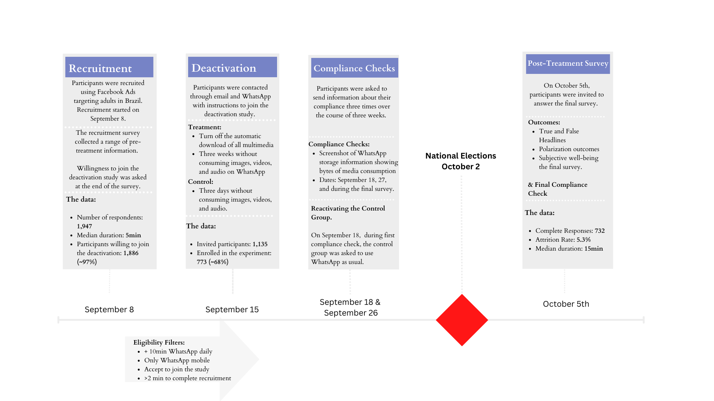
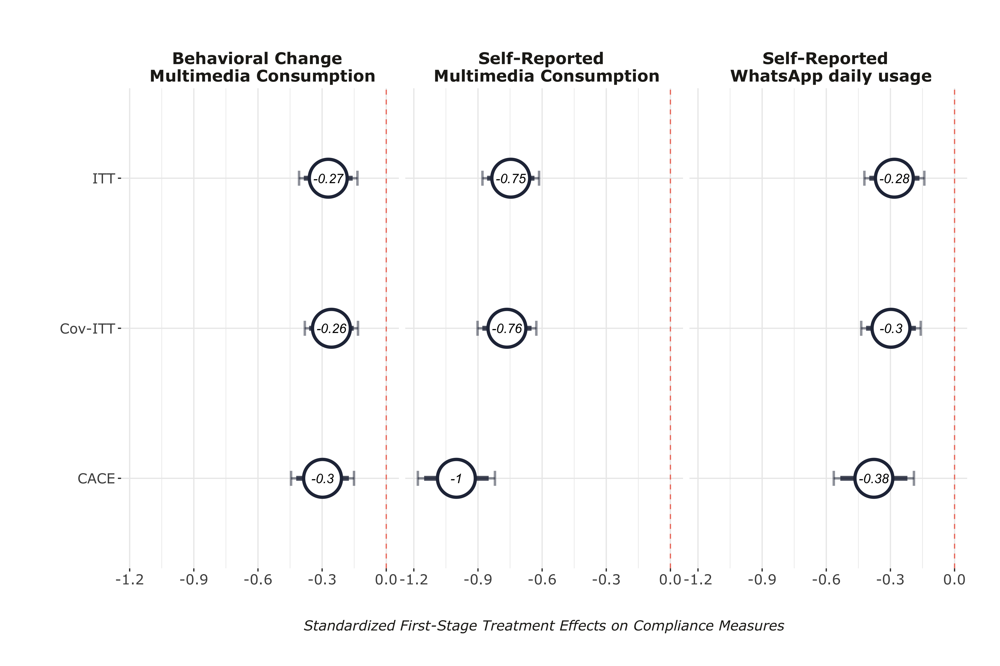
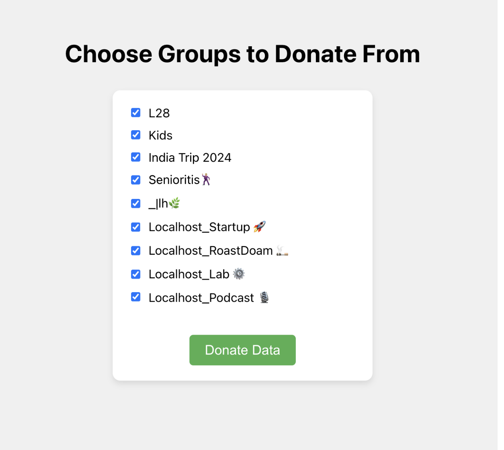

layout: true

<div class="my-footer"><span>Tiago Ventura (Georgetown University) &nbsp &nbsp &nbsp &nbsp &nbsp &nbsp &nbsp &nbsp &nbsp &nbsp &nbsp &nbsp &nbsp &nbsp &nbsp &nbsp &nbsp  CLAS- Latin America Research Seminar</span></div> 

```{r setup, include=FALSE}
library(xaringanthemer)
options(htmltools.dir.version = FALSE)
knitr::opts_chunk$set(messagwese=FALSE, warning = FALSE)
xaringanthemer::style_mono_light(base_color ="#23395b", 
                                  title_slide_text_color="#ffff", 
                                  title_slide_background_color = "#23395b", 
                                  background_color = "#fff", 
                                  link_color =  "#23395b")
options(htmltools.dir.version = FALSE)
knitr::opts_chunk$set(message=FALSE, warning = FALSE, error=TRUE, echo=FALSE, cache=TRUE)
```

```{r style-share-again, echo=FALSE}
xaringanExtra::use_tile_view()
xaringanExtra::use_panelset()

#xaringanExtra::style_share_again(
#  share_buttons = c("twitter", "linkedin", "pocket")
#)
```

---
class:middle

## Research Agenda on WhatsApp, Misinformation and Politics

`r icons::fontawesome("arrow-alt-circle-right")` .red[Misinformation Exposure Beyond Traditional Feeds: Evidence from a WhatsApp Deactivation Experiment in Brazil] (With Rajeshwari Majumdar, Jonathan Nagler, and Joshua A. Tucker)

`r icons::fontawesome("arrow-alt-circle-right")` .red[Reducing WhatsApp Usage to Mitigate Misinformation Exposure During Elections: Evidence from a Multi-Country Experiment] (With Rajeshwari Majumdar, Shelley Liu, Carolina Torreblanca, and Joshua A. Tucker)

`r icons::fontawesome("arrow-alt-circle-right")` .red[WhatsApp Links Explorer: Data Donation Pipeline for WhatsApp Data] (With Jonathan Nagler, and any others interested in collecting WhatsApp data)

---
class:middle, inverse

# Motivation

---
class:middle
### Social Media, Misinformation and Politics

--

- **From Liberation to Turmoil**: In the last 10 years, the general public, journalist accounts and the academic research on the effects of social media in society has been dominated by the issue of misinformation (.midgrey[Tucker et. al., 2018])

--

- **A decade after**: gap between public discourse and scientific research on this issue .midgrey[(Budak et. al., 2024)]. Scientific research shows:

--
   - **Misinformation is a small part of our social media life**: People aren’t actually exposed to a lot of misinformation – but exposure is heavily concentrated .midgrey[(Grinberg et. al. 2019, Guess et. al. 2019)]

--

   - **Minimal Effects and Selective Exposure:** Nulls effects from in-the-field studies for exposure to misinformation on attitudes .midgrey[(Eady et al. 2023, and Meta papers)]
  

--

---
class:middle
### Social Media, Misinformation and Politics

`r icons::fontawesome("arrow-alt-circle-right")` **Majority of scholarly work comes from W.E.I.R.D countries**:

--
   - Over 80% of existing studies on interventions to correct misinformation focus on Global North countries .midgrey[(Blair et. al. 2023,  Badrinathan and Chauchard, 2023a)]

--

   - Spreading, production and exposure to misinformation differs greatly across the world (e.g different platforms, distinct levels of digital literacy)

--
   - In the Global South:
   
      - Informal networks for information sharing matter more ~ easier to mix true and false information
      - The real-world effects of misinformation exposure may be more pronounced in these countries, fewer fact-checking agencies, for example,
      - Social media messaging apps are more prevalent vs feed-based platforms

--


---
class:middle


```{r out.width="100%"}
knitr::include_graphics("whatsappmotivation.png")
```


---

<br>
<br>
<br>
<br>
<br>
<br>
<br>
<br>

.content-box-gray[Identify the causal effects of **.red[WhatsApp usage]** on **.red[exposure to online rumors]** and its downstream effects on **.red[belief accuracy]** and **.red[political attitudes]**]

---
class:middle

## Deactivation Studies: A design to measure causal effects of social media usage

.center[
```{r out.width="90%"}
knitr::include_graphics("deactivation_studies.png")
```
]

.pull-left[
.center[Facebook Deactivation in the US [(Alcott et al., 2020)](https://www.aeaweb.org/articles?id=10.1257/aer.20190658)]
]

.pull-right[

.center[Facebook Deactivation in Bosnia and Herzegovina [(Asimovic et. al, 2022)](https://www.pnas.org/doi/10.1073/pnas.2022819118)]
]


---
class: middle

### Multimedia Deactivation Experiment in Brazil, 2022

`r icons::fontawesome("arrow-alt-circle-right")` **Problem**: Fully deactivating WhatsApp is neither possible nor ideal

`r icons::fontawesome("arrow-alt-circle-right")` **Our Design:** Cut the primary channels through which users are exposed to misinformation and polarizing content: videos, images and audios .midgrey[(Machado et al., 2019; Resende et al., 2019; Garimella and Tyson, 2018; Garimella and Eckles, 2020; Batista Pereira et al., 2023).]


`r icons::fontawesome("arrow-alt-circle-right")` **Experiment:** Offer respondents a monetary incentive to

- Disable their automatic download of media on WhatsApp.
- Do not purposefully click and watch any media on WhatsApp.


`r icons::fontawesome("arrow-alt-circle-right")` **Treatment Period:** Three weeks:

- **Start:** Three weeks before general election in Brazil.
- **End:** three days after the voting day.


---
class:middle, center, inverse

# Overview of the Experiment

---
class:middle

.center[
```{r out.width="120%"}

```
]

---
class:middle
## Recruitment

**Method:** Facebook Ads targeting adults Brazil

**Started Recruitment:** September 8th

**Number of respondents:** 1,947

**Screening variables:** 

  + Willingness to join: .red[1,8861 participants]
  
  + More 5min WhatsApp daily

  + Only WhatsApp mobile
  
  + More than 2 min to complete recruitment + other quality controls

---
class:middle
## Treatment Assignment


**Start**: September 15.

**Treatment**:

- Turn off the automatic download.
- Three .red[weeks] without consuming any multimedia.
  
**Control**: Three .red[days] without consuming any multimedia.

**Invited**: 1,135 respondents 

**Enrolled**: 773 respondents

---

## Deactivation

.center[
```{r  out.width="40%"}
knitr::include_graphics("./output/iphone_deact.jpeg")
```
]


---
### Treatment Media Intervention & Compliance

.pull-left[
.center[
#### Intervention: Adding Friction
```{r out.width="100%"}
knitr::include_graphics("blur.jpg") 
```
]
]

.pull-left[
.center[

#### Compliance: Monitoring Behavior

```{r out.width="60%"}
knitr::include_graphics("ss_tmedia_networkusage.jpeg")
```

]]

.center[
```{r  out.width="60%"}
knitr::include_graphics("./blur.jpg")
```
]

---
class:middle
## Compliance

**Compliance Tasks:**

- Screenshots of WhatsApp storage intormation 

- Every week + final survey

- After the  first compliance check, the control group was re-activated

---
class:middle

## Outcomes

**Self-Reported Exposure and Accuracy Judgment**

  - False Rumors published on fact-checking webpages during the month of the experiment + True News stories headlines from mainstream media.

**Polarization**

  - Affective polarization (Feeling Thermometer).
  - Social Polarization (Willingness to engage with outgroup voter).
  - Issue Polarization (Abortion, gun control, etc..).
  - Perceptions about ideological polarization ('Where do I observe the two main candidates?').

**Subjective Well-being**

  - How did you feel for the past three weeks? (Happy, Anxious, etc...).

---
class:middle

## Hypotheses

`r icons::fontawesome("arrow-alt-circle-right")` H1: Deactivated users will report lower levels of previous exposure to FALSE rumors. .midgrey[(Machado et al., 2019; Resende et al., 2019; Garimella and Tyson, 2018; Garimella and Eckles, 2020; Batista Pereira et al., 2023).]

`r icons::fontawesome("arrow-alt-circle-right")` H2a: Deactivated  will display a higher ability to accurately identify FALSE rumors. .midgrey[(Fazio et al., 2015; Dechêne et al., 2010; Pennycook et al., 2018)]

`r icons::fontawesome("arrow-alt-circle-right")` H2b Deactivated users will display lower levels of mainstream news knowledge. .midgrey[((Valenzuela et al., 2021; Rossini et al., 2021a))]

`r icons::fontawesome("arrow-alt-circle-right")` H3: Deactivated will display lower levels of outgroup political polarization. .midgrey[((Bail et al., 2018; Settle, 2018; Lelkes et al., 2017, Omundsmen et. al. 2021)]

`r icons::fontawesome("arrow-alt-circle-right")` H4: Deactivated will display higher levels of the aggregated index of subjective well-being. .midgrey[((Allcott et al., 2020; Asimovic et al., 2021; Vanman et al., 2018; Tromholt, 2016)]

---
class: center, middle, inverse

# Results

---

### First-Stage Results

.center[
```{r  out.width="90%"}

```
]

---
### Effects on Exposure to Misinformation Rumors (H1)

.center[
```{r  out.width="90%"}
knitr::include_graphics("./output/exposure_h1.png")
```
]

---
### Reduction in exposure is large for false news (H1)

.center[
```{r  out.width="90%"}
knitr::include_graphics("./output/difference_true_false_exposure.png")
```
]

---
### Effects on Belief Accuracy (H2)

.center[
```{r  out.width="90%"}
knitr::include_graphics("./output/belief_accuracy_h2.png")
```
]

---
### Effects on Polarization & Subjective Well-Being (H3 & H4)

.center[
```{r  out.width="90%"}
knitr::include_graphics("./output/pol_sw_index.png")
```
]

---
class: middle, inverse, center

## Additional Analyses  (Non Pre-Registered)

---
### Exposure and Partisanship

.center[
```{r  out.width="90%"}
knitr::include_graphics("output/sif_exposure_bothparties_counter_pro.png")
```
]

---
### Belief Accuracy Conditional on WhatsApp usage for Politics

.center[
```{r  out.width="90%"}
knitr::include_graphics("output/sif_het_use_whatsapp_fac.png")
```
]


---
### Polarization Outcomes

.center[
```{r  out.width="90%"}
knitr::include_graphics("output/pol_outcomes.png")
```
]

---

class: middle

## Discussion


`r icons::fontawesome("arrow-alt-circle-right")` **WhatsApp is an important vector through which voters receive misinformation in Brazil at .red[a higher rate] compared to true news.**


`r icons::fontawesome("arrow-alt-circle-right")` **The null results provide support for a .red[minimalist view of the short-term causal effects] of exposure to misinformation on WhatsApp on political attitudes.**

`r icons::fontawesome("arrow-alt-circle-right")`  **Exposure to misinformation .red[does not] mechanically affect attitudes**

`r icons::fontawesome("arrow-alt-circle-right")` **Limitation:** single-country, low-powered study: effects are likely larger among subgroups more exposure to misinformation, and vary contextually. 


---
class: middle
### Multi-Country Deactivation Experiment

- **Problem**: Single country studies have limited power to speak of contextual effects (and in our case, limited statistical power)

- **Summary**: Multicountry extension across three major Global South countries; Brazil (In the field), India and South Africa

- **Stronger Treatment**: Replicate Multimedia Deactivation + Time Reduction

- **More statistical power**: ~ 2500 participants across the three countries.  


---
class:middle
### WhatsApp Link Explore: A Data Donation Pipeline

- WhatsApp is end-to-end encrypted. 

- But, users can easily export their data. This makes Data Donation the easiest (possible only way to collect WhatsApp Data)

- Develop a pipeline using [WhatsApp Web](https://github.com/pedroslopez/whatsapp-web.js); A WhatsApp API client that connects through the WhatsApp Web browser app
---
class:middle


## Data Donation Pipeline: 

- Recruit participants via surveys
  
- Ask them to authenticate in the web app (no need to download anything; but need two devices)
  
- Participants can choose which groups to donate the data. Only allow groups >5 participants.
  
- Collect: 
   - users' metadata, 
   - groups' metadata,
   - messages from donated groups.
   - only collect messages that contains URLs, avoid collecting risky and private content (images, messages, videos.)

---
## Examples of the Data Pipeline

.pull-left[
```{r out.width="100%"}
knitr::include_graphics("wpp_monitor.png")
```
]

.pull-right[
```{r out.width="100%"}

```

]

- Planned Data Collections: CSIP-Latinos in the US; online sample in Brazil. 

---
class:center, inverse, middle

# Thank you
