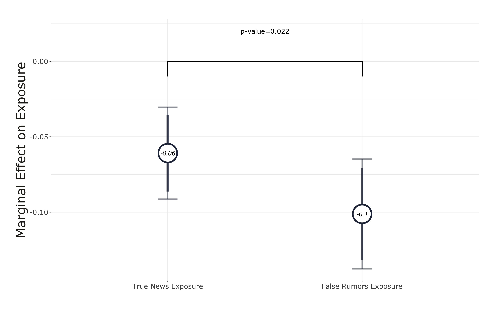
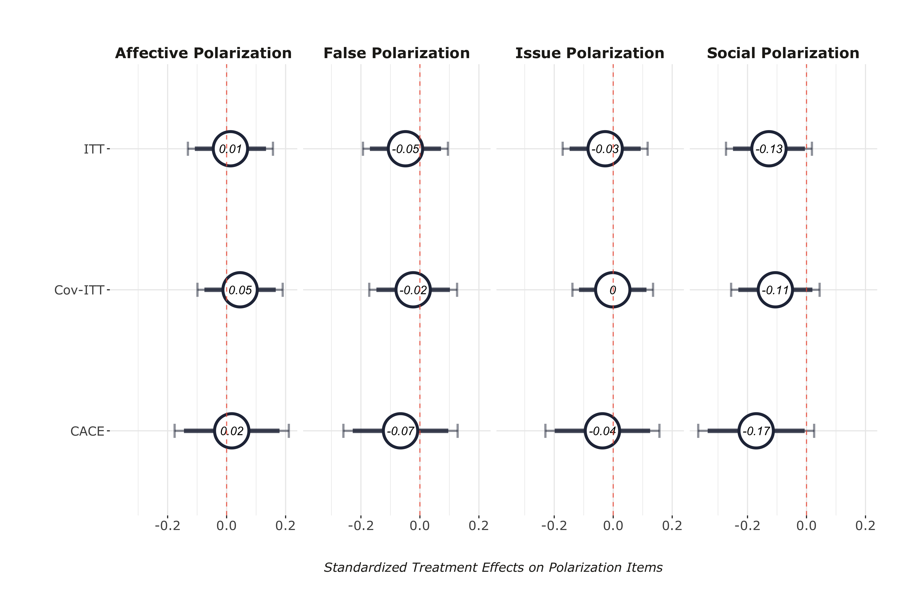

layout: true

<div class="my-footer"><span>Tiago Ventura (Georgetown University) &nbsp &nbsp &nbsp &nbsp &nbsp &nbsp &nbsp &nbsp &nbsp &nbsp &nbsp &nbsp &nbsp &nbsp &nbsp &nbsp &nbsp &nbsp &nbsp &nbsp &nbsp &nbsp &nbsp  McCourt School  Faculty Seminar</span></div> 

```{r setup, include=FALSE}
library(xaringanthemer)
options(htmltools.dir.version = FALSE)
knitr::opts_chunk$set(messagwese=FALSE, warning = FALSE)
xaringanthemer::style_mono_light(base_color ="#23395b", 
                                  title_slide_text_color="#ffff", 
                                  title_slide_background_color = "#23395b", 
                                  background_color = "#fff", 
                                  link_color =  "#23395b")
options(htmltools.dir.version = FALSE)
knitr::opts_chunk$set(message=FALSE, warning = FALSE, error=TRUE, echo=FALSE, cache=TRUE)
```

```{r style-share-again, echo=FALSE}
xaringanExtra::use_tile_view()
xaringanExtra::use_panelset()

#xaringanExtra::style_share_again(
#  share_buttons = c("twitter", "linkedin", "pocket")
#)
```


---
class:middle
### From Liberation to Turmoil: The Misinformation Turn

.center[
```{r out.width="100%"}

```

[From Liberation to Turmoil, Tucker et. al., 2019](https://muse.jhu.edu/article/671987)
]
---
class: middle

### Insights

`r icons::fontawesome("arrow-alt-circle-right")` **.red[Prevalence of misinformation]:** 
   -  People .red[aren’t] actually exposed to a lot of .red[**misinformation**] – but exposure is heavily concentrated. .midgrey[(Grinberg et. al., 2019, Guess et. al. 2019)]

---
class:middle 
### .center[1% of users represented 80% of exposure to Fake News on Twitter in 20216]

.center[
```{r out.width="90%"}
knitr::include_graphics("gringer.png")
```
]
.center[[Grinberg et al., 2019](https://www.science.org/doi/pdf/10.1126/science.aau2706)]


---
class: middle

### Insights

`r icons::fontawesome("arrow-alt-circle-right")` .red[**Prevalence of misinformation**]: 
   -  People aren’t actually exposed to a lot of misinformation – but exposure is heavily concentrated. .midgrey[(Grinberg et. al. 2019, Guess et. al. 2019)]

`r icons::fontawesome("arrow-alt-circle-right")` **.red[Downstream effects]:** 
   - Mixed evidence from deactivating users from Facebook on polarization .midgrey[(Asimovic et. al. 2022, Alcott et. al. 2020, Arcenaux and Ladd 2023)]
   - Null effects from Meta Election 2020 studies .midgrey[(Guess et al. 2023a,b; Nyhan et al. 2023)]
   - Null effects of exposure to misinformation campaigns from Russian bots on Twitter .midgrey[(Eady et al. 2023)]

---
### .center[Exposure to IRA Russian Misinformation on Twitter doesn’t lead to changes in attitudes]

.center[

```{r out.width="70%"}
knitr::include_graphics("russian.png")
```

.center[[Eady et al., 2023](https://www.nature.com/articles/s41467-022-35576-9)]
]

---
### Insights

`r icons::fontawesome("arrow-alt-circle-right")` .red[**Prevalence of misinformation**]: 
   -  People aren’t actually exposed to a lot of misinformation – but exposure is heavily concentrated. .midgrey[(Grinberg et. al. 2019, Guess et. al. 2019)]

`r icons::fontawesome("arrow-alt-circle-right")` .red[**Downstream effects**]: 
   - Mixed evidence from Deactivating users from Facebook .midgrey[(Asimovic et. al. 2022, Alcott et. al. 2020, Arcenaux and Ladd 2023)]
   - Meta Election 2020 studies .midgrey[(Guess et al. 2023a,b; Nyhan et al. 2023)]
   - Null effects of exposure to misinformation campaigns from Russian bots on Twitter .midgrey[(Eady et al. 2023)]

`r icons::fontawesome("arrow-alt-circle-right")` **.red[Majority of scholarly work comes from Western countries]**:
   - Over 80% of existing studies on interventions to correct misinformation focus on Global North countries 
.midgrey[(Blair et. al. 2023,  Badrinathan and Chauchard, 2023a)]
   - Despite the fact that the real-world effects of misinformation exposure may be more pronounced in these countries.


---
class:middle


```{r out.width="100%"}
knitr::include_graphics("nyt.png")
```


---
class:middle

## WhatsApp 101

--

.panelset.sideways[

.panel[.panel-name[WhatsApp]

#### WhatsApp is a worldwide popular end-to-end encrypted messaging app allowing both .red[direct] and .red[group-based] communications with close to 2 billion around the world

]

.panel[.panel-name[Usage in Brazil]


- .red[66% of the Brazilian eligible voters] has a social media account, and .red[65% have an WhatsApp account] ([Datafolha 2018](http://media.folha.uol.com.br/datafolha/2018/10/27/44cc2204230d2fd45e18b039ee8c07a6.pdf)) – 150 million people in 2022. 


- Most used app for all purposes: .red[talk to family & friends, do business & pay bills, consume news, talk politics, among others] ([Reuters Institute, 2021](https://reutersinstitute.politics.ox.ac.uk/digital-news-report/2021)). 


- Used by .red[48% of population to read news], despite having no “news feed” ([Reuters Institute, 2021](https://reutersinstitute.politics.ox.ac.uk/digital-news-report/2021))


- Across the world, .red[Brazilians are the most concerned about misinformation]. And among the most active social media users


- And .red[WhatsApp is the main social media application] where users report to see more misinformation. 
]
.panel[.panel-name[Effects on Politics]

Several claims about the role of WhatsApp on offline attitudes and behaviors: 

- Powerful propaganda and organizational tool for political parties .midgrey[(Chauchard and Garimella, 2022; Gil de Zúñiga et al. 2021)]
- Misinformation led episodes of offline violence against minority groups .midgrey[(Saha et al., 2021; Banaji et al., 2019)] 
- Voting behavior .midgrey[(Tardáguila et al., 2018; Mello, 2020)]

]
]

---

<br>
<br>
<br>
<br>
<br>
<br>
<br>
<br>

.content-box-gray[Identify the causal effects of **.red[WhatsApp usage]** on **.red[exposure to online rumors]** and its downstream effects on **.red[belief accuracy]** and **.red[political attitudes]**]

---
class: middle, inverse, center

# WhatsApp Multimedia Constrained Deactivation

---
class: middle

## Deactivation Studies

.center[
```{r out.width="90%"}
knitr::include_graphics("deactivation_studies.png")
```
]

.pull-left[
.center[Facebook Deactivation in the US [(Alcott et al., 2020)](https://www.aeaweb.org/articles?id=10.1257/aer.20190658)]
]

.pull-right[

.center[Facebook Deactivation in Bosnia and Herzegovina [(Asimovic et. al, 2022)](https://www.pnas.org/doi/10.1073/pnas.2022819118)]
]
f

---
class: middle

### Our Experiment

--

`r icons::fontawesome("arrow-alt-circle-right")` **Our Design:** Cut the primary channels through which users are exposed to misinformation and polarizing content: videos, images and audios .midgrey[(Machado et al., 2019; Resende et al., 2019; Garimella and Tyson, 2018; Garimella and Eckles, 2020; Batista Pereira et al., 2023).]

--

`r icons::fontawesome("arrow-alt-circle-right")` **Experiment:** Offer respondents a monetary incentive to

- Disable their automatic download of media on WhatsApp.
- Do not purposefully click and watch any media on WhatsApp.

--

`r icons::fontawesome("arrow-alt-circle-right")` **Treatment Period:** Three weeks:

- **Start:** Three weeks before general election in Brazil.
- **End:** three days after the voting day.

--

`r icons::fontawesome("arrow-alt-circle-right")` **Outcomes:** 
- Exposure and Beliefs to online misinformation, 
- Outgroup polarization 
- Subjective well-being. 

--

---
class:center, middle, inverse

# Overview of the Experiment

---
class:middle

.center[
```{r out.width="120%"}
knitr::include_graphics("output/research_design.png")
```
]

---
class:middle

### Overview of the Experiment


.panelset.sideways[

.panel[.panel-name[Recruitment]

**Method:** Facebook Ads targeting adults Brazil

**Started Recruitment:** September 8th

**Number of respondents:** 1,947

**Screening variables:** 

  + Willingness to join: .red[1,8861 participants]
  
  + More 5min WhatsApp daily

  + Only WhatsApp mobile
  
  + More than 2 min to complete recruitment + other quality controls

]

.panel[.panel-name[Treatment Assignment]


**Start**: September 15.

**Treatment**:

- Turn off the automatic download.
- Three .red[weeks] without consuming any multimedia.
  
**Control**: Three .red[days] without consuming any multimedia.

**Invited**: 1,135 respondents 

**Enrolled**: 773 respondents

]

.panel[.panel-name[Deactivation]

.center[
```{r  out.width="40%"}
knitr::include_graphics("./output/iphone_deact.jpeg")
```
]

]

---
.panel[.panel-name[Intervention]


.center[
```{r  out.width="60%"}
knitr::include_graphics("./blur.jpg")
```
]

]

.panel[.panel-name[Compliance]


**Compliance Tasks:**

- Screenshots of WhatsApp storage intormation 

- Every week + final survey

- After the  first compliance check, the control group was re-activated

]

.panel[.panel-name[Compliance II]

.center[
```{r  out.width="40%"}
knitr::include_graphics("./output/iphone_compliance.jpeg")
```
]
]

.panel[.panel-name[Outcomes]


**Self-Reported Exposure and Accuracy Judgment**

  - False Rumors published on fact-checking webpages during the month of the experiment + True News stories headlines from mainstream media.

**Polarization**

  - Affective polarization (Feeling Thermometer).
  - Social Polarization (Willingness to engage with outgroup voter).
  - Issue Polarization (Abortion, gun control, etc..).
  - Perceptions about ideological polarization ('Where do I observe the two main candidates?').

**Subjective Well-being**

  - How did you feel for the past three weeks? (Happy, Anxious, etc...).

]


## Recruitment and Power Analysis


.panel[.panel-name[Power Analysis]

.pull-left[
**Complete Responses:** 732.
]

.pull-right[

**Attrition Rate:** 5.3%.

]

.center[

```{r  out.width="100%"}
knitr::include_graphics("./output/sims_with_covariate.png")
```

]
]

]


---
class:middle

## Hypotheses

`r icons::fontawesome("arrow-alt-circle-right")` H1: Deactivated users will report lower levels of previous exposure to FALSE rumors. .midgrey[(Machado et al., 2019; Resende et al., 2019; Garimella and Tyson, 2018; Garimella and Eckles, 2020; Batista Pereira et al., 2023).]

`r icons::fontawesome("arrow-alt-circle-right")` H2a: Deactivated  will display a higher ability to accurately identify FALSE rumors. .midgrey[(Fazio et al., 2015; Dechêne et al., 2010; Pennycook et al., 2018)]

`r icons::fontawesome("arrow-alt-circle-right")` H2b Deactivated users will display lower levels of mainstream news knowledge. .midgrey[((Valenzuela et al., 2021; Rossini et al., 2021a))]

`r icons::fontawesome("arrow-alt-circle-right")` H3: Deactivated will display lower levels of outgroup political polarization. .midgrey[((Bail et al., 2018; Settle, 2018; Lelkes et al., 2017, Omundsmen et. al. 2021)]

`r icons::fontawesome("arrow-alt-circle-right")` H4: Deactivated will display higher levels of the aggregated index of subjective well-being. .midgrey[((Allcott et al., 2020; Asimovic et al., 2021; Vanman et al., 2018; Tromholt, 2016)]

---
class: center, middle, inverse

# Results

---

### First-Stage Results

.center[
```{r  out.width="90%"}
knitr::include_graphics("./output/models_compliance.png")
```
]

---
### Effects on Exposure to Misinformation Rumors (H1)

.center[
```{r  out.width="90%"}
knitr::include_graphics("./output/exposure_h1.png")
```
]

---
### Reduction in exposure is large for false news (H1)

.center[
```{r  out.width="90%"}

```
]

---
### Effects on Belief Accuracy (H2)

.center[
```{r  out.width="90%"}
knitr::include_graphics("./output/belief_accuracy_h2.png")
```
]

---
### Effects on Polarization & Subjective Well-Being (H3 & H4)

.center[
```{r  out.width="90%"}
knitr::include_graphics("./output/pol_sw_index.png")
```
]

---
class: middle, inverse, center

## Additional Analyses  (Non Pre-Registered)

---
### Exposure and Partisanship

.center[
```{r  out.width="90%"}

```
]

---
### Belief Accuracy Conditional on WhatsApp usage for Politics

.center[
```{r  out.width="90%"}
knitr::include_graphics("output/sif_het_use_whatsapp_fac.png")
```
]


---
### Polarization Outcomes

.center[
```{r  out.width="90%"}

```
]

---

class: middle

## Discussion


--

`r icons::fontawesome("arrow-alt-circle-right")` **WhatsApp is an important vector through which voters receive misinformation in Brazil at .red[a higher rate] compared to true news.**

--

`r icons::fontawesome("arrow-alt-circle-right")` **The null results provide support for a .red[minimalist view of the short-term causal effects] of exposure to misinformation on WhatsApp on political attitudes.**
--

`r icons::fontawesome("arrow-alt-circle-right")`  **Exposure to misinformation .red[does not] mechanically affect attitudes**

--

---
class: middle

### Limitations

--

- scope conditions: focus on direct effects of WhatsApp & and short-term effects.

--

- Do not rule out the use of WhatsApp as a mobilization and organizational tool by malicious actors. 

--

- Largers effect might exist exactly in hard to reach populations.

--

- Small effect size & Power

--

- Electoral context + Motivated Reasoning

--


---
class: middle

## Next steps

--

`r icons::fontawesome("arrow-alt-circle-right")` .red[**Experimental**]

- Multi-Country Deactivation: Mexico, South Africa and India. (TPP Grant)

- Contextual Diversity

- New treatment Arm: overall reduction on WhatsApp usage.

--

`r icons::fontawesome("arrow-alt-circle-right")` .red[**Computational**]

- Developing a data donation pipeline for WhatsApp group data

--

---
class:middle, center, inverse

# Thank you!

---

## Examples of Misinformation Outcomes

### False Item: 

_Only complete votes are counted by the electoral justice. If the voter only votes for the President, and votes blank for all the other races, the vote is considered a partial vote, and will be annulled_

### True Item:

_After consecutive reductions, the current oil price in Brazil is below the global average value_


