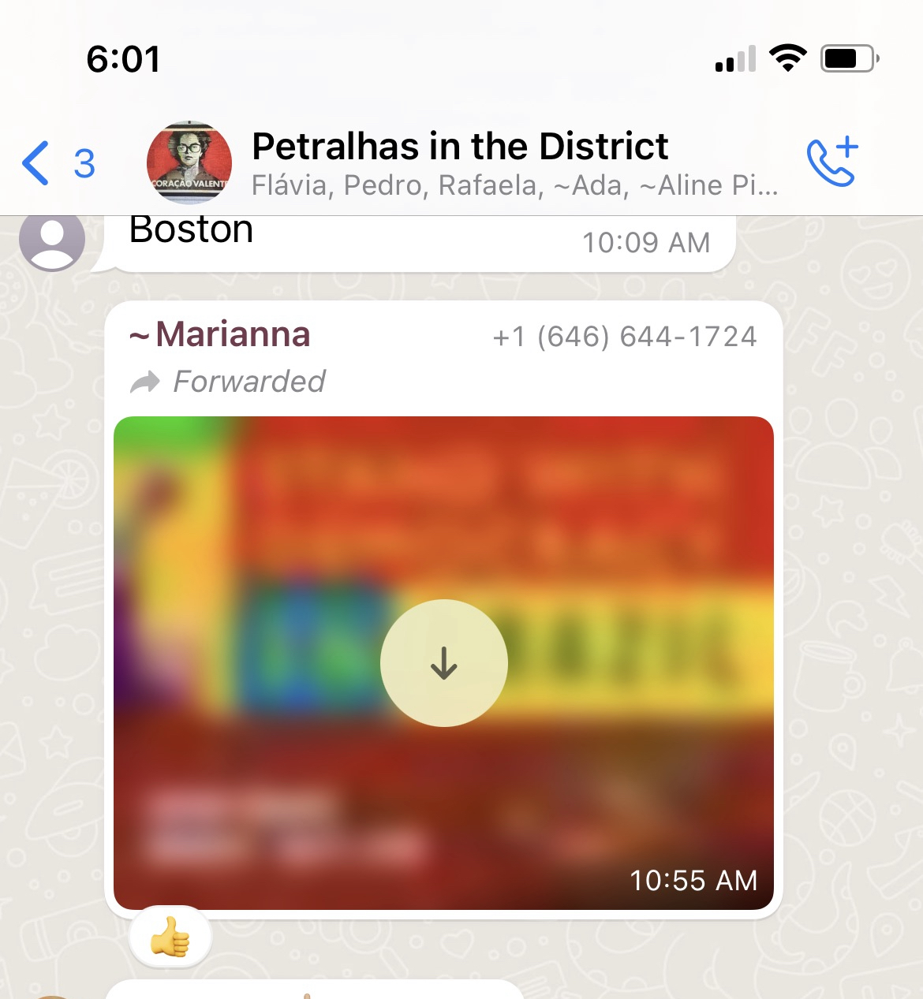
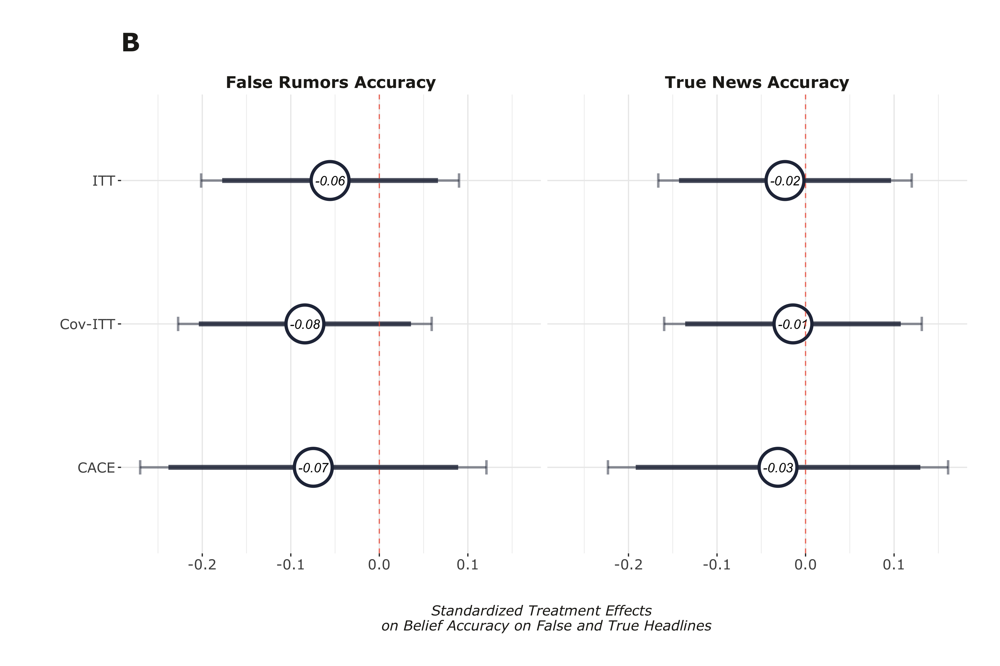

layout: true

<div class="my-footer"><span>Tiago Ventura | Georgetown University &nbsp &nbsp &nbsp &nbsp &nbsp &nbsp &nbsp &nbsp &nbsp &nbsp &nbsp &nbsp &nbsp &nbsp &nbsp &nbsp &nbsp &nbsp Tech & Public Policy Grantee Conference </span></div> 

```{r setup, include=FALSE}
options(htmltools.dir.version = FALSE)
knitr::opts_chunk$set(message=FALSE, warning = FALSE)
xaringanthemer::style_mono_light(base_color ="#23395b", 
                                  title_slide_text_color="#ffff", 
                                  title_slide_background_color = "#23395b", 
                                  background_color = "#fff", 
                                  link_color =  "#0072CE")
options(htmltools.dir.version = FALSE)
knitr::opts_chunk$set(message=FALSE, warning = FALSE, error=TRUE, echo=FALSE, cache=TRUE)
```

```{r style-share-again, echo=FALSE}
xaringanExtra::use_tile_view()
xaringanExtra::use_panelset()

#xaringanExtra::style_share_again(
#  share_buttons = c("twitter", "linkedin", "pocket")
#)
```

---

class:middle
### Motivation

.center[
```{r out.width="100%"}
knitr::include_graphics("nyt.png")
```

]

--

---
class:middle

### WhatsApp Multimedia Deactivation Experiment - Brazil 2022

--

`r icons::fontawesome("arrow-alt-circle-right")` .red[Research Problem:] What are the causal effect of WhatsApp usage on beliefs for misinformation and its downstream effects, particularly political polarization?

--

`r icons::fontawesome("arrow-alt-circle-right")` .red[Design:] Multimedia-Constrained Deactivation Experiment on WhatsApp:

- Incentivized participants to spent three weeks without accessing any multimedia (images, videos and audio) on WhatsApp.


--

`r icons::fontawesome("arrow-alt-circle-right")` .red[Context:] Weeks before the 2022 Presidential Election in Brazil


---
class:middle

## Intervention


.pull-left[
.center[
```{r  out.width="70%"}
knitr::include_graphics("./output/iphone_deact.jpeg")
```
]
]


.pull-right[
<br>
.center[
```{r  out.width="80%"}

```
]
]

---
class:middle, inverse, center

# Results

---
class:middle

### Effects on Exposure to Misinformation Rumors (H1)

.center[
```{r  out.width="90%"}
knitr::include_graphics("./output/exposure_h1.png")
```
]

---
class:middle

### Effects on Belief Accuracy (H2)

.center[
```{r  out.width="90%"}

```
]


---
class:middle

### Effects on Polarization & Subjective Well-Being (H3 & H4)

.center[
```{r  out.width="90%"}
knitr::include_graphics("./output/pol_sw_index.png")
```
]

---
class:middle

## Limitations

- Scope conditions: focus on **.red[direct effects]** of exposure to misinformation on WhatsApp. 

- Effects might be **.red[context-dependent]**

  - Previous deactivation studies found different results in United States (x2), France and Bosnia
  
- **.red[Election context]**: richer information environment + motivated reasoning

---
class:middle, center, inverse

# Tech & Public Policy Proposal

---
class:middle

## Multi-Country WhatsApp Deactivation

--

`r icons::fontawesome("arrow-alt-circle-right")` .red[Research Problem:] What are the causal effect of WhatsApp usage on beliefs for misinformation and its downstream effects, particularly political polarization?

--

`r icons::fontawesome("arrow-alt-circle-right")` .red[Design:] Multi-Country Deactivation in three major Global South Democracies with Presidential Elections:

- Country Selection: Mexico, South Africa, India

- High WhatsApp usage + Ethnic and Political Polarization + Misinformation traveling primarely through WhatsApp

--

`r icons::fontawesome("arrow-alt-circle-right")` .red[Design:] Interventions: 

- Multimedia Deactivation - Focus on reducing exposure to Misinformation

- Reduction on WhatsApp usage - Full deactivation, >10min per day. 

- Four week period. 

--

---
class:middle

## Extensions

- Effects of group-based conversations on political polarization (Fall 2024)

- Online Data Donation Tool for Content from WhatsApp Groups (Fall 2024)
  
  - Focus on immigrant communities in the US
  
  - Conditional on time also used in the multi-country deactivation


---
class:middle

## Progress

- Our first big effort was on building a team of experts and select the countries to run the experiment: 

 + [Joshua Tucker](https://wp.nyu.edu/fas-joshuatucker/): Director of NYU’ Center for Social Media and Politics (CSMaP)

  + [Shelley Liu](https://www.shelleyxliu.com/): Assistant professor at Duke University, Sanford School of Public Policy

  + [Rajeshwari Majumdar](https://r-majumdar.github.io/): PhD Candidate, NYU Politics
    
  + [Carolina Torreblanco](https://carolina-torreblanca.github.io/): PhD Candidate, NYU Politics
  
  + [Maitreyi Natarajan])():  McCourt School’s Tech & Public Policy Scholar 

---
class:middle

## Progress

- IRB Review: November and December

- Recruitment: Starting in January

- Deactivation: Early April to May. 

---
class:middle, center, inverse

# Impact

---
class:middle

## Causal Effects of WhatsApp on Politics

--
- **Claims about WhatsApp**:

  - Downstream effects on episodes offline violence 
  
  - Affects voting choices in Global South elections
  
  - Facilitates spread of misinformation -> beliefs

--

- **Our work provides the first comparative evidence for the effects of WhatsApp on political outcomes**. 

  - Separates general usage vs direct exposure to misinformation
  
  - Contextual variation
  
--

---
class:middle

## Causal Effects of Misinformation on Political Attitudes

- Since 2016, Google scholar returns 200,000 studies to the word "misinformation".

- **No causal evidence -> poor policy choices.** 

   - Policymakers and  technologists risk proposing solutions grounded in conventional wisdom, folk theory, or research from heterogeneous contexts. 
   
- Most recent studies (**.red[Meta 2020 Studies]**) have found null effects from misinformation exposure on attitudes. 


---
class:middle

## The role of multimodal content on spread of misinformation

Our work also focuses on multimodal content: 

- Most academic work has focuses on textual misinformation

- In contexts of low literacy, multimodal content have dominated the misinformation market

  - travel fasters
  
  - easier to understand
  
- Most social media companies have guardrails focused on text/sources. Little developed for multimodal content. 

---
class:middle

## Dissemination Plan
- Present at major academic conferences in the next year calendar: APSA, IC2S2 & ICA

- Summer 2024: Social Media and Politics Conference at Georgetown (together with John Ladd)

- Open discussions about industry-academic collaborations with Meta/WhatsApp

---
class:center, middle, inverse

# Q&A