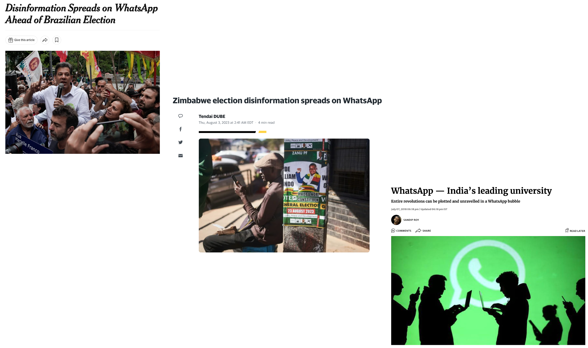
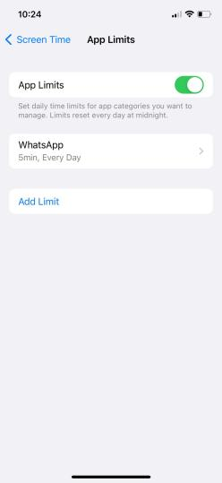
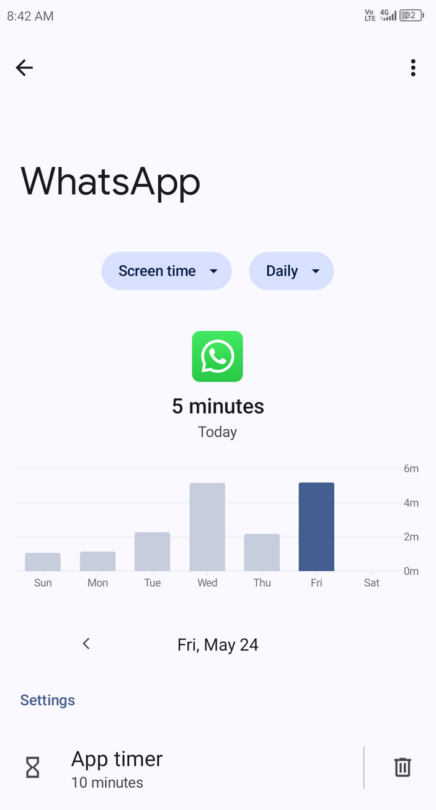
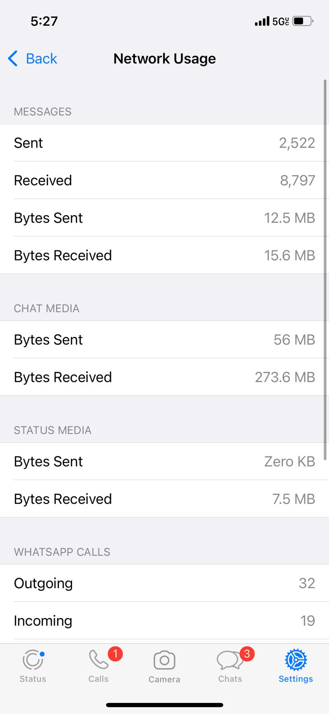
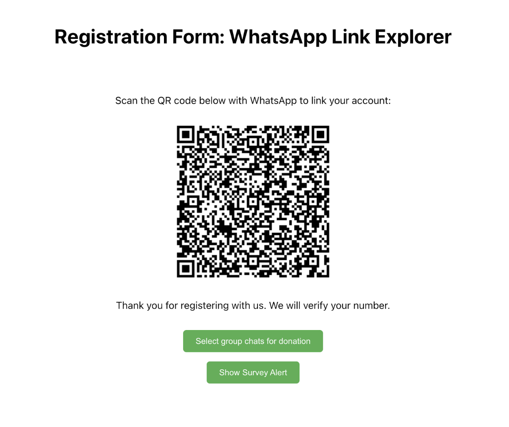
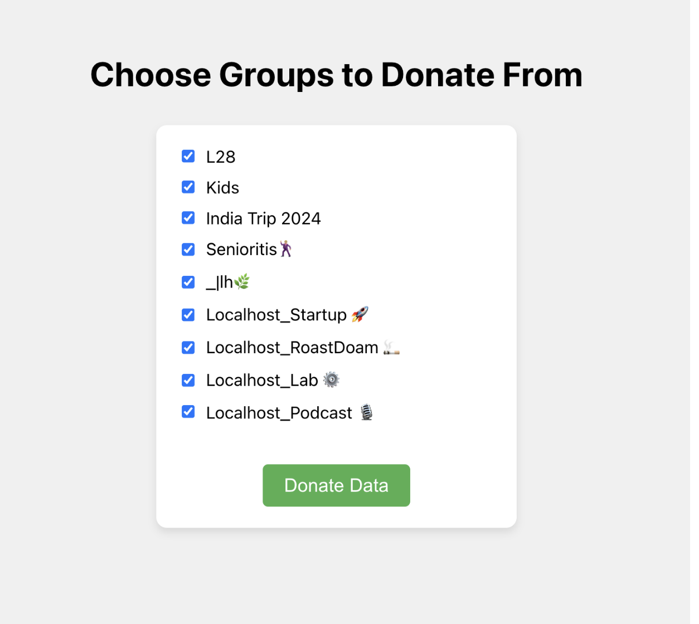

layout: true

<div class="my-footer"><span>Tiago Ventura (Georgetown University) &nbsp &nbsp &nbsp &nbsp &nbsp &nbsp &nbsp &nbsp &nbsp &nbsp &nbsp &nbsp &nbsp &nbsp &nbsp &nbsp &nbsp &nbsp &nbsp &nbsp &nbsp &nbsp &nbsp Tech & Public Policy Symposium</span></div> 

```{r setup, include=FALSE}
library(xaringanthemer)
options(htmltools.dir.version = FALSE)
knitr::opts_chunk$set(messagwese=FALSE, warning = FALSE)
xaringanthemer::style_mono_light(base_color ="#23395b", 
                                  title_slide_text_color="#ffff", 
                                  title_slide_background_color = "#23395b", 
                                  background_color = "#fff", 
                                  link_color =  "#23395b")
options(htmltools.dir.version = FALSE)
knitr::opts_chunk$set(message=FALSE, warning = FALSE, error=TRUE, echo=FALSE, cache=TRUE)
```

```{r style-share-again, echo=FALSE}
xaringanExtra::use_tile_view()
xaringanExtra::use_panelset()

#xaringanExtra::style_share_again(
#  share_buttons = c("twitter", "linkedin", "pocket")
#)
```


---
class:middle, inverse

# Motivation

---
class:middle
### Social Media, Misinformation and Politics

--

- **From Liberation to Turmoil**: At least since 2016, after some initial optimism, most of the public and policy debates over the effects of social media in society have been dominated by the issue of misinformation (.midgrey[Tucker et. al., 2018])

--

- **Almost decade after**: gap between public discourse and scientific research on this issue .midgrey[(Budak et. al., 2024)].

--

-  **Majority of scholarly work comes from W.E.I.R.D countries**:

--
   - Over 80% of existing studies on interventions to correct misinformation focus on Global North countries .midgrey[(Blair et. al. 2023,  Badrinathan and Chauchard, 2023a)]

--

--
   - In the Global South:
   
      - Informal networks for information sharing matter more ~ easier to mix true and false information.
      - The real-world effects of misinformation exposure may be more pronounced in these countries, fewer fact-checking agencies, and weaker institutions, for example.
      - Social media messaging apps are more prevalent vs feed-based platforms for information consumption.

--


---
class:middle


```{r out.width="100%"}

```


---
class:middle

## Studies Today:

#### `r icons::fontawesome("arrow-alt-circle-right")`  .red[Causal:] Reducing WhatsApp Usage to Mitigate Misinformation Exposure During Elections: Evidence from a Multi-Country Experiment (With Rajeshwari Majumdar, Shelley Liu, Carolina Torreblanca, and Joshua A. Tucker)

#### `r icons::fontawesome("arrow-alt-circle-right")` .red[Descriptive:] WhatsApp Links Explorer: Data Donation Pipeline for WhatsApp Data (With Jonathan Nagler, and any others interested in collecting WhatsApp data)]


---
class: middle

### Studying Causal Effectcs of Social Media Usage

--

- **Problem I:** In a context of widely adoption of certain social media applications, RCTs "treating" users with social media have several theoretical and statistical constraints
  
   - **Solution:** Instead of "activating", researchers have used deactivation designs to measure the short term causal effects of social media usage .midgrey[(Asimovic et. al. 2022, Alcott et. al. 2020, Arcenaux and Ladd 2023)]
   
--

- **Problem II **: Fully deactivating WhatsApp is neither possible nor ideal

--

- **Our Design:** Partial Deactivation to reduce exposure to misinformation 

   - **Time Treatment:** Incentivize users to reduce time spent on WhatsApp 

   - **Media Treatment** Cut the primary channels through which users are exposed to misinformation and polarizing content: videos, images and audios (Replication of Ventura et al., 2024)

--


---
class: middle

### MultiCountry Experimental Intervention


--

- **Selected some of the largest Global South countries having democratic elections in 2024.**

  - India: **Presidential Elections** Spring 2024
  - South Africa: **Presidential Elections** Spring 2024
  - Brazil: **Local Elections** Fall 2024

--

-  **Experiment:** Friction + Incentive to change behavior:

   - **Time Treatment:** Add a 5min time limit for WhatsApp usage per day;
   - **Media Treatment**: Disable their automatic download of media on WhatsApp, and do not purposefully click and watch any media on WhatsApp;

--

- **Treatment and control:** 

   - **Treatment**: Change settings and behavior for 4 weeks (one month) leading up to election in three countries
   - **Control:** Change only behavior for 3 days a month before election

--

- **Outcomes:** Recall, Accuracy, Polarization and Well-Being. 

--

---
class:middle

### Treatment Time Intervention & Compliance

.pull-left[
.center[
#### Intervention: Adding Friction
```{r out.width="55%"}
 
```
]
]
.pull-right[
.center[
#### Compliance: Monitoring Behavior

```{r out.width="60%"}

```
]
]

---
class:middle 
### Treatment Media Intervention & Compliance

.pull-left[
.center[
#### Intervention: Adding Friction
```{r out.width="60%"}
knitr::include_graphics("ss_tmedia_examplereal_dlpre.png") 
```
]
]

.pull-left[
.center[

#### Compliance: Monitoring Behavior

```{r out.width="60%"}

```

]]

---
class: middle

### Progress Update

- Experiment successfully deployed across the three countries

- Pre-Registration available here: [https://osf.io/e4dmt/](https://osf.io/e4dmt/)

- Started with 2,429 respondents across the three countries; 2,234 (92%)
completed the endline survey. Data collection finalized in Brazil last month.

- Working paper with early results from India and South Africa - Presented at APSA 2024. 

- **Next steps**: 

  - Use GenAI + Human Coders to labels the screenshots from compliance.
  
  - Analyze the three experiments together.
  
  - Planned Presentations: Mortara Center, Columbia Media Effects Workshop, MPSA, NYU Experimental Workshop.
  
  - Submit for publication: Spring 2024


---
class:middle

#### `r icons::fontawesome("arrow-alt-circle-right")` .palegrey[Reducing WhatsApp Usage to Mitigate Misinformation Exposure During Elections: Evidence from a Multi-Country Experiment (With Rajeshwari Majumdar, Shelley Liu, Carolina Torreblanca, and Joshua A. Tucker)]

#### `r icons::fontawesome("arrow-alt-circle-right")` .red[WhatsApp Links Explorer: Data Donation Pipeline for WhatsApp Data] (With Jonathan Nagler, and any others interested in collecting WhatsApp data)

---
class:middle
### WhatsApp Link Explore: A Data Donation Pipeline

Experiments offer us causal effects of interventions. However, as important as identifying the effects of interventions, it is to descriptively understand the informational environment on WhatsApp and encrypted apps in general. 

--

- **Reuters Digital News Report, 2024**: WhatsApp appears as one of the most used apps for News in many Global South Countries, for example, first in Brazil, second in India, and second in SA. 

   - All of this, despite not having a news feed! All sharing behavior from groups and one-on-one chats.  

--

- **Chalenge:** WhatsApp is end-to-end encrypted. No available data to analyze.

--

- But, users can easily export their data. This makes data donation the easiest (possible only way to collect WhatsApp Data)

--

- Develop a pipeline using [WhatsApp Web](https://github.com/pedroslopez/whatsapp-web.js); A WhatsApp API client that connects through the WhatsApp Web browser app, support by MDI, Georgetown. 

--

---
class:middle
## Data Donation Pipeline

--

- Recruit participants via surveys

--

- Ask them to authenticate in the web app (no need to download anything; but need two devices)

--

- Participants can choose which groups to donate the data. Only allow groups >5 participants.

--

- Collect: 
   - users' metadata, 
   - groups' metadata,
   - messages from donated groups.
   - only collect messages that contains URLs, avoid collecting risky and private content (images, messages, videos.)

--

---
## Examples of the Data Pipeline

.pull-left[
```{r out.width="100%"}

```
]

.pull-right[
```{r out.width="100%"}

```

]

- Planned Data Collections: CSIP-Latinos in the US; online sample in Brazil. 

---
class:center, inverse, middle

# Impact

---
class: middle

## Multicountry Experiment: The importance of causal effects

**Our work provides the first comparative study for the effects of WhatsApp on exposure to misinformation and political outcomes **. 

- Understand the most used social media app in the global south (where most of the population in the world lives!)

- Helps closing the gap between public perceptions and scientific evidence about the effects of social media and politics. 

   - Policy decisions depend on strong and robust scientific evidence
   
   - Without those, policy makers make decisions based on particular cases and folk theory. 

- Deeper understanding of contextual effects.

---
class:middle

## The role of multimodal content on spread of misinformation

Our work also focuses on multimodal content: 

- Most academic work has focuses on textual misinformation

- In contexts of low literacy, multimodal content have dominated the misinformation market

  - travel fasters
  
  - easier to understand
  
- Most social media companies have guardrails focused on text/sources. Little developed for multimodal content. 

---
class:middle

## Data Donation

- Critical to be able to describe the informational environment on WhatsApp. 

- Most of the previous research rely mostly on large public groups (a small part of the WhatsApp environment)

- Open source tool: plan to share with others to collect data in their countries and for their own research


---
class:middle

# Thank you!

