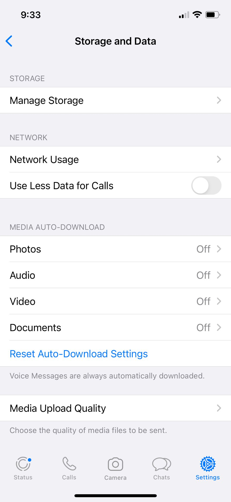
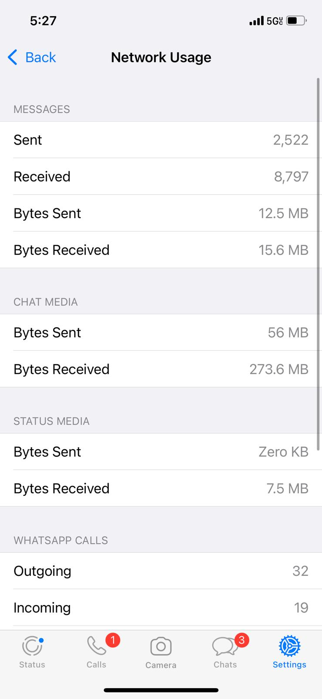

layout: true

<div class="my-footer"><span>Tiago Ventura (CSMaP) &nbsp &nbsp &nbsp &nbsp &nbsp &nbsp &nbsp &nbsp &nbsp &nbsp &nbsp &nbsp &nbsp &nbsp &nbsp &nbsp Laboratório de Ciência Computacional e Experimental - UFPE </span></div> 

```{r setup, include=FALSE}
options(htmltools.dir.version = FALSE)
knitr::opts_chunk$set(messagwese=FALSE, warning = FALSE)
xaringanthemer::style_mono_light(base_color ="#23395b", 
                                  title_slide_text_color="#ffff", 
                                  title_slide_background_color = "#23395b", 
                                  background_color = "#fff", 
                                  link_color =  "#DA291C")
options(htmltools.dir.version = FALSE)
knitr::opts_chunk$set(message=FALSE, warning = FALSE, error=TRUE, echo=FALSE, cache=TRUE)
```

```{r style-share-again, echo=FALSE}
xaringanExtra::use_tile_view()
xaringanExtra::use_panelset()

#xaringanExtra::style_share_again(
#  share_buttons = c("twitter", "linkedin", "pocket")
#)
```


---
class:middle


### From Liberation to Turmoil: The Misinformation Turn


.center[
```{r out.width="100%"}
knitr::include_graphics("output/time.png")
```

[From Liberation to Turmoil, Tucker et. al., 2019](https://muse.jhu.edu/article/671987)
]
---
class:middle, inverse

## Three insights from the recent literature on social media and misinformation. 

---
class: middle 

## 1) People .red[aren’t] actually exposed to a lot of .red[misinformation] – but exposure is heavily concentrated. 
---
class:middle 

```{r out.width="100%"}
knitr::include_graphics("gringer.png")
```
.center[[Grinberg et al., 2019](https://www.science.org/doi/pdf/10.1126/science.aau2706)]

---
class: middle 

## 2) The downstream effects of exposure to misinformation on political atttitudes are .red[difficult to measure, often small in size, and context dependent]. 

---

class:middle 

### .center[Exposure to IRA Russian Misinformation on Twitter  doesn’t lead to changes in attitudes]

.center[

```{r out.width="70%"}
knitr::include_graphics("russian.png")
```

.center[[Eady et al., 2023](https://www.nature.com/articles/s41467-022-35576-9)]
]


---
class:middle 

### .center[Causal effects of social media are context-dependent]

.pull-left[

.middle[
```{r out.width="100%"}

```

.center[Facebook Deactivation in the US [Alcott et al., 2020](https://www.aeaweb.org/articles?id=10.1257/aer.20190658)]
]
]

.pull-right[

.middle[
```{r out.width="120%"}

```

.center[Facebook Deactivation in Bosnia and Herzegovina [Asimovic et. al, 2022](https://www.pnas.org/doi/10.1073/pnas.2022819118)]
]
]
---
class:middle

## 3) Most of the scholarly evidence come from a .red[advanced democracies] and from a .red[few platforms] (mostly Twitter, and to some extent Facebook)

---
class:middle 

.center[
```{r out.width="100%"}
knitr::include_graphics("nyt.png")
```

]

--

---
class:middle
## Today's Presentation

--
.red[Research Problem:] What are the causal effect of WhatsApp usage on beliefs for misinformation and its downstream effects, particularly political polarization?

--

.red[Design:] Multimedia-Constrained Deactivation Experiment on WhatsApp:

- Incentivized participants to spent three weeks without accessing any multimedia (images, videos and audio) on WhatsApp.


--

.red[Context:] Weeks before the 2022 Presidential Election in Brazil


--
.red[Results:] 

- Substantive reduction in **exposure to popular misinformation rumors**.

- Unable to detect small to moderate effects on **attitudes (belief accuracy and polarization)**

--

---
### Deactivation Studies on Facebook

```{r out.width="90%"}
knitr::include_graphics("deactivation_studies.png")
```
.pull-left[.center[Facebook Deactivation in the US [Alcott et al., 2020](https://www.aeaweb.org/articles?id=10.1257/aer.20190658)]]

.pull-right[.center[Facebook Deactivation in Bosnia and Herzegovina [Asimovic et. al, 2022](https://www.pnas.org/doi/10.1073/pnas.2022819118)]]

---

class: middle

`r icons::fontawesome("arrow-alt-circle-right")` **Our Design:** Cut the primary channels through which users are exposed to misinformation and polarizing content: videos, images and audios .red[(Machado et al., 2019; Resende et al., 2019; Garimella and Tyson, 2018; Garimella and Eckles, 2020; Batista Pereira et al., 2023).]

--

`r icons::fontawesome("arrow-alt-circle-right")` **Experiment:** Offer respondents a monetary incentive to

- Disable their automatic download of media on WhatsApp.
- Do not purposefully click and watch any media on WhatsApp.

--

`r icons::fontawesome("arrow-alt-circle-right")` **Treatment Period:** Three weeks:

- **Start:** Three weeks before general election in Brazil.
- **End:** three days after the voting day.

---
class:center, inverse, middle

## Overview of the Experiment

---

## Recruitment

**Method:** Facebook Ads targeting adults Brazil

**Started Recruitment:** September 8th

**Number of respondents:** 1,947

**Screening variables:** 

  + Willingness to join: .red[1,8861 participants]
  
  + More 5min WhatsApp daily

  + Only WhatsApp mobile
  
  + More than 2 min to complete recruitment + other quality controls


---

## Treatment Assignment

.pull-left[

**Start**: September 15.

**Treatment**:

- Turn off the automatic download.
- Three .red[weeks] without consuming any multimedia.
  
**Control**: Three .red[days] without consuming any multimedia.

**Invited**: 1,135 respondents 

**Completed**: 773 respondents
]


.pull-right[
.center[
```{r  out.width="80%"}

```
]
]

---

## Compliance Checks


.pull-left[

**Compliance Tasks:**

- Screenshots of WhatsApp storage intormation 

- Every week + final survey

- After the  first compliance check, the control group was activated

]


.pull-right[
.center[
```{r  out.width="80%"}

```
]
]

---
class:middle
## Outcomes

--

**Self-Reported Exposure and Accuracy Judgment**

  - False Rumors published on fact-checking webpages during the month of the experiment + True News stories headlines from mainstream media.

--

**Polarization**

  - Affective polarization (Feeling Thermometer).
  - Social Polarization (Willingness to engage with outgroup voter).
  - Issue Polarization (Abortion, gun control, etc..).
  - Perceptions about ideological polarization ('Where do I observe the two main candidates?').

--

**Subjective Well-being**

  - How did you feel for the past three weeks? (Happy, Anxious, etc...).

--

---
class:middle

## Hypotheses

H1: Deactivated users will report lower levels of previous exposure to FALSE rumors.

H2a: Deactivated  will display a higher ability to accurately identify FALSE rumors.

H2b Deactivated users will display lower levels of mainstream news knowledge.

H3: Deactivated will display lower levels of outgroup political polarization.

H4: Deactivated will display higher levels of the aggregated index of subjective well-being.

---

## Recruitment and Power Analysis


.pull-left[
**Complete Responses:** 732.
]

.pull-right[

**Attrition Rate:** 5.3%.

]

.center[

```{r  out.width="70%"}
knitr::include_graphics("./output/sims_with_covariate.png")
```

]

---
class: center, middle, inverse

# Results

---

### First-Stage Results

.center[
```{r  out.width="90%"}
knitr::include_graphics("./output/models_compliance.png")
```
]

---
### Effects on Exposure to Misinformation Rumors (H1)

.center[
```{r  out.width="90%"}
knitr::include_graphics("./output/exposure_h1.png")
```
]

---
### Reduction in exposure is large for false news (H1)

.center[
```{r  out.width="90%"}
knitr::include_graphics("./output/difference_true_false_exposure.png")
```
]

---
### Effects on Belief Accuracy (H2)

.center[
```{r  out.width="90%"}
knitr::include_graphics("./output/belief_accuracy_h2.png")
```
]

---

### Belief Accuracy Conditional on WhatsApp usage for Politics

.center[
```{r  out.width="90%"}
knitr::include_graphics("./output/sif_het_use_whatsapp_fac.png")
```
]


---
### Effects on Polarization & Subjective Well-Being (H3 & H4)

.center[
```{r  out.width="90%"}
knitr::include_graphics("./output/pol_sw_index.png")
```
]

---
### Polarization Outcomes

.center[
```{r  out.width="90%"}
knitr::include_graphics("./output/pol_outcomes.png")
```
]

---

class: middle

## Discussion


--

`r icons::fontawesome("arrow-alt-circle-right")` **WhatsApp is an important vector through which voters receive misinformation in Brazil at .red[a higher rate] compared to true news.**

--

`r icons::fontawesome("arrow-alt-circle-right")` **The null results provide support for a .red[minimalist view of the short-term causal effects] of exposure to misinformation on WhatsApp on political attitudes.**
--

`r icons::fontawesome("arrow-alt-circle-right")`  **Exposure to misinformation .red[does not] mechanically affect attitudes**

--

---
class:middle

## Limitations

--

- Scope conditions: focus on direct effects of WhatsApp. 

--

- Larger effect might exist exactly in hard to reach groups.

--

- Small effect size vs power

--

---
class: middle

## Next steps. 

--

### Replication, Replication, Replication

--

---
class:middle

## Extra points for discussion

- Pre-Analysis plan

- Pilot(s)

- Interacting with participants

- Costs of running a field experiment

- Researching on a "natural science" style lab

- PhD in the United States

- Job Market

- etc..
---
class:center, middle, inverse

## Obrigado!!