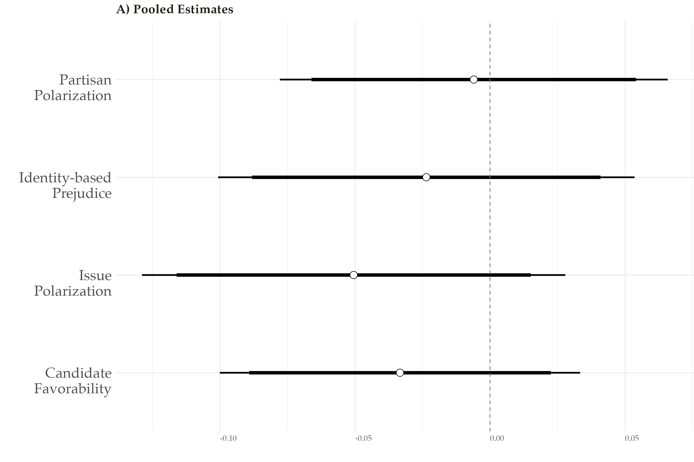
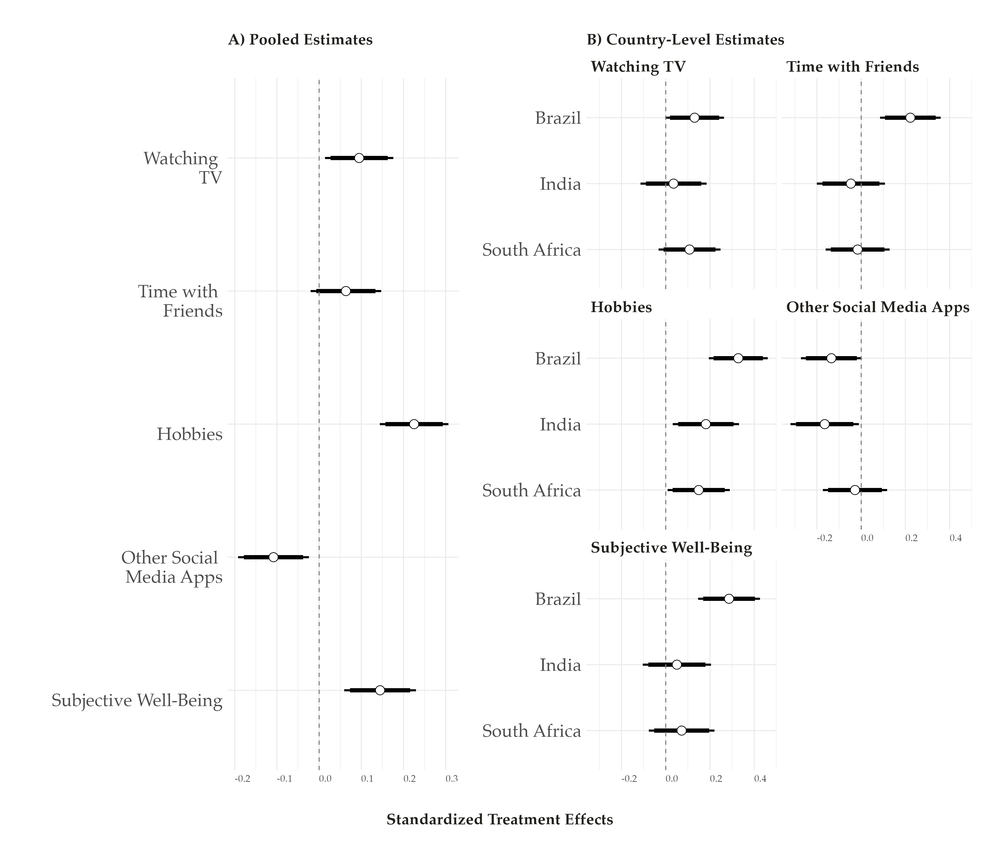

layout: true

<div class="my-footer"><span>Tiago Ventura (Georgetown University) &nbsp &nbsp &nbsp &nbsp &nbsp &nbsp &nbsp &nbsp &nbsp &nbsp &nbsp &nbsp &nbsp &nbsp &nbsp &nbsp &nbsp &nbsp &nbsp &nbsp &nbsp &nbsp &nbsp Comppit FGV Roundtable 2025</span></div> 

```{r setup, include=FALSE}
library(xaringanthemer)
options(htmltools.dir.version = FALSE)
knitr::opts_chunk$set(message=FALSE, warning = FALSE)
xaringanthemer::style_mono_light(base_color ="#2e4a75", 
                                  title_slide_text_color="#ffff", 
                                  title_slide_background_color = "#2e4a75", 
                                  background_color = "#fff", 
                                  link_color =  "#2e4a75")
options(htmltools.dir.version = FALSE)
knitr::opts_chunk$set(message=FALSE, warning = FALSE, error=TRUE, echo=FALSE, cache=TRUE)
```

```{r style-share-again, echo=FALSE}
xaringanExtra::use_tile_view()
xaringanExtra::use_panelset()

#xaringanExtra::style_share_again(
#  share_buttons = c("twitter", "linkedin", "pocket")
#)
```

---
class: middle
## Research Agenda 

.content-box-gray[Understand information consumption via messaging apps, and identify causal effects of **.red[WhatsApp Usage]** on **.red[political]** and **.red[non-political]** attitudes.]


---
class:middle

## Papers

 `r icons::fontawesome("arrow-alt-circle-right")` Misinformation Beyond Traditional Feeds: Evidence from a WhatsApp Deactivation Experiment in Brazil (With Rajeshwari Majumdar, Jonathan Nagler, and Joshua A. Tucker), Forthcoming Journal of Politics 

`r icons::fontawesome("arrow-alt-circle-right")` Reducing WhatsApp Usage to Mitigate Misinformation Exposure During Elections: Evidence from a Multi-Country Experiment (With Rajeshwari Majumdar, Shelley Liu, Carolina Torreblanca, and Joshua A. Tucker) (Working Paper)

---
class: middle

### Multimedia Deactivation Experiment in Brazil, 2022

--
`r icons::fontawesome("arrow-alt-circle-right")` **Problem**: Fully deactivating WhatsApp is neither possible nor ideal

--

`r icons::fontawesome("arrow-alt-circle-right")` **Partial Deactivation:** Offer respondents a monetary incentive to

- Disable their automatic download of media on WhatsApp
- Do not purposefully click and watch any media on WhatsApp

--

`r icons::fontawesome("arrow-alt-circle-right")` **Mechanism:** Cut the primary channels through which users are exposed to misinformation and polarizing content: videos, images and audios .midgrey[(Machado et al., 2019; Resende et al., 2019; Garimella and Tyson, 2018; Garimella and Eckles, 2020; Batista Pereira et al., 2023).]

--

`r icons::fontawesome("arrow-alt-circle-right")` **Treatment Period:** Three weeks:

- **Start:** Three weeks before general election in Brazil.
- **End:** three days after the voting day.

--
---
class:middle, center, inverse

# Overview of the Experiment

---
class:middle

.center[
```{r out.width="120%"}

```
]


---
### Treatment Media Intervention & Compliance

.pull-left[
.center[
#### Intervention: Adding Friction
```{r out.width="60%"}
knitr::include_graphics("output_mpsa/ss_tmedia_examplereal_dlpre.png") 
```
]
]

.pull-left[
.center[

#### Compliance: Monitoring Behavior

```{r out.width="60%"}
knitr::include_graphics("output_mpsa/ss_tmedia_networkusage.jpeg")
```

]
]


---
class: center, middle, inverse

# Pre-Registered Results

---

### First-Stage Results

.center[
```{r  out.width="90%"}
knitr::include_graphics("output/output/models_compliance.png")
```
]


---
class:  middle

### Exposure to and Belief in News Headlines 


- Participants are shown 8 news headlines; asked (a) whether they have seen this news before & (b) whether they think the news is true  

- Four headlines are true news; four are misinformation stories  

- Count how many (a) recalled & (b) accurately identified as T/F  


---
### Effects on Exposure to Misinformation Rumors 

.center[
```{r  out.width="90%"}
knitr::include_graphics("output/output/exposure_h1.png")
```
]

---
### Reduction in exposure is large for false news 

.center[
```{r  out.width="90%"}
knitr::include_graphics("output/output/difference_true_false_exposure.png")
```
]

---
### Effects on Belief Accuracy 

.center[
```{r  out.width="90%"}
knitr::include_graphics("output/output/belief_accuracy_h2.png")
```
]

---
class:middle

## Downstream Effects: Measuring Polarization


- Participants are asked about their feelings towards with voters of two main Presidential Candidates (Lula and Bolsonaro) -- Affective Polarization

- We also ask their willingness to engage with voters from these candidates -- Social Polarization

- And their agreement across several policy issues salient in the election -- Ideological Polarization


---
class:middle

## Downstream consequences on political polarization 

.center[
Can this short-term reduction in exposure to political misinformation change political attitudes and reduce polarization?
]

--

.center[
**Not quite.**
]


---
### Effects on Polarization

.center[
```{r  out.width="90%"}
knitr::include_graphics("output/output/pol_outcomes.png")
```
]

---
class:inverse, center, middle

# Additional Results


---
### Exposure and Partisanship

.center[
```{r  out.width="90%"}
knitr::include_graphics("output/output/sif_exposure_bothparties_counter_pro.png")
```
]

---
### Belief Accuracy Conditional on WhatsApp usage for Politics

.center[
```{r  out.width="90%"}
knitr::include_graphics("output/output/sif_het_use_whatsapp_fac.png")
```
]


---

class: middle

## Discussion


`r icons::fontawesome("arrow-alt-circle-right")` **WhatsApp is an important vector through which voters receive misinformation in Brazil at .red[a higher rate] compared to true news.**


`r icons::fontawesome("arrow-alt-circle-right")` **The null results provide support for a .red[minimalist view of the short-term causal effects] of exposure to misinformation on WhatsApp on political attitudes.**

`r icons::fontawesome("arrow-alt-circle-right")`  **Exposure to misinformation .red[does not] mechanically affect attitudes**

`r icons::fontawesome("arrow-alt-circle-right")` **Limitation:** single-country, low-powered study: effects are likely larger among subgroups more exposure to misinformation, and vary contextually. 


---
class: middle
### Multi-Country Deactivation Experiment

- **Problem**: Single country studies have limited power to speak of contextual effects (and in our case, limited statistical power)

- **Summary**: Multicountry extension across three major Global South countries; Brazil, India and South Africa

- **Stronger Treatment**: Replicate Multimedia Deactivation + Time Reduction

- **More statistical power and external validity**: ~ 2500 participants across the three countries.  

---
class:middle

### Multi-Country WhatsApp Partial Deactivation Experiment

--

-  **Design:** Partial Deactivation -> Friction + Incentive to reduce usage:

   - **Media Treatment**: Disable their automatic download of media on WhatsApp, and do not purposefully click and watch any media on WhatsApp;
   - **Time Treatment:** Add time limit for WhatsApp usage per day + Limit Usage to 5min per day;


--

- **Duration:** 

   - **Treatment**: Change settings and behavior for 4 weeks (one month) leading up to election in three countries
   - **Control**: Change ONLY behavior for 3 days.
   
--

- **Multicountry Design:** selected some of the largest Global South countries having democratic elections in 2024.

  - India: **General Election** Spring 2024
  - South Africa: **Presidential Election** Spring 2024
  - Brazil: **Local Election** Fall 2024

--

---
class:middle, center, inverse

# Experimental Design

---
class: middle

```{r out.width="100%"}
knitr::include_graphics("output/design.png")
```

- Participants enrolled: 2426 (678 in India, 820 in South Africa, and 928 in Brazil)

- Final Sample: 2220 (653 in India, 742 in South Africa, and 825 in Brazil)


---
class:middle
### Treatment Time - Intervention & Compliance

.pull-left[
.center[
#### Intervention: Adding Friction
```{r out.width="55%"}
knitr::include_graphics("output/time-limite.png") 
```
]
]

.pull-right[
.center[
#### Compliance: Monitoring Behavior

```{r out.width="60%"}
knitr::include_graphics("output_mpsa/ss_ttime_actualsubject_lightmode.png")
```
]
]

---
class:middle 

### Treatment: Media Intervention & Compliance

.pull-left[
.center[
#### Intervention: Adding Friction
```{r out.width="60%"}
knitr::include_graphics("output_mpsa/ss_tmedia_examplereal_dlpre.png") 
```
]
]

.pull-left[
.center[

#### Compliance: Monitoring Behavior

```{r out.width="60%"}
knitr::include_graphics("output_mpsa/ss_tmedia_networkusage.jpeg")
```

]
]

---
class:middle, inverse, center
# Results

---
class:middle
## Exposure of Rumors and True News

Limiting WhatsApp usage reduces exposure to misinformation & news  


```{r out.width="90%"}
knitr::include_graphics("output_mpsa/recall.png")
```

---
class:  middle
## Belief Accuracy

A short-term reduction in exposure does not translate to changes in accuracy judgments  

```{r out.width="90%"}
knitr::include_graphics("output_mpsa/accuracy.png")
```


---
class:  middle
## Uncivil content more broadly 

Using several different items, we find that limiting WhatsApp usage also reduces exposure to online incivility and low-quality political discourse  

```{r out.width="90%"}
knitr::include_graphics("output_mpsa/others_info.png")
```


---
class:  middle
### Downstream consequences on political polarization

```{r out.width="90%"}

```


---
class: middle

### Are these nulls effects consistent with other studies? 

--

**Yes**. Other studies with changes in consumption, but nulls on political attitudes:


- Multimedia whatsapp deactivation in Brazil, 2022 election .midgrey[(Ventura et al., 2025)]

- Recent Facebook/Instagram deactivation experiment in US and France .midgrey[(Allcott et al., 2024, Arceunaux et al., 2024)]


- Changing Facebook feed to chronological instead of algorithmic .midgrey[(Guess et al., 2023)]


- Removing re-shares from people's Facebook News Feed .midgrey[(Guess et al., 2024)]

- Installing a browser to signal when people are navigating on low-quality news websites  .midgrey[(Aslett et al., 2022)]

- And experiments incentivizing participants to take a "news vacation" for two weeks .midgrey[(Wojcieszak et al., 2022)]

--

---
class:  middle, center
### Downstream consequences on Non-Political Attitudes and Substitutes

Using several well-being items, we find that limiting WhatsApp usage makes participants feel better (happier, less anxious, less concerned about others)

--

 **This occurs alongside increased offline activity.** 

--

---
class:  middle, center

```{r out.width="90%"}

```

---
class:middle

## Key Takeaways

--

- WhatsApp is an important channel through which voters receive misinformation and news in major Global South democracies 

--

- Reduced exposure to such information does not mechanically affect accuracy perceptions 

--

- In the context of elections, WhatsApp also increases exposure to toxic content and uncivil political discussions

--

   - ...none of this change meaningfully political attitudes (at least not within a short electoral period) 

--

- Yet limiting WhatsApp usage **also** improves overall subjective well-being, and these effects are associated with higher time spent on offline activities.

--

---
class:center, inverse, middle

# Thank you!

