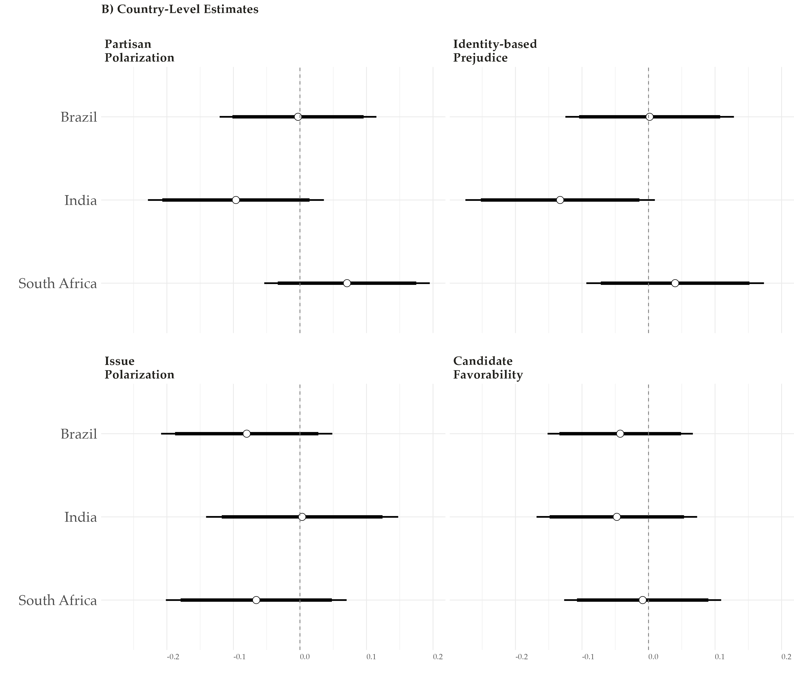

layout: true

<div class="my-footer"><span>Tiago Ventura (Georgetown University) &nbsp &nbsp &nbsp &nbsp &nbsp &nbsp &nbsp &nbsp &nbsp &nbsp &nbsp &nbsp &nbsp &nbsp &nbsp &nbsp &nbsp &nbsp &nbsp &nbsp &nbsp &nbsp &nbsp EBAPE-FGV Research Seminar</span></div> 

```{r setup, include=FALSE}
library(xaringanthemer)
options(htmltools.dir.version = FALSE)
knitr::opts_chunk$set(message=FALSE, warning = FALSE)
xaringanthemer::style_mono_light(base_color ="#2e4a75", 
                                  title_slide_text_color="#ffff", 
                                  title_slide_background_color = "#2e4a75", 
                                  background_color = "#fff", 
                                  link_color =  "#2e4a75")
options(htmltools.dir.version = FALSE)
knitr::opts_chunk$set(message=FALSE, warning = FALSE, error=TRUE, echo=FALSE, cache=TRUE)
```

```{r style-share-again, echo=FALSE}
xaringanExtra::use_tile_view()
xaringanExtra::use_panelset()

#xaringanExtra::style_share_again(
#  share_buttons = c("twitter", "linkedin", "pocket")
#)
```

---
class:middle, inverse, center
# Motivation

---
class: middle
## Social Media Effects in Politics
--

**From Liberation to Turmoil:** Over the past decade, public debate about social media usage have increasingly focused on its negative consequences on society. Social media is said to:

--

- Facilitates the spread of misinformation .midgrey[(Guess, Nyhan, and Reifler 2018; Flaxman, Goel, and Rao 2016)]

--

- Facilitates users' self-selection on online echo chambers .midgrey[(Guess et al. 2023; Sunstein 2018)]

--

- Increase exposure to uncivil/low-quality content .midgrey[(Bor and Petersen 2022)]

--

- ... polarizes voters around the world .midgrey[(Banks et al. 2021; Tokita, Guess, and Tarnita 2021; Bail et al. 2018; Settle 2018)]


--

- ... harms mental health .midgrey[(Tromholt 2016; Vanman, Baker, and Tobin 2018; Hanley, Watt, and Coventry 2019)]

--


---
class: center, middle

.center[
```{r out.width="110%"}
knitr::include_graphics("output/research_misinformation.png")
```
]

<!-- --- -->
<!-- class:middle -->

<!-- - **A decade after**: gap between public discourse and scientific research on this issue .midgrey[(Budak et al.,, 2024)]. Scientific research shows: -->

<!-- -- -->
<!-- - People aren’t actually exposed to a lot of misinformation/low-quality content – but exposure is heavily concentrated .midgrey[(Grinberg et al., 2019, Guess et al., 2019)] -->

<!-- -- -->

<!--    - Nulls effects from in-the-field studies for exposure to misinformation on attitudes .midgrey[(Eady et al. 2023, and Meta papers)] -->

<!-- -- -->

<!--   - Mixed evidence from many deactivation studies on Facebook .midgrey[(Asimovic et al., 2022, Allcott et al., 2020, Arceneaux and Ladd 2023)] -->

<!-- -- -->

---
class:middle
### Challenges on Social Media Studies


#### **Challenge 1:**  Overemphasis on feed-based platforms


--

- Information consumption and information spread varies greatly across different social media platforms (Feed-Based vs Social Messaging Apps vs Non-Social Graph Apps) .midgrey[(Garimella et al., 2019, Resende et al., 2019, Ventura et al., 2024)] 

--

- Social media messaging apps are more prevalent in the Global South vs feed-based platforms. 


--

- Messaging apps are encrypted, which makes access to data for researchers really challenging!

--

- With no news feed, most of the viral content has no metadata, no author information, and it travels through quasi-anonymous, multimedia content. 

--

---
class:middle

#### **Challenge 2:** Research is concentrated in a handful of high-income countries .midgrey[(Budak et al.,, 2024)]:


--

- Effects of social media may be distinct in low-income countries: 

  - Less content moderation from platforms, and 
  - Weaker independent media infra-structure
  - Fewer fact-checking agencies and studies on corrections .midgrey[(Blair et al., 2023)], 

--

- Heavier reliance on social media for news .midgrey[(Reuters 2024)]
   
--

-  Similarly,  informal networks for information sharing matter more ~ easier to mix true and false information 

--

---
class:middle

#### **Challenge 3:** Evidence is mostly correlational 

.center[
```{r out.width="70%"}

```
]

.footnote[.midgrey[(Lorenz-Spreen et al., 2023)]]

---

<br>
<br>
<br>
<br>
<br>
<br>
<br>
<br>

.content-box-gray[Understand information consumption via messaging apps, and identify causal effects of **.red[WhatsApp Usage]** on **.red[political]** and **.red[non-political]** attitudes.]


---
class:middle

## Research Agenda

 `r icons::fontawesome("arrow-alt-circle-right")` Misinformation Exposure Beyond Traditional Feeds: Evidence from a WhatsApp Deactivation Experiment in Brazil -- With Rajeshwari Majumdar, Jonathan Nagler, and Joshua A. Tucker (*Forthcoming JoP*)

#### `r icons::fontawesome("arrow-alt-circle-right")` Reducing WhatsApp Usage to Mitigate Misinformation Exposure During Elections: Evidence from a Multi-Country Experiment -- With Rajeshwari Majumdar, Shelley Liu, Carolina Torreblanca, and Joshua A. Tucker *(Presentation Today!)*

`r icons::fontawesome("arrow-alt-circle-right")` WhatsApp Links Explorer: Data Donation Pipeline for WhatsApp Data -- With Jonathan Nagler, and any others interested in collecting WhatsApp data) *(Software Development)*


---
class: middle

### Studying Causal Effects of WhatsApp Usage

--

- **Problem I:** In a context of widely adoption of certain social media applications, RCTs "treating" users with social media have several theoretical and statistical constraints. 
  
   - **Solution:** Instead of "activating", researchers have used deactivation designs to measure the short term causal effects of social media usage .midgrey[(Asimovic et al., 2022, Allcott et al., 2020, Arceneaux and Ladd 2023)]
   
--

- **Problem II **: Fully deactivating WhatsApp users has ethical and empirical challenges:

   - More embedded in users' personal and professional lives compared to feed-based .midgrey[((Rossini et al 2021; Gil de Zuniga et al 2021))] 
   
   - Most used for diversity of purposes other than sharing/receiving political information .midgrey[(Newman et. 2024)]
   
   - Leads to a subject pool with limited inferential value.

---
class:middle

## Our Design: WhatsApp Partial Deactivation

--

-  **Experiment:** Friction + Incentive to reduce WhatsApp usage:

   - **Time Treatment:** Add time limit for WhatsApp usage per day + Limit Usage to 5min per day;
   - **Media Treatment**: Disable their automatic download of media on WhatsApp, and do not purposefully click and watch any media on WhatsApp;

--

- **Multicountry Design:** selected some of the largest Global South countries having democratic elections in 2024.

  - India: **General Election** Spring 2024
  - South Africa: **Presidential Election** Spring 2024
  - Brazil: **Local Election** Fall 2024

--

- **Duration:** 

   - **Treatment**: Change settings and behavior for 4 weeks (one month) leading up to election in three countries
   
--

- **Outcomes:** Information consumption + Attitudes 

--
---
class:middle, center, inverse

# Experimental Design

---
class: middle

```{r out.width="100%"}
knitr::include_graphics("output/design.png")
```


---
class:middle
### Treatment Time - Intervention & Compliance

.pull-left[
.center[
#### Intervention: Adding Friction
```{r out.width="55%"}
knitr::include_graphics("output/time-limite.png") 
```
]
]

.pull-right[
.center[
#### Compliance: Monitoring Behavior

```{r out.width="60%"}
knitr::include_graphics("output_mpsa/ss_ttime_actualsubject_lightmode.png")
```
]
]

---
class:middle 

### Treatment: Media Intervention & Compliance

.pull-left[
.center[
#### Intervention: Adding Friction
```{r out.width="60%"}
knitr::include_graphics("output_mpsa/ss_tmedia_examplereal_dlpre.png") 
```
]
]

.pull-left[
.center[

#### Compliance: Monitoring Behavior

```{r out.width="60%"}
knitr::include_graphics("output_mpsa/ss_tmedia_networkusage.jpeg")
```

]
]

---
class:middle, inverse, center
# Hypotheses

---
class:middle

## Theoretical Expectations

We posit our interventions will affect the information consumption through three distinct mechanisms: 

--

**Direct exposure mechanism:**

- Misinformation and polarizing content frequently spreads anonymously through viral multimedia content (.midgrey[Resende et al., 2019, Garimella et al., 2018]). 

- Easy to share, quasi-anonymous, no author metadata

--

**Enhance Attention:**

- More purposefully select type of content they engage with online, reduce lazy consumption (.midgrey[Rand et al., 2019])

--

**Force users to prioritize relevant engagements/one-on-one:**

   - Information finds users primarily through incidental exposure on medium/large WhatsApp Groups. (.midgrey[Stroud et al., 2022, Schafer 2023])

--

---
class:middle
## Hypotheses

--

#### `r icons::fontawesome("arrow-alt-circle-right")` Information Effects:

- Reduce exposure to (mis)information.
- Reduce exposure to online toxicity + uncivil political discussions.
- Improve accuracy discernment

--

--

#### `r icons::fontawesome("arrow-alt-circle-right")` Consequences on Political Attitudes:

- Reduce Partisan and Ethnic Affective Polarization.
- Reduce Ideological Polarization (Issue-Based).
- Reduce Candidate favorability. 

--

--

#### `r icons::fontawesome("arrow-alt-circle-right")` Consequences on Non-Political Attitudes:

- Increase Subjective Well-Being (+ Substitution Effects)

--


---
class:middle, inverse, center
# Results

---
class:middle

## Sample Characteristics


- Participants enrolled: 2426 (678 in India, 820 in South Africa, and 928 in Brazil)

- Final Sample: 2220  (653 in India, 742 in South Africa, and 825  in Brazil)

- Attrition Rate: 

   - On average more than 90% of completion rate across the three countries
   
   - No evidence of differential attrition. 
   
---
class: middle
## Compliance Results

```{r out.width="90%"}

```

---
class:  middle

### Exposure to and Belief in News Headlines 


- Participants are shown 8 news headlines; asked (a) whether they have seen this news before & (b) whether they think the news is true  

- Four headlines are true news; four are misinformation stories  

- Count how many (a) recalled & (b) accurately identified as T/F  


---
class:middle
## Exposure of Rumors and True News

Limiting WhatsApp usage reduces exposure to misinformation & news  


```{r out.width="90%"}
knitr::include_graphics("output_mpsa/recall.png")
```

---
class:  middle
## Belief Accuracy

A short-term reduction in exposure does not translate to changes in accuracy judgments  

```{r out.width="90%"}
knitr::include_graphics("output_mpsa/accuracy.png")
```


---
class:  middle
## Uncivil content more broadly 

Using several different items, we find that limiting WhatsApp usage also reduces exposure to online incivility and low-quality political discourse  

```{r out.width="90%"}
knitr::include_graphics("output_mpsa/others_info.png")
```


---
class:  middle,

.center[
```{r out.width="90%"}
knitr::include_graphics("output/itt_cov_information_outcomes_right.png")
```
]

---
class:middle

## Downstream Effects: Measuring Polarization


- Participants are asked about their feelings, traits and willingness to engage with voters/members of two main parties and ethnic/religious groups in *each* country

- We also ask their feelings towards the leaders of the parties

- And their agreement across several policy issues salient in the election


---
class:middle

## Downstream consequences on political polarization 

.center[
Can this short-term reduction in exposure to political misinformation and toxic political content change political attitudes and reduce polarization?
]

--

.center[
**Not quite.**
]

---
class:  middle
### Downstream consequences on political polarization

```{r out.width="90%"}
knitr::include_graphics("output_mpsa/political_left.png")
```


---
class:  middle

```{r out.width="90%"}

```


---
class: middle

### Are these nulls effects consistent with other studies? 

--

**Yes**. Other studies with changes in consumption, but nulls on political attitudes:

--

- Multimedia whatsapp deactivation in Brazil, 2022 election .midgrey[(Ventura et al., 2025)]

--

- Recent Facebook/Instagram deactivation experiment in US and France .midgrey[(Allcott et al., 2024, Arceunaux et al., 2024)]

--

- Changing Facebook feed to chronological instead of algorithmic .midgrey[(Guess et al., 2023)]

--

- Removing re-shares from people's Facebook News Feed .midgrey[(Nyhan et al., 2024)]

--

- Installing a browser to signal when people are navigating on low-quality news websites  .midgrey[(Aslett et al., 2022)]

--

- And experiments incentivizing participants to take a "news vacation" for two weeks .midgrey[(Wojcieszak et al., 2022)]

--


---
class:  middle, center
### Downstream consequences on Non-Political Attitudes and Substitutes

Using several well-being items, we find that limiting WhatsApp usage makes participants feel better (happier, less anxious, less concerned about others)

--

 **This occurs alongside increased offline activity.** 

--

---
class:  middle, center

```{r out.width="90%"}
knitr::include_graphics("output/itt_cov_substitution.png")
```

---
class:middle

## Key Takeaways

--

- WhatsApp is an important channel through which voters receive misinformation and news in major Global South democracies 

--

- Reduced exposure to such information does not mechanically affect accuracy perceptions 

--

- In the context of elections, WhatsApp also increases exposure to toxic content and uncivil political discussions

--

   - ...none of this change meaningfully political attitudes (at least not within a short electoral period) 

--

- Yet limiting WhatsApp usage **also** improves overall subjective well-being, and these effects are associated with higher time spent on offline activities.

--

`r icons::fontawesome("arrow-alt-circle-right")` Push forward the conversation about the trade-offs of social media usage 

`r icons::fontawesome("arrow-alt-circle-right")` Methodological contributions to studying causal effects of social media usages across three major  Global South countries

--

---
class:center, inverse, middle

# Thank you!


