## {.beamer-title}

::: {.beamer-titlebox}
Reducing Social Media Usage During Elections: Evidence from a Multi-Country WhatsApp Experiment
:::

::: {.beamer-authors}
Rajeshwari Majumdar (GWU) 
**Tiago Ventura (Georgetown)** 
Shelley Liu (Duke) 
Carolina Torreblanca (Penn) 
Joshua A. Tucker (NYU)
:::

::: {.beamer-venue}
GI SPARC Seminar, ICS-ULisboa 
October 1, 2026
:::

## Motivation

After early years of optimism, recently the public and academic debate about social media have increasingly focused on its negative consequences on society. Social Media is said to:

::: {.fragment}
- Facilitates the spread of **misinformation** [(Guess, Nyhan, and Reifler 2018; Flaxman, Goel, and Rao 2016)]{.midgray}

- Facilitates users' self-selection on **online echo chambers** [(Guess et al. 2023; Sunstein 2018)]{.midgray}

- Increase exposure to **uncivil/low-quality** content [(Bor and Petersen 2022)]{.midgray}

- ... therefore **polarizing** voters around the world [(Banks et al. 2021; Tokita, Guess, and Tarnita 2021; Bail et al. 2018; Settle 2018)]{.midgray}

- ... and harming **mental health** [(Tromholt 2016; Vanman, Baker, and Tobin 2018; Hanley, Watt, and Coventry 2019)]{.midgray}
:::

## 

#### **Challenge 1:** Overemphasis on feed-based platforms

- Information consumption and content propagation varies greatly across different social media platforms (Feed-Based vs Social Messaging Apps vs Non-Social Graph Apps) [(Garimella et al., 2019, Resende et al., 2019, Ventura et al., 2024)]{.midgray}

::: {.fragment}
#### **Challenge 2:** Research is concentrated in a handful of high-income countries:

- Effects of social media usage are likely to vary across contexts [(Budak et al., 2024)]{.midgray}. For example, between low vs high-income countries:
  - Less content moderation from platforms, and
  - Weaker independent media infra-structure
  - Social Media more heavily used for news consumption.
:::

::: {.fragment}
#### **Challenge 3:** Evidence is mostly correlational
:::

##

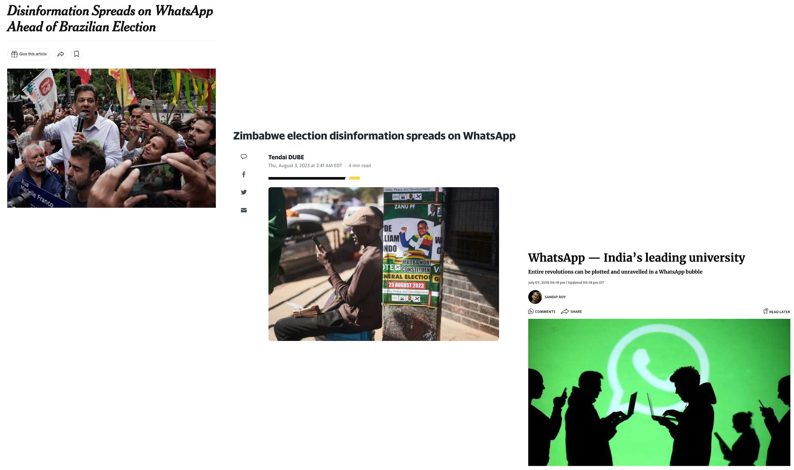{fig-align="center" width="100%"}

## Research Agenda {.center}

::: {.box}
Understand information consumption via WhatsApp in the Global South, and identify causal effects of [WhatsApp Usage]{.red} on [political]{.red} and [non-political]{.red} attitudes.
:::

## This is a hard question!

::: {.fragment}
- **Problem I:** In a context of widely adoption of certain social media applications, RCTs "treating" users with social media have several theoretical constraints.

   - **Solution:** Instead of "activating", researchers have used deactivation designs to measure the short term causal effects of social media usage [(Asimovic et al., 2022, Allcott et al., 2020, Arceneaux and Ladd 2023)]{.midgray}
:::

::: {.fragment}
- **Problem II:** Fully deactivating WhatsApp users further ethical and empirical challenges:

   - **Solution:** Partial Deactivation ~ induce friction to usage or channels to which users receive "problematic" content on WhatsApp [(Ventura et. al., 2025)]{.midgray}
:::

---
## Multi-Country WhatsApp Usage Reduction Experiment

-  **Design:** Usage Reduction  -> Friction + Incentive to reduce usage:

   - **Time Treatment:** Add time limit for WhatsApp usage per day + Limit Usage to 5min per day;
   - **Media Treatment**: Disable their automatic download of media on WhatsApp, and do not purposefully click and watch any media on WhatsApp;

- **Duration:** 

   - **Treatment**: Change settings and behavior for 4 weeks (one month) leading up to election in three countries
   - **Control**: Change ONLY behavior for 3 days.
  

- **Multicountry Design:** selected some of the largest Global South countries having democratic elections in 2024.

  - India: **General Election** Spring 2024
  - South Africa: **Presidential Election** Spring 2024
  - Brazil: **Local Election** Fall 2024

# Theory {background-color="#23395b"}

## On WhatsApp, what you see depends on which chats you're in

:::: {.columns}

::: {.column width="33%"}
**Weak-tie groups**

Large, strangers, joined by invite link

Partisan coordination, viral multimedia, quasi-anonymous content

[(Gursky et al. 2022; Chauchard & Garimella 2022)]{.midgray .smaller}
:::

::: {.column width="33%"}
**Strong-tie groups**

Family, friends, neighbors

Homogeneous, conflict-avoidant: misinformation goes uncorrected

[(Zhu et al. 2024; Chadwick et al. 2024)]{.midgray .smaller}
:::

::: {.column width="33%"}
**One-on-one chats**

Where most messages go

Least toxic, least political

[(Rossini et al. 2025)]{.midgray .smaller}
:::

::::

## Usage reduction affects volume and composition

::: {.incremental}
- **Volume:** less time on the app means less content, mechanically

- **Selectivity:** a binding constraint makes users pick
  - *Which conversations* to enter and keep
  - *Which content* to open inside them

- Prediction: users hold on to **one-on-one and family chats** and let go of **large weak-tie groups**, where toxic content and misinformation circulate
:::

## 
::: {.mech-table}
| | **Volume**  [*Intensive margin, lowering consumption*]{.midgray} | **Selectivity**  [*Reallocating scarce attention*]{.midgray} |
|---|---|---|
| [**Time**]{.blue}  [*Conversation level*]{.midgray} | Limit how often and how long participants use WhatsApp, mechanically reducing all content encountered. | Participants decide which conversations merit their limited time, and thus they prioritize one-on-one exchanges. |
| [**Multimedia**]{.blue}  [*Content level*]{.midgray} | Blurs all photos and videos received, reducing the volume of multimedia participants are exposed to. | Participants decide whether to manually download each piece of blurred multimedia, and they are more likely to do so for content from close contacts in one-on-one chats. |
:::

## Hypotheses

:::: {.columns}

::: {.column width="50%"}
**Information consumption**

- Less exposure to low-quality and uncivil political discussion [(H1--H2)]{.midgray}
- Less exposure to misinformation [(H3a)]{.midgray} *and* true news [(H3b)]{.midgray}

**Belief accuracy**

- Better at spotting false news [(H4a)]{.midgray}, worse at spotting true news [(H4b)]{.midgray}
:::

::: {.column width="50%"}
**Political attitudes**

- Less partisan polarization [(H5)]{.midgray}
- Less identity-based prejudice [(H6)]{.midgray}
- Less issue polarization [(H7)]{.midgray}
- Less extreme candidate favorability [(H8)]{.midgray}

**Non-political** [(exploratory)]{.midgray}

- Substitution and well-being
:::

::::

# Experimental Design {background-color="#23395b"}

##

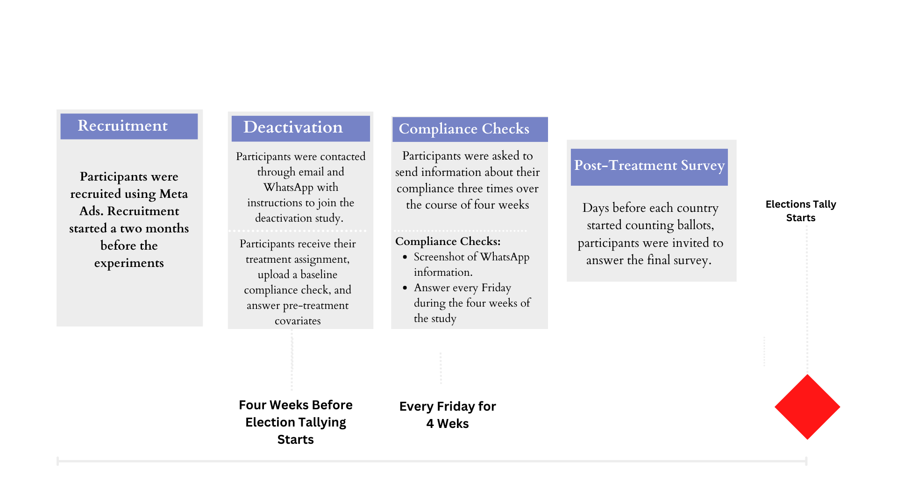{fig-align="center" width="100%"}

- Participants enrolled: 2426 (678 in India, 820 in South Africa, and 928 in Brazil)

- Final Sample: 2220 (653 in India, 742 in South Africa, and 825 in Brazil)

## Two ways to add friction without cutting people off

:::: {.columns}

::: {.column width="50%"}
[**Multimedia**]{.red}

Turn off automatic downloads. Don't open images, video, or audio.

::: {.phone}
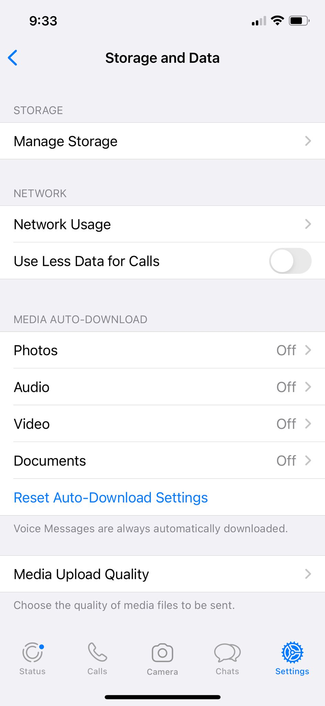{fig-align="center"}
:::
:::

::: {.column width="50%"}
[**Time**]{.red}

Set a native app timer. Use WhatsApp **10 minutes a day** at most.

::: {.phone}
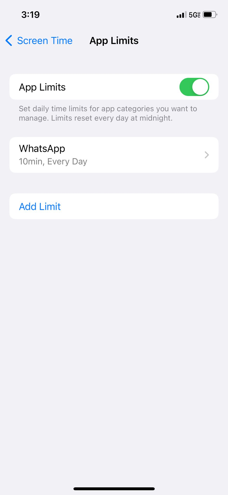{fig-align="center"}
:::
:::

::::

## The control group took the treatment for three days

::: {.incremental}
- Controls got the same instructions, for **3 days** instead of 4 weeks, with **no settings change**

- Why:
  - Screens out **never-takers** from both groups
  - Makes it harder for controls to know they're controls
  - Keeps attrition balanced

- Standard in deactivation studies [(Allcott et al. 2020, 2024; Arceneaux et al. 2023; Ventura et al. 2025)]{.midgray}

- Treatment assignment is revealed only **after** the baseline screenshot
:::

## We checked compliance with weekly screenshots

:::: {.columns}

::: {.column width="50%"}
**Multimedia arm:** bytes of media received

::: {.phone}
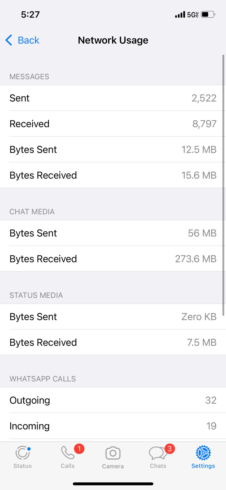{fig-align="center"}
:::
:::

::: {.column width="50%"}
**Time arm:** daily WhatsApp screen time

::: {.phone}
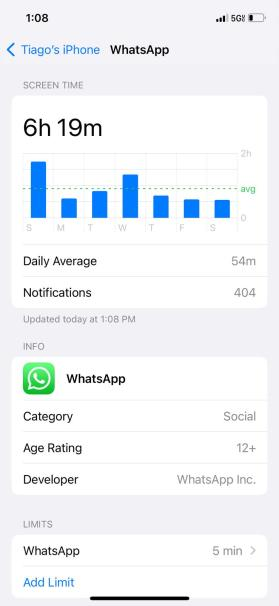{fig-align="center"}
:::
:::

::::

::: aside
Baseline plus four weekly screenshots, from treatment and control alike
:::

## Treated users cut usage in every country and in both arms

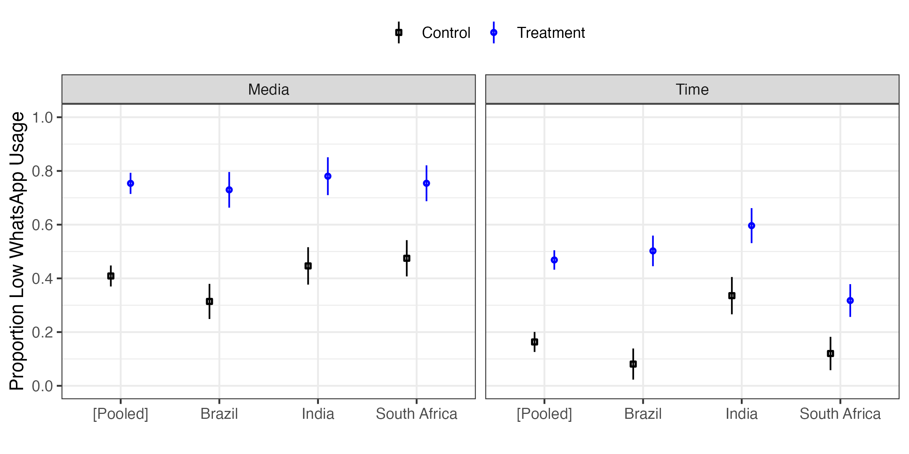{fig-align="center" width="95%"}

::: {.smaller}
- **Time:** 47% of treated stayed under 10 min/day for all four weeks, vs. 16% of controls
- **Multimedia:** 77% of treated consumed less media than the average control
- Multimedia was **easier to comply with**. Even a 10-minute cap is hard for most people.
:::

## Attrition was low and balanced {visibility="hidden"}

::: {.incremental}
- 2,220 of 2,425 enrolled finished the endline: **8.4% attrition**
- Treatment 8.5% vs. control 8.3%, and no selective attrition on baseline covariates or outcomes [(Ghanem et al. 2023)]{.midgray}
- **Estimation:** covariate-adjusted ITT, both arms pooled, Lasso-selected covariates, country random intercepts
- The enrolled are **younger, more educated, and heavier WhatsApp users** than the eligible pool
:::

# Results {background-color="#23395b"}

## Measuring exposure to news and misinformation

::: {.incremental}
- **Misinformation:** 4 false stories that went viral during each campaign, picked from national fact-checkers

- **True news:** 4 real headlines from major outlets during the same weeks, plus 2 placebo fakes with a key fact reversed

- For each headline we ask:
  - Have you seen this in the past 30 days? → **Recall**
  - Is it true? → **Accuracy**

- Plus indices of **online incivility** and **low-quality political discussion** [(Allcott et al. 2020; Rossini 2022)]{.midgray}
:::

## Less WhatsApp meant less incivility, less misinformation, and less news

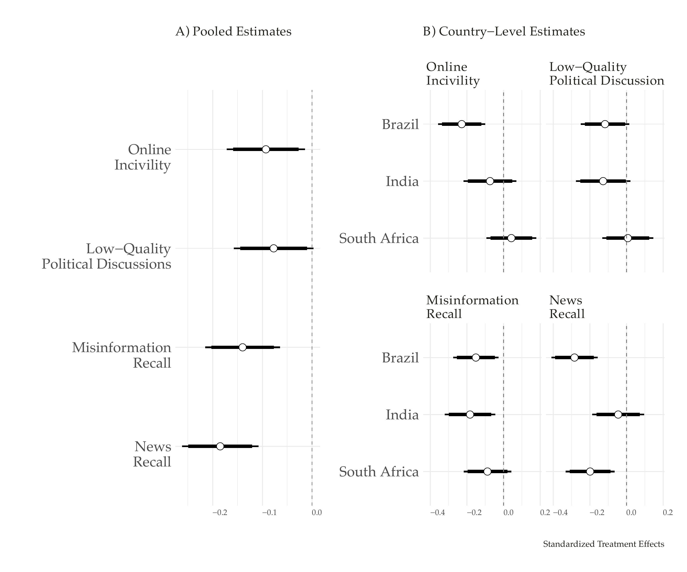{fig-align="center" width="68%"}

-  The trade-off: people lost true news too

## Seeing less didn't change what people believed

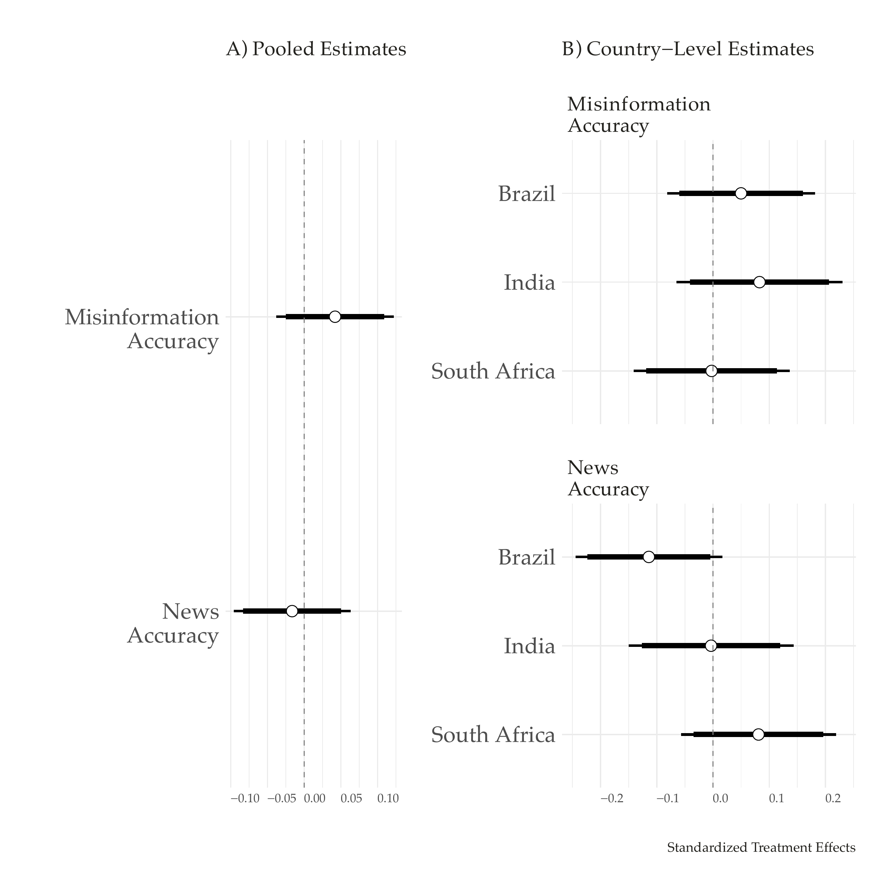{fig-align="center" width="58%"}

::: aside
Consistent with prior deactivation studies [(Allcott et al. 2020, 2024; Ventura et al. 2025)]{.midgray}
:::

## Measuring political attitudes

::: {.incremental}
- **Partisan polarization:** feelings, willingness to interact, and traits for voters of the two main coalitions
  - BJP vs. Congress · ANC vs. DA · PL vs. PT

- **Identity-based prejudice:** the same items for Hindus/Muslims (India) and Black/White South Africans

- **Issue polarization:** distance from the control-group mean on six campaign issues

- **Candidate favorability:** in-party vs. out-party leaders (Modi, Gandhi, Ramaphosa, Zuma, Lula, Bolsonaro, ...)
:::

## {.center}

::: {.larger-font}
Did less exposure to toxic content and misinformation reduce polarization?
:::

::: {.fragment .larger-font}
**Not quite.**
:::

## Political attitudes didn't move

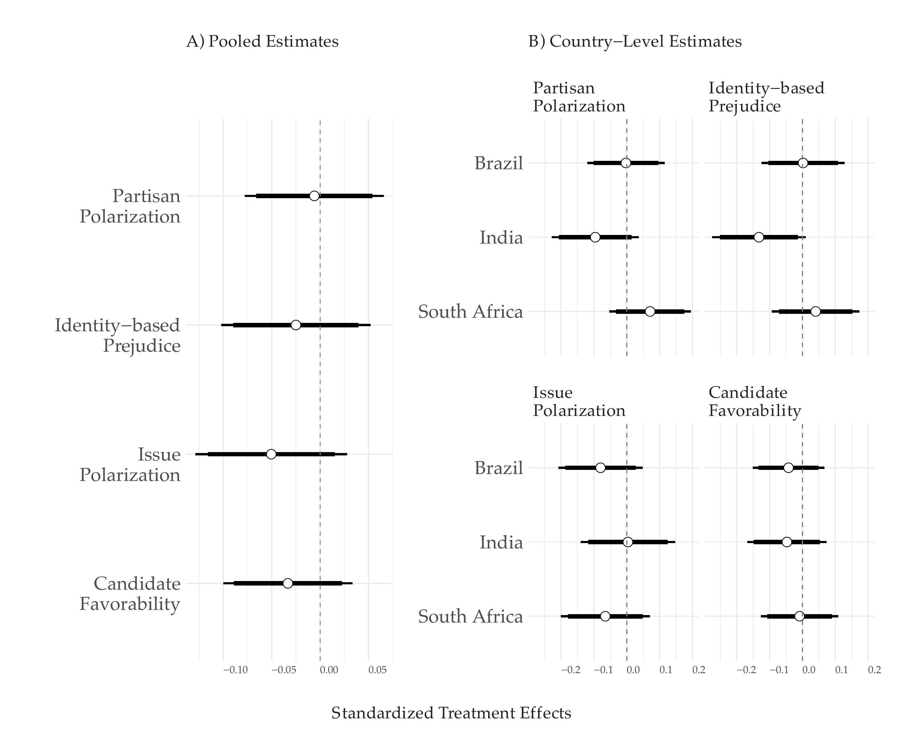{fig-align="center" width="68%"}

::: aside
One exception: Time arm in India reduced anti-Muslim prejudice (d = −0.13, p = 0.067)
:::

## These nulls match the rest of the literature

Studies that shifted consumption but not attitudes:

::: {.incremental}
- WhatsApp multimedia deactivation, Brazil 2022 [(Ventura et al. 2025)]{.midgray}
- Facebook/Instagram deactivation, US 2020 [(Allcott et al. 2024)]{.midgray}
- Chronological instead of algorithmic Facebook feeds [(Guess et al. 2023a)]{.midgray}
- Removing reshares from Facebook feeds [(Guess et al. 2023b)]{.midgray}
- Reducing like-minded sources on Facebook [(Nyhan et al. 2023)]{.midgray}
:::

## People felt better, and spent the time on hobbies and TV

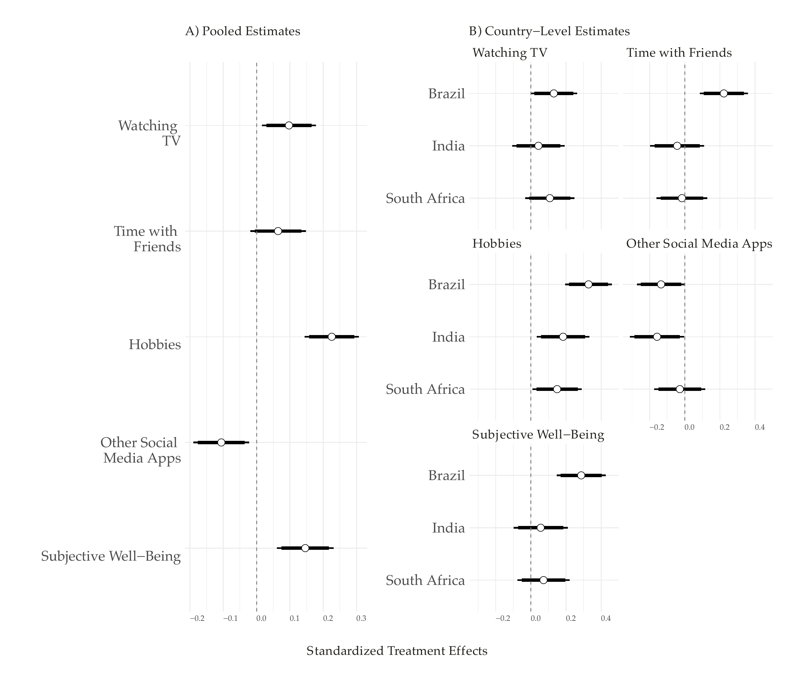{fig-align="center" width="62%"}

## Well-being gains were largest in Brazil, where people went offline

::: {.incremental}
- Subjective well-being: [**+0.14 SD**]{.red} pooled
- Hobbies **+0.22 SD**, TV **+0.09 SD**, other social media **−0.10 SD**
- Brazil: biggest well-being gain *and* biggest shift to offline activities, including time with friends
- Less screen time alone may not be enough. The benefit seems to come from **what replaces it**.
:::

## Treated users dropped large groups and kept close ties

Brazil sample, chats used in the past 3 days (treatment effect, pooled arms)

::: {.small-table}
| Type of chat | Effect | |
|---|---|---|
| Any close-tie chat | −0.02 | |
| Any large group (10+ people) | [**−0.11**]{.red} | *** |
| Number of chat types | [**−0.38**]{.red} | *** |
| Large groups: friends | −0.12 | *** |
| Large groups: work/education | −0.08 | * |
| Large groups: politics | −0.04 | + |
| Large groups: family | −0.03 | |
:::

::: aside
Suggestive evidence: only collected in Brazil, the last of the three experiments
:::

## Effects were strongest among heavy WhatsApp users

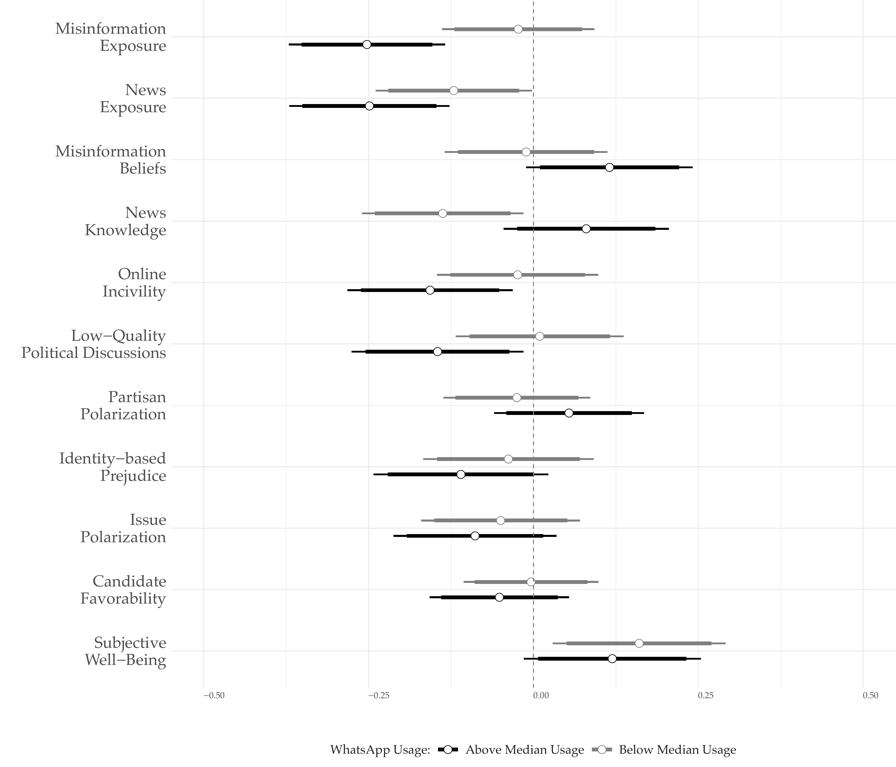{fig-align="center" width="68%"}

::: aside
Heavy users (above the median) also got **better at spotting misinformation**
:::

## Weak partisans left toxic spaces, strong ones stayed

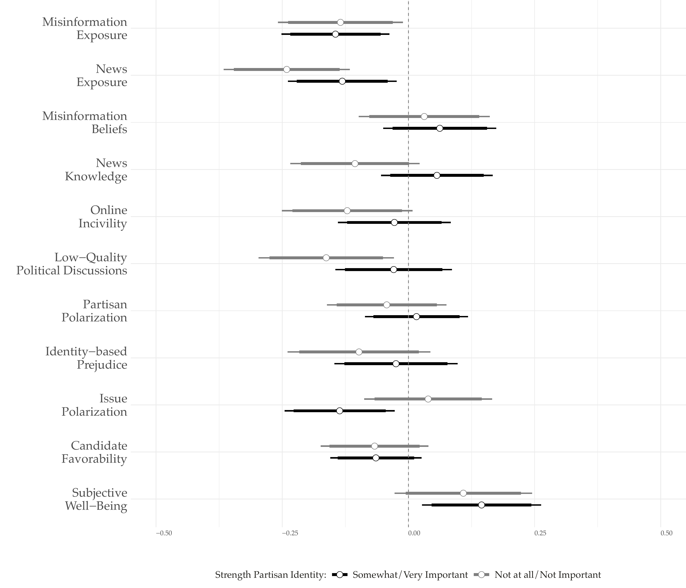{fig-align="center" width="62%"}

## Country context shaped what reduction removed {visibility="hidden"}

| | What moved | Why |
|---|---|---|
| **Brazil** | Incivility ↓, news ↓, misinfo ↓, well-being ↑ | Large political groups are common. People shifted offline. |
| **South Africa** | Misinfo ↓, news ↓. No change in incivility | Information travels through everyday conversation, not political groups |
| **India** | Misinfo ↓, low-quality discussion ↓. **News unchanged** | Lower reliance on WhatsApp for news at baseline |

# Implications {background-color="#23395b"}

## Key Takeaways

:::incremental
- WhatsApp is an important channel through which voters receive misinformation and news in major Global South democracies 

- Reduced exposure to such information does not mechanically affect accuracy perceptions 

- In the context of elections, WhatsApp also increases exposure to toxic content and uncivil political discussions

   - ...none of this change meaningfully political attitudes (at least not within a short electoral period) 

- Yet limiting WhatsApp usage **also** improves overall subjective well-being, and these effects are associated with higher time spent on offline activities.
:::

## Participants found it hard at first, but saw benefits

::: {.box}
"It was hard at first and felt like I was missing out on the rest of the day's interactions, but I got used to it and started feeling like I had so much time on my hands and could do a lot more things."

[-- South African participant]{.midgray}
:::

::: {.fragment .box}
"It was a big challenge, the first few days were the hardest, but I kept myself busy with other things. My boyfriend liked that I spoke to him more in person instead of on WhatsApp."

[-- Brazilian participant]{.midgray}
:::

::: {.fragment}
60% of treated participants described positive experiences, 47% negative ones. Many said both.
:::

## Friction by default is a policy that works and can scale

::: {.incremental}
- Platforms won't add friction on their own: it cuts engagement

- Our Multimedia arm is a **settings change**:
  - WhatsApp could make media downloads **opt-in by default**
  - Regulators could require **screen-time limits** in a default digital health toolkit

- Cheaper and less intrusive than bans, and it preserves access to essential communication

- Participants said the settings changes themselves helped them cut back
:::

## Caveats

::: {.incremental}
- **Sample:** online recruits who agreed to cut back, younger and heavier users than the eligible pool
- **Self-reports:** exposure and well-being are survey measures
- **Timing:** four weeks, at the height of a campaign. Effects may differ at other points in the electoral cycle.
- **Mechanism:** we can't cleanly separate **selectivity from volume**
:::

## {background-color="#23395b" .center}

::: {.larger-font style="color: white;"}
Small barriers to WhatsApp use cut exposure to toxic content and misinformation, cost people some news, left their politics unchanged, and made them feel better.
:::

 

[Tiago Ventura · tv186@georgetown.edu · tiagoventura.github.io]{style="color: white; font-size: 0.7em;"}

# Appendix {background-color="#23395b"}

## Instructions by condition

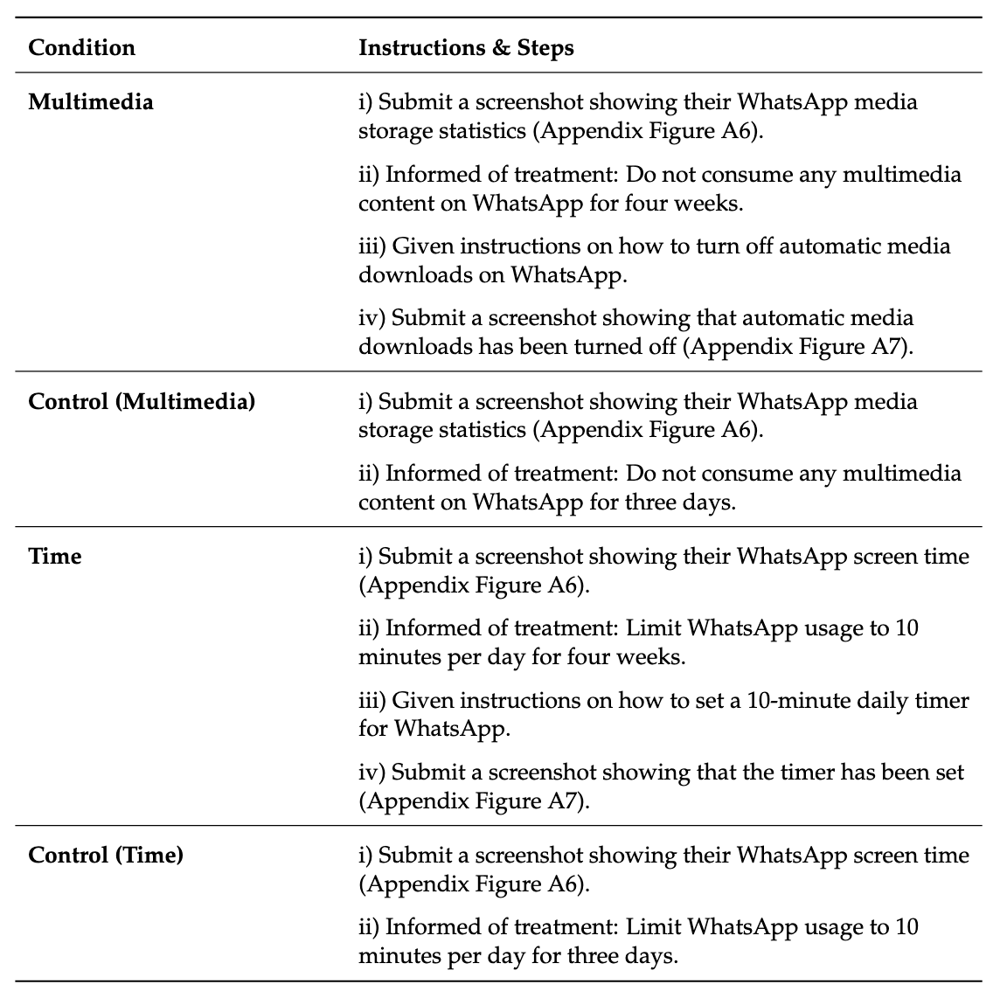{fig-align="center" width="62%"}

## Both arms reduced exposure by similar amounts

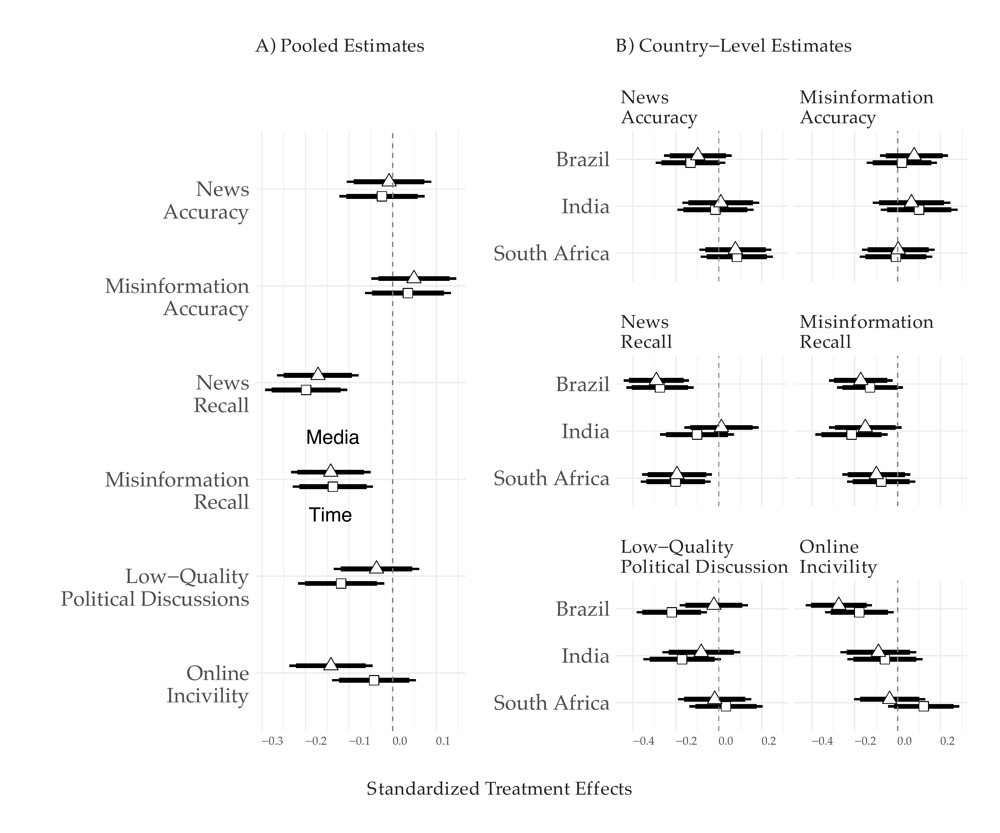{fig-align="center" width="68%"}

::: aside
Media drives the drop in incivility, Time drives the drop in low-quality discussion
:::

## Treated users noticed less false news but not less true news

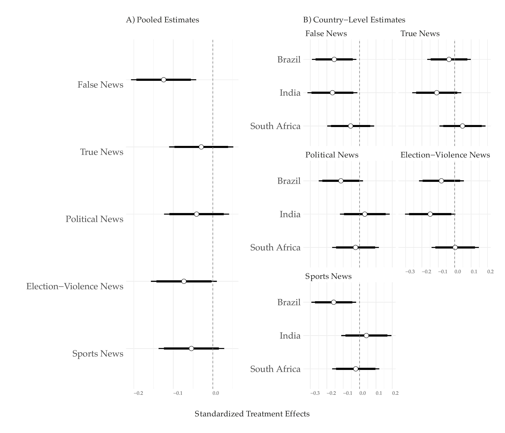{fig-align="center" width="58%"}

## Brazilians started with more exposure to incivility

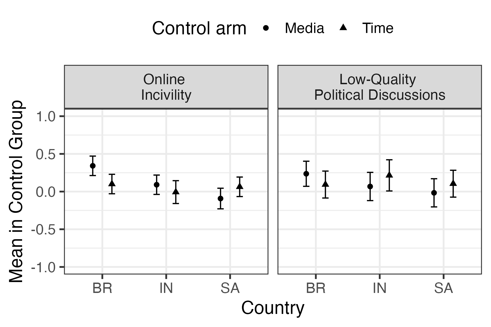{fig-align="center" width="72%"}

## Everyone rated the study positively, treated a bit less so

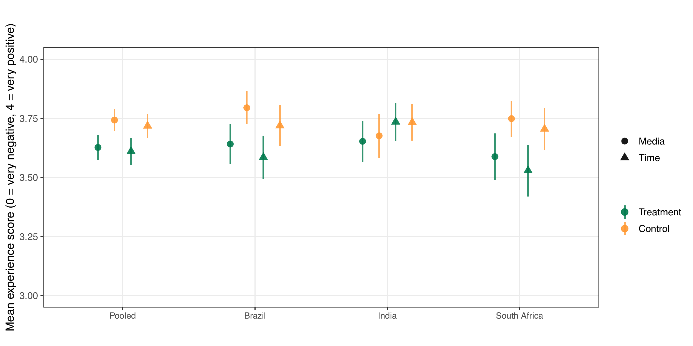{fig-align="center" width="85%"}

## Open-ended reflections mixed benefits and costs

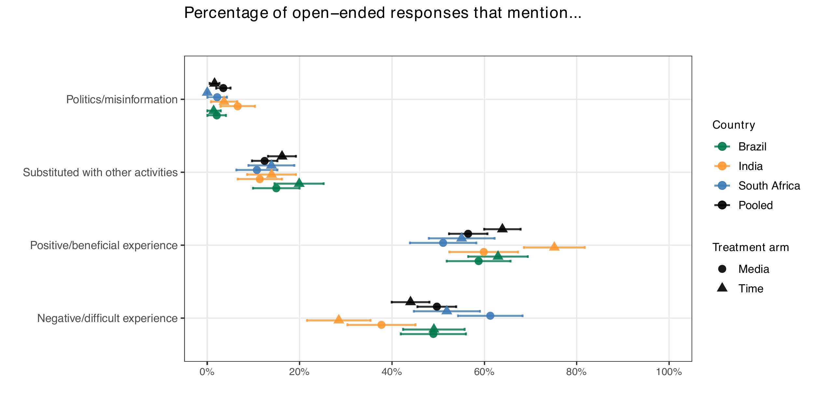{fig-align="center" width="85%"}

::: aside
60% mentioned positive feelings, 47% negative ones
:::
