layout: true

<div class="my-footer"><span>Tiago Ventura (Georgetown University) &nbsp &nbsp &nbsp &nbsp &nbsp &nbsp &nbsp &nbsp &nbsp &nbsp &nbsp &nbsp &nbsp &nbsp &nbsp &nbsp &nbsp &nbsp &nbsp &nbsp &nbsp &nbsp &nbsp MEEW 2025</span></div> 

```{r setup, include=FALSE}
library(xaringanthemer)
options(htmltools.dir.version = FALSE)
knitr::opts_chunk$set(message=FALSE, warning = FALSE)
xaringanthemer::style_mono_light(base_color ="#2e4a75", 
                                  title_slide_text_color="#ffff", 
                                  title_slide_background_color = "#2e4a75", 
                                  background_color = "#fff", 
                                  link_color =  "#2e4a75")
options(htmltools.dir.version = FALSE)
knitr::opts_chunk$set(message=FALSE, warning = FALSE, error=TRUE, echo=FALSE, cache=TRUE)
```

```{r style-share-again, echo=FALSE}
xaringanExtra::use_tile_view()
xaringanExtra::use_panelset()

#xaringanExtra::style_share_again(
#  share_buttons = c("twitter", "linkedin", "pocket")
#)
```

---
class: middle
## Motivation
--

**From Liberation to Turmoil:** After early years of optimism, the past ten years on the public and academic debate about social media usage have increasingly focused on its negative consequences on society. Social Media is said to:
--

- Facilitates the spread of **misinformation** .midgrey[(Guess, Nyhan, and Reifler 2018; Flaxman, Goel, and Rao 2016)]

- Facilitates users' self-selection on **online echo chambers** .midgrey[(Guess et al. 2023; Sunstein 2018)]

- Increase exposure to **uncivil/low-quality** content .midgrey[(Bor and Petersen 2022)]

- ... therefore **polarizing** voters around the world .midgrey[(Banks et al. 2021; Tokita, Guess, and Tarnita 2021; Bail et al. 2018; Settle 2018)]

- ... and harming **mental health** .midgrey[(Tromholt 2016; Vanman, Baker, and Tobin 2018; Hanley, Watt, and Coventry 2019)]

--

---
class:middle
### Challenges on the social media scholarship

--

#### **Challenge 1:**  Overemphasis on feed-based platforms

- Information consumption and content propagation varies greatly across different social media platforms (Feed-Based vs Social Messaging Apps vs Non-Social Graph Apps) .midgrey[(Garimella et al., 2019, Resende et al., 2019, Ventura et al., 2024)] 

--

#### **Challenge 2:** Research is concentrated in a handful of high-income countries:


- Effects of social media usage are likely to vary across contexts .midgrey[(Budak et al., 2024)]. For example, between low vs high-income countries:

  - Less content moderation from platforms, and 
  - Weaker independent media infra-structure
  - Social Media more heavily used for news consumption.

--

#### **Challenge 3:** Evidence is mostly correlational 

--

---
class:middle

```{r out.width="100%"}
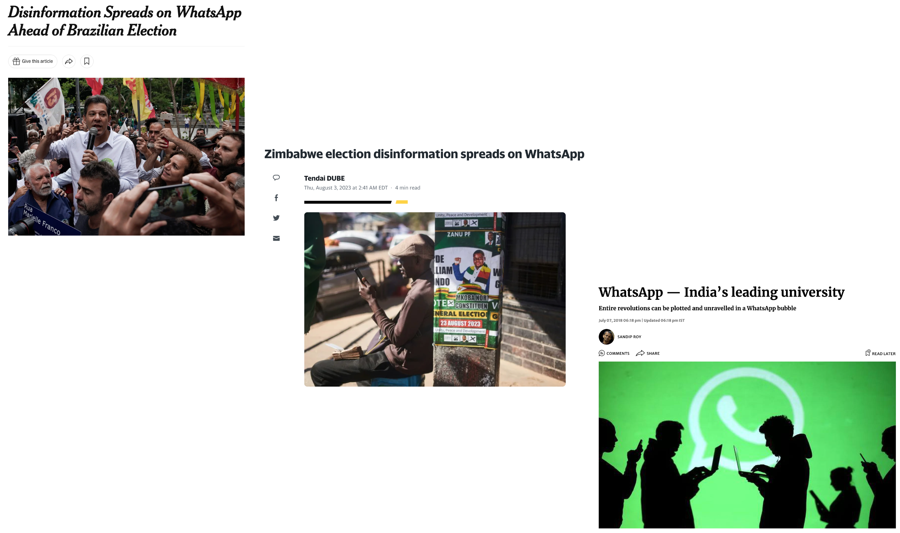
```

---
## Research Agenda

<br>
<br>
<br>
<br>
<br>
<br>

.content-box-gray[Understand information consumption via WhatsApp in the Global South, and identify causal effects of **.red[WhatsApp Usage]** on **.red[political]** and **.red[non-political]** attitudes.]

---
class:center, middle


```{r out.width="60%"}
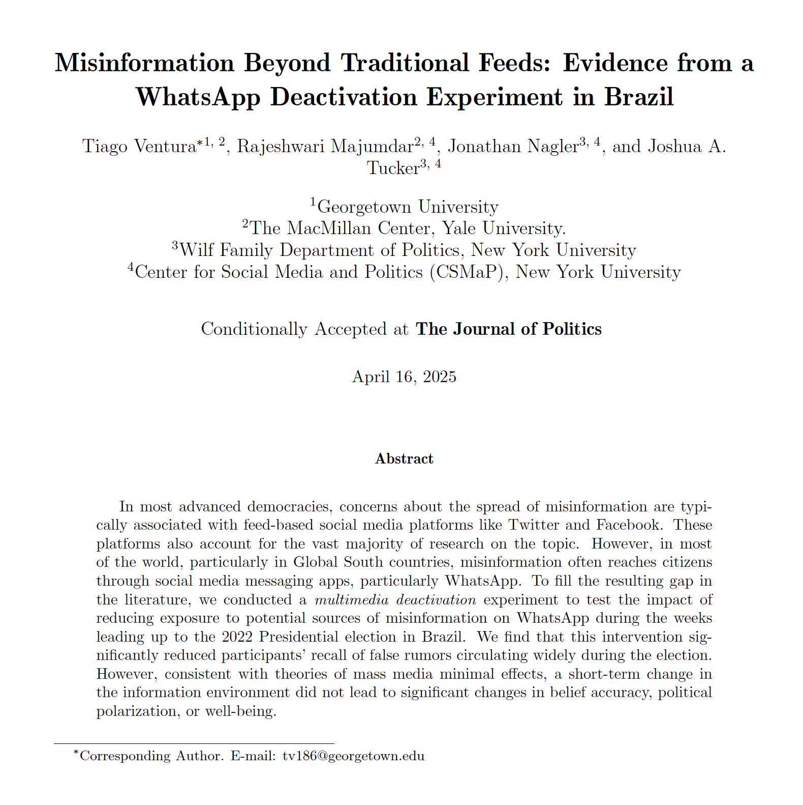
```

.midgrey[Ventura et. al, Misinformation Beyond Traditional Feeds,  Forthcoming Journal of Politics]


---
class:middle

### Multi-Country WhatsApp Partial Deactivation Experiment

--

-  **Design:** Partial Deactivation -> Friction + Incentive to reduce usage:

   - **Time Treatment:** Add time limit for WhatsApp usage per day + Limit Usage to 5min per day;
   - **Media Treatment**: Disable their automatic download of media on WhatsApp, and do not purposefully click and watch any media on WhatsApp;

--

- **Duration:** 

   - **Treatment**: Change settings and behavior for 4 weeks (one month) leading up to election in three countries
   - **Control**: Change ONLY behavior for 3 days.
   
--

- **Multicountry Design:** selected some of the largest Global South countries having democratic elections in 2024.

  - India: **General Election** Spring 2024
  - South Africa: **Presidential Election** Spring 2024
  - Brazil: **Local Election** Fall 2024

--
---
class:middle

## Theoretical Mechanisms

We posit our interventions will affect the information consumption through three distinct mechanisms: 

--

**Direct exposure mechanism:**

- Misinformation and polarizing content frequently spreads anonymously through viral multimedia content (.midgrey[Resende et al., 2019, Garimella et al., 2018]). 

--

**Enhance Attention:**

- More purposefully select type of content they engage with online, reduce lazy consumption (.midgrey[Rand et al., 2019])

--

**Force users to prioritize relevant engagements/one-on-one:**

   - Information finds users primarily through incidental exposure on medium/large WhatsApp Groups. (.midgrey[Stroud et al., 2022, Schafer 2023])

--


---
class:middle, center, inverse

# Experimental Design

---
class: middle

```{r out.width="100%"}
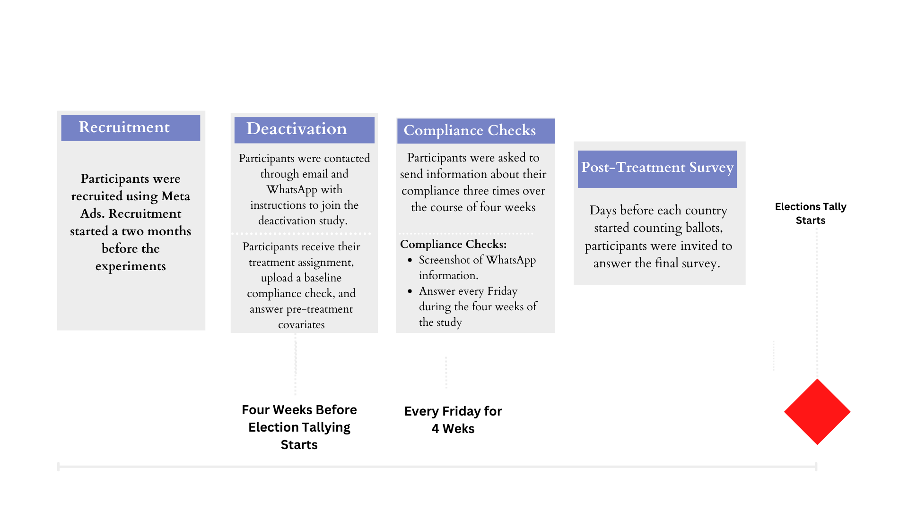
```

- Participants enrolled: 2426 (678 in India, 820 in South Africa, and 928 in Brazil)

- Final Sample: 2220 (653 in India, 742 in South Africa, and 825 in Brazil)


---
class:middle
### Treatment Time - Intervention & Compliance

.pull-left[
.center[
#### Intervention: Adding Friction
```{r out.width="55%"}
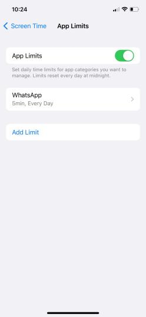 
```
]
]

.pull-right[
.center[
#### Compliance: Monitoring Behavior

```{r out.width="60%"}
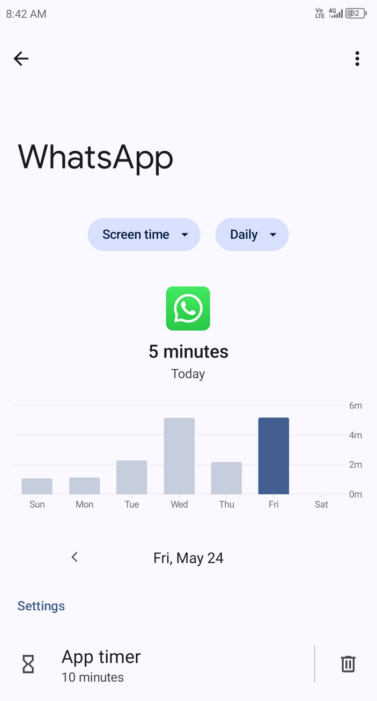
```
]
]

---
class:middle 

### Treatment: Media Intervention & Compliance

.pull-left[
.center[
#### Intervention: Adding Friction
```{r out.width="60%"}
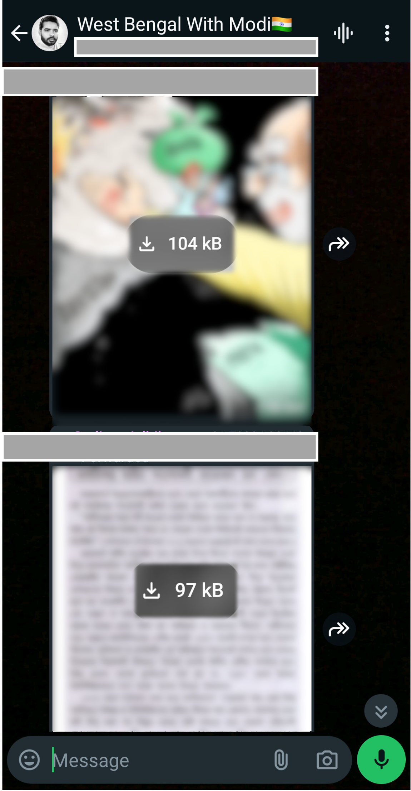 
```
]
]

.pull-left[
.center[

#### Compliance: Monitoring Behavior

```{r out.width="60%"}
knitr::include_graphics("output_mpsa/ss_tmedia_networkusage.jpeg")
```

]
]

---
class:middle, 
## Outcomes

#### `r icons::fontawesome("arrow-alt-circle-right")` Information Effects:

- Recall of News and Misinformation Rumors
- Accuracy Beliefs for the same set of headlines
- Self-reported exposure to online toxicity + uncivil political discussions.

#### `r icons::fontawesome("arrow-alt-circle-right")` Consequences on Political Attitudes:

- Partisan and Ethnic Affective Polarization.
- Ideological Polarization (Issue-Based).
- Candidate favorability. 

#### `r icons::fontawesome("arrow-alt-circle-right")` Consequences on Non-Political Attitudes:

- 5 items for Subjective Well-Being + Substitution Effects

---
class:middle, inverse, center
# Results

---
class:  middle

### Exposure to and Belief in News Headlines 


- Participants are shown 8 news headlines; asked (a) whether they have seen this news before & (b) whether they think the news is true  

- Four headlines are true news; four are misinformation stories  

- Count how many (a) recalled & (b) accurately identified as T/F  


---
class:middle
## Exposure of Rumors and True News

Limiting WhatsApp usage reduces exposure to misinformation & news  


```{r out.width="90%"}
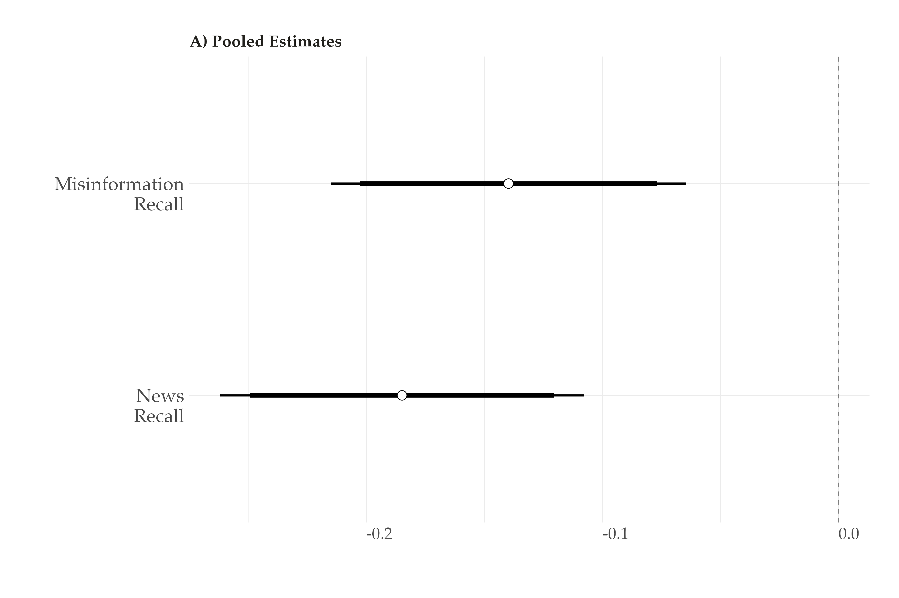
```

---
class:  middle
## Belief Accuracy

A short-term reduction in exposure does not translate to changes in accuracy judgments  

```{r out.width="90%"}
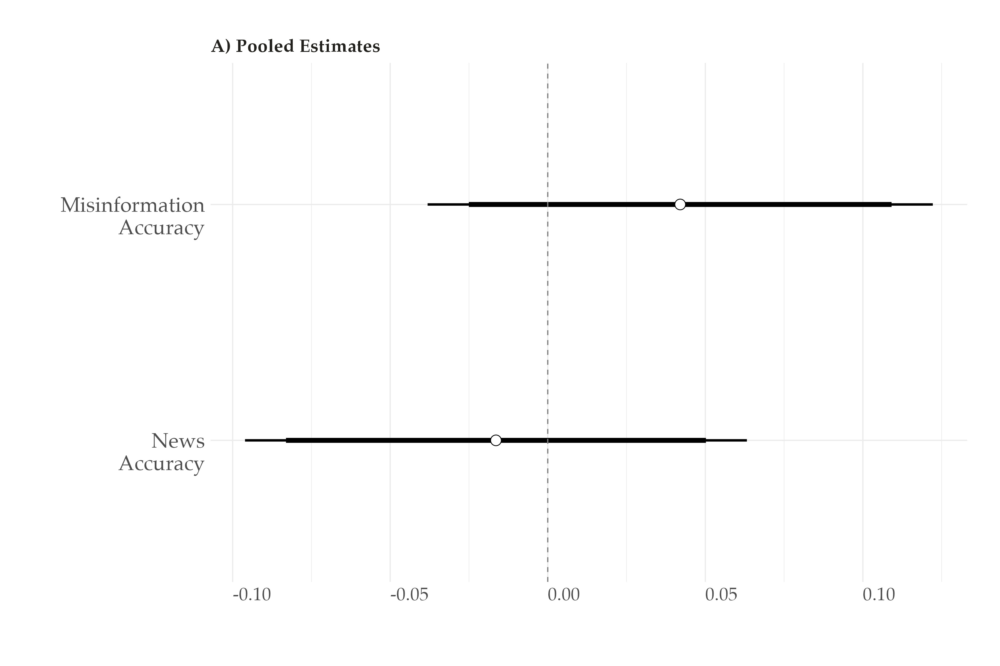
```


---
class:  middle
## Uncivil content more broadly 

Using several different items, we find that limiting WhatsApp usage also reduces exposure to online incivility and low-quality political discourse  

```{r out.width="90%"}
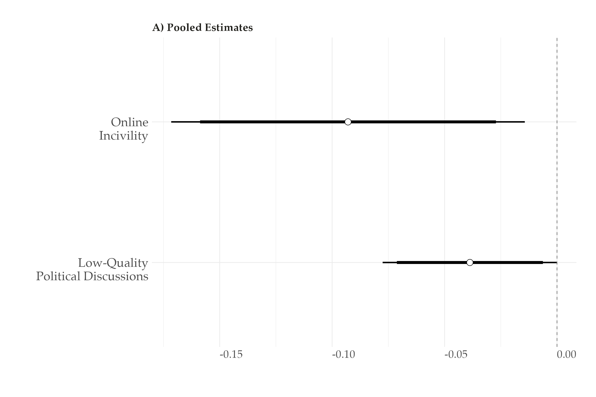
```


---
class:middle

## Downstream Effects: Measuring Polarization


- Participants are asked about their feelings, traits and willingness to engage with voters/members of two main parties and ethnic/religious groups in *each* country

- We also ask their feelings towards the leaders of the parties

- And their agreement across several policy issues salient in the election


---
class:middle

## Downstream consequences on political polarization 

.center[
Can this short-term reduction in exposure to political misinformation and toxic political content change political attitudes and reduce polarization?
]

--

.center[
**Not quite.**
]

---
class:  middle
### Downstream consequences on political polarization

```{r out.width="90%"}
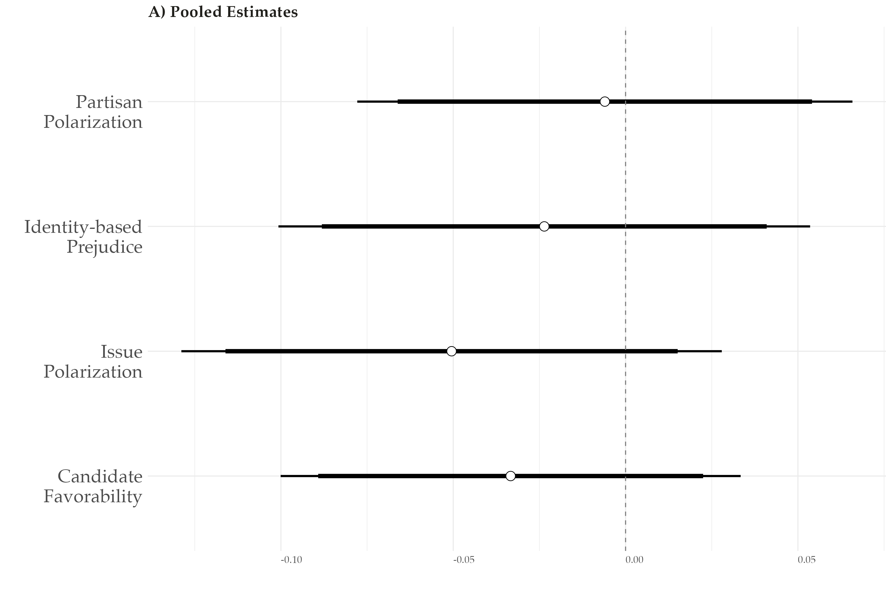
```


---
class: middle

### Are these nulls effects consistent with other studies? 

--

**Yes**. Other studies with changes in consumption, but nulls on political attitudes:


- Multimedia whatsapp deactivation in Brazil, 2022 election .midgrey[(Ventura et al., 2025)]

- Recent Facebook/Instagram deactivation experiment in US and France .midgrey[(Allcott et al., 2024, Arceunaux et al., 2024)]


- Changing Facebook feed to chronological instead of algorithmic .midgrey[(Guess et al., 2023)]


- Removing re-shares from people's Facebook News Feed .midgrey[(Nyhan et al., 2024)]

- Installing a browser to signal when people are navigating on low-quality news websites  .midgrey[(Aslett et al., 2022)]

- And experiments incentivizing participants to take a "news vacation" for two weeks .midgrey[(Wojcieszak et al., 2022)]

--


---
class:  middle, center
### Downstream consequences on Non-Political Attitudes and Substitutes

Using several well-being items, we find that limiting WhatsApp usage makes participants feel better (happier, less anxious, less concerned about others)

--

 **This occurs alongside increased offline activity.** 

--

---
class:  middle, center

```{r out.width="90%"}
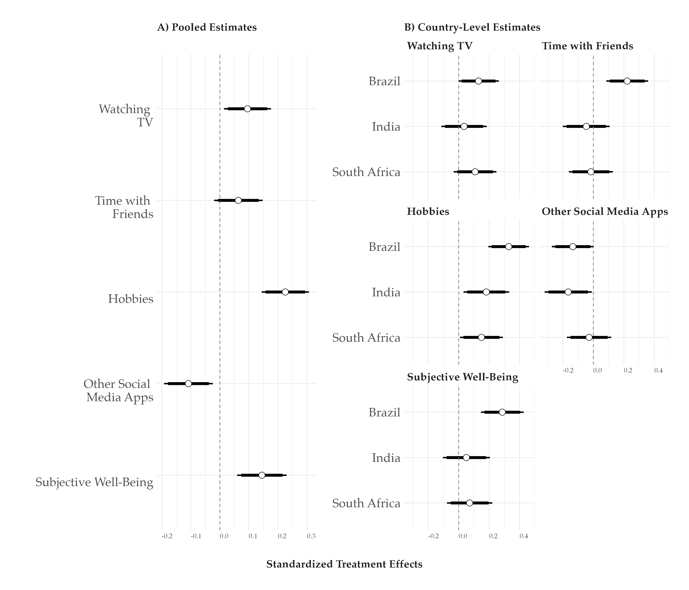
```

---
class:middle

## Key Takeaways

--

- WhatsApp is an important channel through which voters receive misinformation and news in major Global South democracies 

--

- Reduced exposure to such information does not mechanically affect accuracy perceptions 

--

- In the context of elections, WhatsApp also increases exposure to toxic content and uncivil political discussions

--

   - ...none of this change meaningfully political attitudes (at least not within a short electoral period) 

--

- Yet limiting WhatsApp usage **also** improves overall subjective well-being, and these effects are associated with higher time spent on offline activities.

--

---
class:center, inverse, middle

# Thank you!

